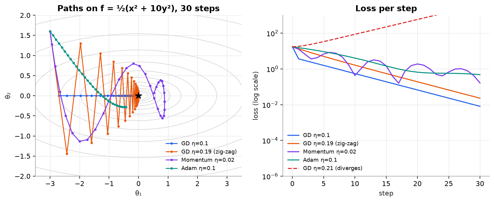

# How gradient descent finds the bottom

<!-- lab:gradient-descent -->

<!-- /lab -->

Training a model means finding the parameters with the lowest loss. With two parameters you can draw that search as a map. This explainer walks through it one picture at a time; on the website the lab beside the text changes as you scroll.

<!-- step:start -->
## The map

Each point on this surface is one choice of the two parameters, $\theta_1$ and $\theta_2$. The colour is the loss at that point: darker blue is worse. The ring marks the lowest point, the minimum.

We start at the dot. We can't see the whole map, only the slope under our feet, so we need a rule that uses just that slope.

<!-- step:arrow -->
## Which way is downhill?

The gradient $\nabla L$ points uphill, in the direction where the loss grows fastest. So we go the other way. The teal arrow is the step we're about to take:

```math
\theta \leftarrow \theta - \eta \, \nabla L(\theta)
```

$\eta$, the learning rate, scales how far we move. A steep slope gives a long arrow, a gentle slope a short one.

<!-- step:descend -->
## Step, recompute, repeat

Take the step, compute the new slope, take another. Nothing tells the optimizer to slow down near the bottom. It happens on its own, because the gradient shrinks as the surface flattens, so the steps shrink with it.

This bowl is narrow: steep across, shallow along. The path first drops across the steep direction, then creeps along the valley floor. That slow crawl is where most of the training time goes.

<!-- step:zigzag -->
## Too big a step

Raise $\eta$ from 0.10 to 0.18 and the path zigzags. In the steep direction each step overshoots the valley floor and lands on the opposite wall, which slopes back the other way.

It still gets there, because each overshoot is a little smaller than the one before. But it wastes steps bouncing between the walls.

<!-- step:diverge -->
## Much too big

At $\eta = 0.21$ the bounce grows instead of shrinking, and the loss explodes. On this surface the steep direction has curvature 10, and gradient descent is only stable while

```math
\eta \times 10 < 2 \quad\Longrightarrow\quad \eta < 0.2
```

This is why a loss that suddenly jumps to `NaN` usually means the learning rate is too high, not that the data is broken.

<!-- step:optimizers -->
## Smarter steps

Same surface, three optimizers. Plain gradient descent (blue) still crawls. **Momentum** (orange) keeps a running velocity, so it speeds up along the valley floor, where the gradient keeps pointing the same way, while the back-and-forth across the valley cancels out. **Adam** (purple) also scales each direction by how large its gradients have been, so the steep and shallow directions get similar-sized steps.

That's why most deep networks today are trained with Adam or a close relative.

**Try it yourself:** click anywhere on the surface to move the starting point, or open the [full lesson](../lessons/11-gradient-descent-backprop/01-gradient-descent.md) for the math with every step worked out.
