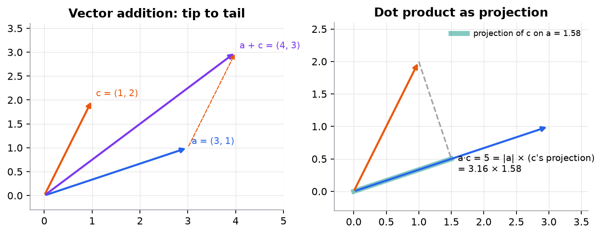

# Vectors and matrices

> **Mental model.** A vector is a list of numbers describing one thing (a house, a word, a user). A matrix is a stack of such lists, or a machine that turns one vector into another. Almost every model computation is "multiply a matrix by a vector and add something."

**You will learn to**
- Distinguish scalars, vectors, matrices, and tensors, and state their shapes.
- Compute a dot product and interpret it as a weighted sum and as a projection.
- Multiply matrices by hand and predict the result's shape before computing.
- Use the shape habit to catch bugs before they happen.

**Why it matters.** A linear model is a dot product. A neural-network layer is a matrix-vector product. Attention is two matrix products and a softmax. If you can multiply matrices and track shapes, you can read any model's code.

## 1. Intuition

- A **scalar** is a single number: a learning rate, a loss value.
- A **vector** is an ordered list: a house described as `[bedrooms, thousand sq ft] = [2, 1.5]`. Its length is its dimension.
- A **matrix** is a grid of numbers, rows by columns. A dataset of 1,000 houses with 2 features is a $1000 \times 2$ matrix: one row per house.
- A **tensor** is the same idea with more axes. A batch of 32 color images of 64×64 pixels is a tensor of shape $[32, 3, 64, 64]$.

The **dot product** of two equal-length vectors multiplies matching entries and adds them up. If $x$ is a house and $w$ holds a price per unit of each feature, then $x \cdot w$ is a predicted price. Geometrically, the dot product measures how much two vectors point the same way: large and positive if aligned, zero if perpendicular, negative if opposed.

**Matrix multiplication** is many dot products at once: each entry of $AB$ is a row of $A$ dotted with a column of $B$.

## 2. Visualization



What to notice:
- Adding vectors places them tip to tail.
- The dot product $a \cdot c = 5$ equals $\lVert a \rVert$ (3.16) times the length of $c$'s shadow on $a$ (1.58). If $c$ were perpendicular to $a$, the shadow and the dot product would be 0.

## 3. The math

### Symbols

| Symbol | Meaning | Shape |
|---|---|---|
| $x_i$ | the $i$-th entry of vector $x$ | scalar |
| $x \cdot w$ | dot product | scalar |
| $\lVert x \rVert$ | length (Euclidean norm), $\sqrt{x \cdot x}$ | scalar |
| $A_{ij}$ | entry in row $i$, column $j$ of matrix $A$ | scalar |
| $A^\top$ | transpose: rows become columns | $[n, m]$ if $A$ is $[m, n]$ |

### Dot product

```math
x \cdot w = \sum_{i=1}^{n} x_i w_i = \lVert x \rVert \, \lVert w \rVert \cos\theta
```

$\theta$ is the angle between the vectors. Dividing by both lengths gives **cosine similarity**, $\cos\theta$, used everywhere in NLP and retrieval.

### Matrix product

If $A$ is $[m, n]$ and $B$ is $[n, p]$, then $C = AB$ is $[m, p]$ and

```math
C_{ij} = \sum_{k=1}^{n} A_{ik} B_{kj}
```

The inner dimensions ($n$) must match and disappear; the outer dimensions ($m$, $p$) remain. Matrix multiplication is not commutative: $AB \neq BA$ in general, and often $BA$ isn't even defined.

### Worked example 1: a prediction as a dot product

Features $x = [2, 1.5]$ (bedrooms, thousand sq ft), weights $w = [30, 120]$ (thousand dollars per unit), bias $b = 50$.

```math
x \cdot w = 2 \times 30 + 1.5 \times 120 = 60 + 180 = 240, \qquad \hat{y} = 240 + 50 = 290
```

Predicted price: 290 thousand dollars. If the true price is 310, the residual is $310 - 290 = 20$ and the squared error is $400$ (in thousand-dollars squared).

### Worked example 2: matrix product with shapes

```math
A = \begin{bmatrix}1 & 2\\3 & 4\\5 & 6\end{bmatrix}_{[3,2]}
\quad
B = \begin{bmatrix}1 & 0 & 2\\0 & 1 & 1\end{bmatrix}_{[2,3]}
```

Shape check first: $[3, 2] \times [2, 3] \to [3, 3]$. Then, for example, $C_{13}$ = row 1 of $A$ dotted with column 3 of $B$ $= 1 \times 2 + 2 \times 1 = 4$, and $C_{33} = 5 \times 2 + 6 \times 1 = 16$.

```math
AB = \begin{bmatrix}1 & 2 & 4\\3 & 4 & 10\\5 & 6 & 16\end{bmatrix}
```

### Worked example 3: cosine similarity

$a = [3, 1]$, $c = [1, 2]$: $a \cdot c = 3 + 2 = 5$, $\lVert a \rVert = \sqrt{10} = 3.162$, $\lVert c \rVert = \sqrt{5} = 2.236$. $\cos\theta = 5 / (3.162 \times 2.236) = 5 / 7.071 = 0.7071$, so the angle is 45°.

## 4. Implementation

```python
import numpy as np

x = np.array([2, 1.5])
w = np.array([30, 120])
print(x @ w + 50)                 # 290.0   (@ is matrix/dot product)

X = np.array([[2, 1.5], [3, 2.0], [1, 0.8]])   # [3 houses, 2 features]
print(X @ w + 50)                 # [290. 380. 176.]  one prediction per row: [3,2] @ [2] -> [3]

A = np.array([[1, 2], [3, 4], [5, 6]])
B = np.array([[1, 0, 2], [0, 1, 1]])
print((A @ B).shape)              # (3, 3)
print(A * A)                      # element-wise, NOT a matrix product
```

Runnable script with all of this module's examples and figures: [`code/00-foundations/foundations.py`](../../code/00-foundations/foundations.py).

## 5. Engineering

**The shape habit.** Write shapes next to every line: `X @ W  # [B, d_in] @ [d_in, d_out] -> [B, d_out]`. Most deep-learning bugs are shape bugs, and the worst ones don't crash: broadcasting silently turns a `[B]` minus `[B, 1]` into a `[B, B]` matrix.

**Vectorize.** One matrix product over a batch is thousands of times faster than a Python loop of dot products, because it runs in optimized BLAS or GPU kernels. Batching is also why GPUs make deep learning practical.

**Cost.** A product of $[m, n]$ and $[n, p]$ takes $m \times n \times p$ multiply-adds. Counting these tells you where a model spends its compute.

> [!WARNING]
> **Failure modes.** Confusing `*` (element-wise) with `@` (matrix product); transposing to silence a shape error instead of understanding it; broadcasting a `[n]` vector against `[n, 1]` and getting `[n, n]`; integer arrays truncating results.

### Common mistakes

- Assuming $AB = BA$.
- Forgetting that a dot product needs equal lengths.
- Reading a matrix as columns-per-example when the code uses rows-per-example (frameworks use rows).

## 6. Knowledge check

<!-- quiz:vectors-and-matrices -->
**[Take the vectors and matrices quiz](../../quizzes/vectors-and-matrices.md)**
<!-- /quiz -->

**Practice exercise.** Compute $[1, -2, 3] \cdot [4, 0, -1]$, then the shape of $X W$ where $X$ is $[64, 10]$ and $W$ is $[10, 3]$.

<details>
<summary>Solution</summary>

$4 + 0 - 3 = 1$. $[64, 10] \times [10, 3] = [64, 3]$.
</details>

**Implementation challenge.** Write `matmul(A, B)` with three nested Python loops, check it against `A @ B` on random matrices, then time both for $200 \times 200$ inputs.

## Summary

- Vectors describe one example; matrices stack examples or transform vectors; tensors add more axes.
- The dot product is a weighted sum and a measure of alignment; cosine similarity normalizes it.
- $[m, n] \times [n, p] \to [m, p]$: inner dimensions must match and disappear.
- Write shapes next to every operation and vectorize instead of looping.

**Next:** [Calculus for ML](02-calculus-for-ml.md)

**Related:** [Forward pass](../10-neural-networks/01-neural-network-forward-pass.md) · [Self-attention](../14-transformers/01-self-attention.md)

## Interview angle

<details>
<summary><strong>What does a dot product measure geometrically, and why do embedding systems usually rank by cosine similarity instead of the raw dot product?</strong></summary>

The dot product $x \cdot w = \lVert x \rVert \, \lVert w \rVert \cos\theta$ mixes two things: how aligned the vectors are and how long they are. Cosine similarity divides out both lengths, leaving only direction, in $[-1, 1]$. In embeddings, direction usually encodes meaning while length often tracks nuisance factors such as word frequency or document length, so a raw dot-product search can favor a vector just for being long. Example: $a = [3, 1]$ and $c = [1, 2]$ have dot product 5 but cosine 0.707, a 45° angle. Practical point: if you L2-normalize every vector once at indexing time, the dot product equals the cosine, so a vector database can use fast inner-product search. If a retriever was trained with unnormalized dot-product scoring, use what it was trained with; switching between the two silently changes rankings.

</details>

<details>
<summary><strong>What does multiplying an [m, n] matrix by an [n, p] matrix cost? Estimate the FLOPs for a batch of 64 inputs through a 4096 → 4096 linear layer.</strong></summary>

It takes $m \times n \times p$ multiply-adds, because each of the $mp$ output entries is a length-$n$ dot product; that is usually quoted as $2mnp$ FLOPs. Here $X$ is $[64, 4096]$ and $W$ is $[4096, 4096]$, giving a $[64, 4096]$ output. Multiply-adds: $64 \times 4096 \times 4096 \approx 1.07 \times 10^9$, so about 2.1 GFLOPs. The weights alone are 16.8M parameters, 67 MB in float32. The follow-up insight: that is only about 32 FLOPs per byte of weights loaded, below what a modern GPU needs to stay compute-bound, so at small batch sizes this layer is limited by memory bandwidth rather than arithmetic. Larger batches reuse the same weights for more rows and raise utilization, which is why inference servers batch requests together.

</details>

<details>
<summary><strong>Your regression loss is `((y - y_hat) ** 2).mean()`. Training doesn't crash, but the loss plateaus high and every prediction converges to the same value. What's the likely bug?</strong></summary>

Broadcasting. If `y` has shape `[B]` and `y_hat` has shape `[B, 1]` (a linear layer with one output), then `y - y_hat` broadcasts to `[B, B]`: every prediction is compared with every target. Minimizing that pushes each prediction toward the mean of all targets, so predictions collapse to a constant and the loss stalls near the target variance. Nothing errors, which is why it survives code review. Fix: squeeze the output (`y_hat.squeeze(-1)`) or reshape `y` to `[B, 1]`, and assert shapes before computing the loss: `assert y_hat.shape == y.shape`. PyTorch's `MSELoss` even warns about this exact mismatch, and people ignore the warning. The general habit from this lesson: write the shape next to every line, and treat any `[B, B]` tensor you did not intend as a bug.

</details>

<details>
<summary><strong>A vectorized matrix product does the same arithmetic as a Python loop of dot products. Why is it often 100× or more faster?</strong></summary>

Same number of multiply-adds, very different execution. A Python loop pays interpreter overhead on every element (type checks, boxed objects, function calls), often hundreds of nanoseconds for work the CPU does in under one. A single `X @ W` call hands the whole problem to an optimized BLAS or GPU kernel that uses SIMD instructions, all cores, and cache blocking: it loads a tile of $W$ into fast cache and reuses it for many rows of $X$ before evicting it. That reuse is the key, because memory traffic, not arithmetic, usually limits speed. Typical speedups are 100× to 1000× on CPU and more on GPU. The trade-off is memory: a batched computation holds the whole batch at once, so batch size is chosen to fit memory. This is also why deep learning is written as matrix products in the first place.

</details>
