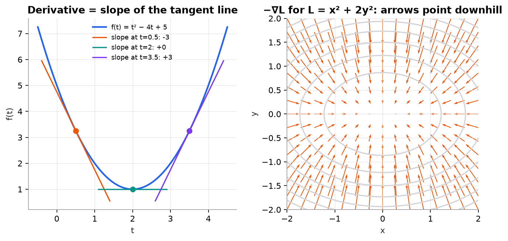

# Calculus for ML

> **Mental model.** A derivative answers "if I nudge this input a little, how much does the output change?" Training a model is asking that question for every parameter at once and nudging each one in the direction that lowers the loss.

**You will learn to**
- Compute derivatives of the functions that appear in ML (powers, exponentials, logarithms).
- Compute partial derivatives and assemble them into a gradient.
- Apply the chain rule to a composition of functions.
- Check a derivative numerically with finite differences.

**Why it matters.** Gradient descent needs gradients, and backpropagation is the chain rule applied systematically. You never need to integrate anything to do deep learning; you need derivatives, fluently.

## 1. Intuition

Imagine driving: your position changes over time, and your speed is how fast it changes right now. Speed is the derivative of position.

For a function like $f(t) = t^2 - 4t + 5$, the derivative at a point is the slope of the tangent line there. A positive slope means increasing $t$ increases $f$; negative means it decreases $f$; zero means you are at a flat spot, possibly a minimum.

With many inputs, a **partial derivative** measures sensitivity to one input while holding the others fixed. The **gradient** collects all the partial derivatives into a vector. It points in the direction of steepest increase, so its negative points downhill: exactly where gradient descent steps.

The **chain rule** handles functions inside functions. If a change in $w$ changes $z$, and a change in $z$ changes the loss, the effect of $w$ on the loss is the product of the two sensitivities.

## 2. Visualization



What to notice:
- The slope is zero exactly at the minimum, $t = 2$.
- On the right, arrows are longer where the surface is steeper and always cross contour lines at right angles. The $y$ direction is steeper (coefficient 2), so arrows lean vertically.

## 3. The math

### Symbols

| Symbol | Meaning |
|---|---|
| $f'(t)$ or $\frac{df}{dt}$ | derivative of $f$ with respect to $t$ |
| $\frac{\partial L}{\partial w}$ | partial derivative of $L$ with respect to $w$, others held fixed |
| $\nabla L$ | gradient: vector of all partial derivatives |
| $\ln$ | natural logarithm (base $e \approx 2.71828$) |

### Rules you will use constantly

| Function | Derivative |
|---|---|
| $c$ (constant) | $0$ |
| $t^n$ | $n t^{n-1}$ |
| $e^t$ | $e^t$ |
| $\ln t$ | $1/t$ |
| $\sigma(t) = 1/(1+e^{-t})$ | $\sigma(t)(1 - \sigma(t))$ |
| $a f(t) + b g(t)$ | $a f'(t) + b g'(t)$ |

**Chain rule.** If $L = g(z)$ and $z = h(w)$, then

```math
\frac{dL}{dw} = \frac{dL}{dz} \cdot \frac{dz}{dw}
```

**Gradient.** For $L(w_1, \dots, w_p)$, $\nabla L = \left[\frac{\partial L}{\partial w_1}, \dots, \frac{\partial L}{\partial w_p}\right]$.

### Worked example 1: a derivative

$f(t) = t^2 - 4t + 5$, so $f'(t) = 2t - 4$. At $t = 3$: $f(3) = 9 - 12 + 5 = 2$ and $f'(3) = 2$. Setting $f'(t) = 0$ gives $t = 2$, the minimum, with $f(2) = 1$.

**Numerical check:** $\frac{f(3.001) - f(2.999)}{0.002} = \frac{2.002001 - 1.998001}{0.002} = 2.000$. Always use this trick to test hand-derived gradients.

### Worked example 2: partial derivatives and a gradient

$L(x, y) = x^2 + 2y^2$. Treat $y$ as a constant to get $\partial L/\partial x = 2x$; treat $x$ as a constant to get $\partial L/\partial y = 4y$. At $(1, 1)$: $\nabla L = (2, 4)$. The negative gradient $(-2, -4)$ points toward the origin, steeper in $y$.

### Worked example 3: the chain rule on squared error

For one example, $L = (y - \hat{y})^2$ with $\hat{y} = wx + b$. Let $r = y - \hat{y}$.

```math
\frac{\partial L}{\partial w} = \frac{\partial L}{\partial r}\cdot\frac{\partial r}{\partial \hat{y}}\cdot\frac{\partial \hat{y}}{\partial w} = 2r \cdot (-1) \cdot x = 2(\hat{y} - y)x
```

With $x = 2$, $y = 7$, $w = 1$, $b = 0$: $\hat{y} = 2$, so $\partial L/\partial w = 2(2 - 7)(2) = -20$. A step with learning rate 0.1 gives $w = 1 - 0.1(-20) = 3$, and the new prediction is 6, much closer to 7.

## 4. Implementation

```python
import numpy as np

def numerical_grad(f, w, h=1e-5):
    """Central finite differences: one partial derivative per coordinate."""
    g = np.zeros_like(w, dtype=float)
    for i in range(len(w)):
        e = np.zeros_like(w, dtype=float); e[i] = h
        g[i] = (f(w + e) - f(w - e)) / (2 * h)
    return g

L = lambda p: p[0] ** 2 + 2 * p[1] ** 2
print(numerical_grad(L, np.array([1.0, 1.0])))   # ≈ [2. 4.]
```

With PyTorch, autograd does this exactly (not approximately):

```python
import torch
p = torch.tensor([1.0, 1.0], requires_grad=True)
(p[0] ** 2 + 2 * p[1] ** 2).backward()
print(p.grad)    # tensor([2., 4.])
```

Runnable script: [`code/00-foundations/foundations.py`](../../code/00-foundations/foundations.py).

## 5. Engineering

**Gradient checking.** Before trusting a hand-written gradient, compare it to finite differences on a few random inputs; relative error should be around $10^{-6}$ or smaller. Frameworks use automatic differentiation, which is exact, so you mostly need this when writing custom operations.

**Numerical issues.** $\ln(0)$ is $-\infty$ and $e^{1000}$ overflows. Libraries combine operations (log-softmax, BCE-with-logits) to stay stable; prefer them.

**Where gradients vanish.** The sigmoid's derivative is at most 0.25. Multiplying many such factors through the chain rule shrinks gradients toward zero in deep networks: the vanishing-gradient problem, covered in [backpropagation](../11-gradient-descent-backprop/02-backpropagation.md).

> [!WARNING]
> **Failure modes.** Sign errors (stepping uphill), forgetting the inner derivative in the chain rule, and using a finite-difference step $h$ so small that floating-point rounding dominates.

### Common mistakes

- Treating a partial derivative as if other variables also change.
- Dropping the factor 2 from a squared term (it only rescales the gradient, but it changes the effective learning rate).
- Confusing $\log_{10}$ with $\ln$; ML formulas use natural logs unless stated.

## 6. Knowledge check

<!-- quiz:calculus-for-ml -->
**[Take the calculus quiz](../../quizzes/calculus-for-ml.md)**
<!-- /quiz -->

**Practice exercise.** For $L(w) = \ln(1 + e^{w})$, compute $dL/dw$ and evaluate it at $w = 0$.

<details>
<summary>Solution</summary>

Chain rule: $\frac{1}{1 + e^{w}} \cdot e^{w} = \frac{e^w}{1+e^w} = \sigma(w)$. At $w = 0$: $\sigma(0) = 0.5$.
</details>

**Implementation challenge.** Use `numerical_grad` to verify the analytic gradient of the linear-regression MSE ($\frac{2}{n}\sum(\hat{y}-y)x$) on random data.

## Summary

- A derivative is a local slope; zero slope marks flat spots such as minima.
- Partial derivatives hold other inputs fixed; the gradient collects them and points uphill.
- The chain rule multiplies sensitivities along a chain of functions; backpropagation is this rule applied systematically.
- Check gradients with central finite differences.

**Next:** [Probability and statistics](03-probability-and-statistics.md)

**Related:** [Gradient descent](../11-gradient-descent-backprop/01-gradient-descent.md) · [Backpropagation](../11-gradient-descent-backprop/02-backpropagation.md)

## Interview angle

<details>
<summary><strong>Derive the derivative of the sigmoid and explain how it leads to vanishing gradients.</strong></summary>

$\sigma(t) = (1 + e^{-t})^{-1}$. Chain rule: $\sigma'(t) = -(1 + e^{-t})^{-2} \cdot (-e^{-t}) = \frac{e^{-t}}{(1+e^{-t})^2}$. Split it as $\frac{1}{1+e^{-t}} \cdot \frac{e^{-t}}{1+e^{-t}} = \sigma(t)\big(1 - \sigma(t)\big)$. The maximum is at $t = 0$, where $\sigma = 0.5$ and the derivative is $0.25$; at $|t| = 5$ it is about $0.0066$. Backpropagation multiplies one such factor per sigmoid layer, so through 10 layers the gradient shrinks by at least $0.25^{10} \approx 10^{-6}$, and far more if units saturate. Early layers stop learning. That is why hidden layers use ReLU-family activations (derivative 1 for positive inputs), along with careful initialization, normalization, and residual connections. Sigmoid is still fine at the output of a binary classifier when paired with cross-entropy, which cancels the $\sigma'$ term.

</details>

<details>
<summary><strong>Why does the negative gradient point in the direction of steepest descent? When does following it work poorly?</strong></summary>

For a small step $\delta$, the first-order Taylor expansion is $L(w + \delta) \approx L(w) + \nabla L \cdot \delta$. Among all steps of fixed length $\epsilon$, the change $\nabla L \cdot \delta = \lVert \nabla L \rVert \, \epsilon \cos\theta$ is most negative when $\cos\theta = -1$, that is, when $\delta$ points exactly opposite the gradient. So $-\nabla L$ is the locally steepest downhill direction, and its length is the slope. Two caveats interviewers look for. "Steepest" is measured in Euclidean distance in parameter space, so on badly scaled surfaces (like $x^2 + 2y^2$, or much worse ratios) the steepest direction does not point at the minimum and gradient descent zigzags; feature scaling and adaptive optimizers address this. And the guarantee is local: take too large a step and the linear approximation breaks, so the loss can go up.

</details>

<details>
<summary><strong>You wrote a custom layer with a hand-derived backward pass, and the model trains poorly. How do you check your gradients?</strong></summary>

Gradient checking with central differences. For each parameter $w_i$, compute $\frac{L(w + h e_i) - L(w - h e_i)}{2h}$ with $h \approx 10^{-5}$, and compare with the analytic gradient using relative error $\frac{|g_a - g_n|}{\max(|g_a|, |g_n|, \epsilon)}$. Around $10^{-7}$ means correct; $10^{-2}$ or worse means a bug. Practical details: run in float64, because in float32 rounding error dominates at small $h$; check a handful of random coordinates on a tiny input instead of every parameter; turn off dropout and other randomness so both evaluations see the same function; avoid kinks such as ReLU at exactly 0. Typical bugs it catches: a missing inner derivative in the chain rule, a sign error, a wrong sum over the batch dimension, a transposed matrix. PyTorch's `torch.autograd.gradcheck` automates this.

</details>

<details>
<summary><strong>For L(w) = (wx − y)² with x = 2, y = 7, w = 1: what is the gradient, and what learning rate lands exactly on the optimum in one step?</strong></summary>

The gradient is $2(\hat{y} - y)x = 2(2 - 7)(2) = -20$. The optimum is $w^* = y/x = 3.5$, so we need $1 - \eta(-20) = 3.5$, giving $\eta = 2.5/20 = 0.125$. That is no coincidence: the second derivative is $2x^2 = 8$, and $\eta = 1/8$ is the Newton step, which solves a quadratic in one move. The same curvature sets the stability limit: on a quadratic, gradient descent converges only if $\eta < 2/\text{curvature} = 0.25$. At exactly $0.25$ it bounces between $w = 1$ and $w = 6$ forever; above it, it diverges. With many parameters, the largest curvature (the top Hessian eigenvalue) caps the learning rate while the smallest sets how slowly you crawl along flat directions. Their ratio, the condition number, explains why badly scaled problems train slowly.

</details>
