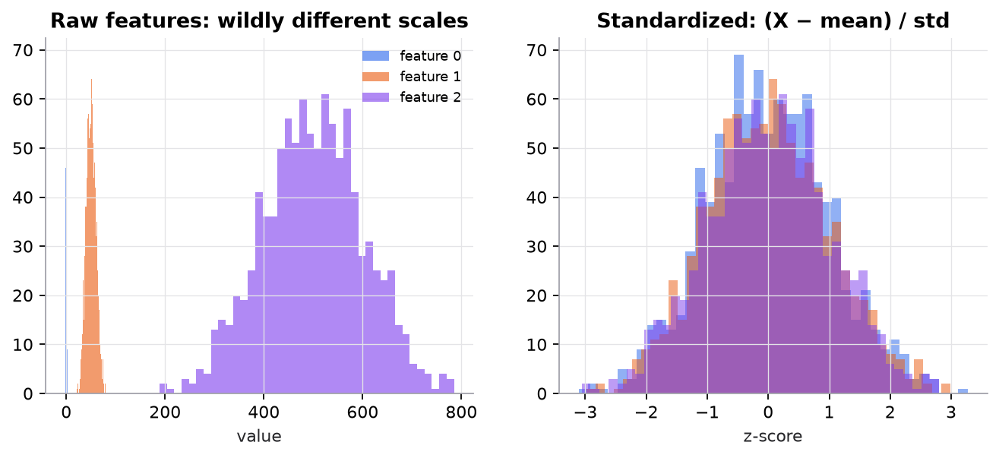

# The Python toolkit

> **Mental model.** NumPy is a calculator for whole arrays at once, pandas is a spreadsheet you can program, and matplotlib draws what you computed. Write operations on entire columns, never loops over rows.

**You will learn to**
- Create arrays, index and slice them, and reduce along an axis.
- Use broadcasting correctly (and recognize when it silently goes wrong).
- Load, inspect, clean, and group tabular data with pandas.
- Plot distributions and relationships with matplotlib.
- Make experiments reproducible with seeds and pinned environments.

**Why it matters.** Every lesson's code uses this stack. Vectorized code is shorter, easier to check against the math, and often 100× faster than Python loops.

## 1. Intuition

A NumPy array is a block of numbers of a single type with a **shape**. Operations apply element by element across the whole block, implemented in C. "Standardize every column" is one line: subtract the column means, divide by the column standard deviations.

**Broadcasting** lets arrays of different shapes combine: a `[1000, 3]` matrix minus a `[3]` vector subtracts the vector from every row. NumPy lines up shapes from the right and stretches dimensions of size 1.

pandas adds column names, mixed types, missing-value handling, and group-by on top of NumPy. Use it to explore and clean; convert to NumPy arrays (or pass DataFrames to scikit-learn) for modeling.

## 2. Visualization



*One broadcasting line, `(X - X.mean(axis=0)) / X.std(axis=0)`, standardizes all three columns.*

## 3. The math

### Broadcasting rules

Compare shapes from the rightmost dimension:

1. Dimensions are compatible if they are equal or one of them is 1.
2. Missing leading dimensions are treated as 1.
3. The result takes the larger size in each dimension.

| A | B | Result |
|---|---|---|
| `[1000, 3]` | `[3]` | `[1000, 3]` |
| `[1000, 3]` | `[1000, 1]` | `[1000, 3]` |
| `[1000]` | `[1000, 1]` | `[1000, 1000]` (usually a bug) |
| `[1000, 3]` | `[1000]` | error |

### Axis reductions

For $X$ of shape $[n, p]$: `X.mean(axis=0)` averages over rows, giving one value per column, shape $[p]$. `X.mean(axis=1)` gives one value per row, shape $[n]$.

### Worked example

$X = \begin{bmatrix}1 & 10\\3 & 30\end{bmatrix}$. Column means: $[2, 20]$. Population standard deviations: $[1, 10]$. Standardized: $\frac{X - [2, 20]}{[1, 10]} = \begin{bmatrix}-1 & -1\\1 & 1\end{bmatrix}$. Each column now has mean 0 and standard deviation 1.

## 4. Implementation

```python
import numpy as np
import pandas as pd
import matplotlib.pyplot as plt

rng = np.random.default_rng(42)                 # seeded: same numbers every run

# NumPy: vectorized standardization
X = rng.normal(size=(1000, 3)) * [1, 10, 100] + [0, 50, 500]
Z = (X - X.mean(axis=0)) / X.std(axis=0)        # [1000,3] - [3] broadcasts per row

# pandas: load, inspect, clean, aggregate
df = pd.DataFrame({"city": rng.choice(["A", "B", "C"], 1000),
                   "price": rng.normal(300, 50, 1000)})
df.loc[rng.choice(1000, 20, replace=False), "price"] = np.nan
print(df.describe())                            # summary statistics
print(df.isna().sum())                          # missing values per column
df["price"] = df["price"].fillna(df["price"].median())
print(df.groupby("city")["price"].agg(["mean", "count"]))

# matplotlib: always label axes
fig, ax = plt.subplots()
ax.hist(df["price"], bins=40)
ax.set(xlabel="price ($k)", ylabel="count", title="Price distribution")
fig.savefig("price.png", dpi=150)
```

Runnable script: [`code/00-foundations/foundations.py`](../../code/00-foundations/foundations.py). This repository pins its dependencies in [`pyproject.toml`](../../pyproject.toml); `uv run` creates the same environment on any machine.

## 5. Engineering

**Reproducibility.** Fix random seeds (`np.random.default_rng(seed)`, `random_state=` in scikit-learn), pin package versions, and record the data version. An experiment you can't rerun is an anecdote.

**Performance.** Vectorize; avoid `df.apply` with Python functions on large frames; use appropriate dtypes (`float32`, `category`). Out-of-memory data needs chunking or tools like Polars, DuckDB, or Spark.

**Exploratory data analysis checklist.** Shape and dtypes; missing values per column; duplicates; distributions and outliers; target balance; time ranges; obviously leaky columns (IDs, timestamps after the event, "status" fields).

> [!WARNING]
> **Failure modes.** Accidental `[n] - [n, 1]` broadcasting; chained pandas indexing (`df[df.a > 0]["b"] = 1`) that silently modifies a copy; integer division and dtype overflow; filling missing values using statistics from the whole dataset (leakage).

### Common mistakes

- Looping over rows instead of using column operations.
- Forgetting `axis=` and reducing the whole array to one number.
- Unseeded randomness, so results change every run.

## 6. Knowledge check

<!-- quiz:python-toolkit -->
**[Take the Python toolkit quiz](../../quizzes/python-toolkit.md)**
<!-- /quiz -->

**Practice exercise.** Without running it, give the shape of `A + B` for `A.shape == (5, 1, 4)` and `B.shape == (3, 1)`.

<details>
<summary>Solution</summary>

Align from the right: (5, 1, 4) and (_, 3, 1). Compare: 4 vs 1 gives 4; 1 vs 3 gives 3; 5 vs missing gives 5. Result `(5, 3, 4)`.
</details>

**Implementation challenge.** Load any CSV with pandas, write an EDA function that prints missing values, duplicate count, numeric summaries, and the five most common values of each categorical column, and plot a histogram of every numeric column.

## Summary

- NumPy operates on whole arrays; broadcasting aligns shapes from the right.
- Reduce with an explicit `axis`; check shapes after every step.
- pandas handles loading, cleaning, missing values, and group-bys; plot with labeled axes.
- Seed randomness and pin versions so experiments are reproducible.

**Next:** [The language of ML](../01-ml-vocabulary/01-ml-vocabulary.md)

**Related:** [The ML workflow](../02-ml-workflow/01-ml-workflow.md)
