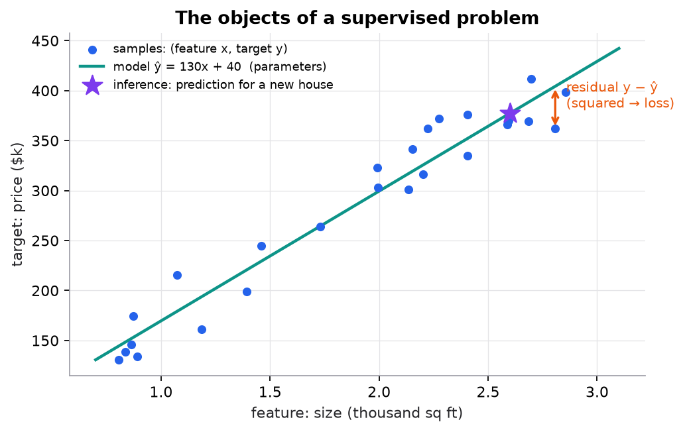

# The language of ML

> **Mental model.** A model is a parameterized function. Training searches for parameter values that make its predictions useful on examples it has not seen. Everything else is vocabulary for the pieces of that sentence.

**You will learn to**
- Define sample, feature, target, label, parameter, hyperparameter, prediction, loss, metric, training, inference, and generalization.
- Compute a prediction, residual, and squared error for one example.
- Say why a loss and a metric are often different functions.
- Explain what "generalization" means and why it is the actual goal.

**Why it matters.** Imprecise words cause real bugs: tuning a hyperparameter on the test set, optimizing a loss nobody cares about, reporting a training metric as if it were production performance. Precise vocabulary makes those mistakes visible.

## 1. Intuition

You want to predict house prices.

- Each house in your data is a **sample** (also called an observation, example, or row).
- What you know about it (size, bedrooms, location) are [features](../../glossary.md#feature), written $x$.
- What you want to predict (the sale price) is the **target**; in a training set it is the [label](../../glossary.md#label), written $y$.
- Your **model** is a function $f_\theta(x)$ that outputs a **prediction** $\hat{y}$.
- The numbers inside the model that training adjusts (slopes, weights) are [parameters](../../glossary.md#parameter) $\theta$.
- Settings you choose *before* training (how complex the model may be, how fast it learns) are [hyperparameters](../../glossary.md#hyperparameter).
- A [loss](../../glossary.md#loss) scores how wrong a prediction is in a way the optimizer can minimize.
- A [metric](../../glossary.md#metric) is how people judge the model: RMSE in dollars, precision, latency.
- **Training** fits the parameters on known examples; **inference** uses the fitted model on new ones.
- [Generalization](../../glossary.md#generalization) is how well the model does on data it never saw. That is the only performance that matters.

## 2. Visualization



*Synthetic data. Every labeled object in the figure is one of the terms above.*

## 3. The math

### Symbols

| Term | Symbol | Example |
|---|---|---|
| Sample | $(x_i, y_i)$ | one house |
| Feature vector | $x_i \in \mathbb{R}^p$ | `[2 bedrooms, 1.5 thousand sq ft]` |
| Target / label | $y_i$ | sale price |
| Parameters | $\theta$ (e.g. $w$, $b$) | regression slope and intercept |
| Hyperparameter | e.g. $\eta$, $\lambda$, $K$ | learning rate, penalty strength, number of neighbors |
| Prediction | $\hat{y}_i = f_\theta(x_i)$ | predicted price |
| Loss | $\ell(\hat{y}, y)$; training objective $L(\theta) = \frac{1}{n}\sum_i \ell(\hat{y}_i, y_i)$ | squared error |
| Metric | e.g. RMSE, F1 | error in dollars |

### Training versus inference

```math
\text{training: } \theta^* = \arg\min_\theta \frac{1}{n}\sum_{i=1}^{n} \ell\big(f_\theta(x_i), y_i\big) \qquad \text{inference: } \hat{y}_{\text{new}} = f_{\theta^*}(x_{\text{new}})
```

### Worked example

A model has parameters $w = [30, 120]$ (thousand dollars per bedroom and per thousand sq ft) and $b = 50$. A house has $x = [2, 1.5]$ and sold for $y = 310$ thousand.

1. Prediction: $\hat{y} = 2 \times 30 + 1.5 \times 120 + 50 = 60 + 180 + 50 = 290$.
2. Residual: $y - \hat{y} = 310 - 290 = 20$.
3. Squared-error loss: $20^2 = 400$ (thousand dollars squared, a unit nobody reports).
4. Metric for humans: across a test set you would report RMSE, the square root of the mean squared error, back in thousands of dollars.

Here, the loss and the metric are related. Often they aren't: a fraud model trains on cross-entropy but the business cares about recall at a fixed review budget.

## 4. Implementation

```python
from sklearn.linear_model import LinearRegression
from sklearn.metrics import mean_squared_error

model = LinearRegression()                 # hyperparameters are constructor arguments
model.fit(X_train, y_train)                # training: learns parameters coef_ and intercept_
print(model.coef_, model.intercept_)       # parameters
y_pred = model.predict(X_test)             # inference
rmse = mean_squared_error(y_test, y_pred) ** 0.5   # metric, on data the model never saw
```

Runnable script for this figure: [`code/02-ml-workflow/workflow.py`](../../code/02-ml-workflow/workflow.py).

## 5. Engineering

**Who sets what.** Parameters come from data via the optimizer. Hyperparameters come from you, chosen on a validation set (never the test set). Configuration such as feature lists and thresholds is part of the model version too.

**Training-serving skew.** Inference must compute features exactly as training did. A feature computed one way in a notebook and another way in the service silently degrades predictions.

**Generalization is measured, not assumed.** A training score says how well the model memorized. Only held-out data, split the way production data will differ, estimates generalization.

> [!IMPORTANT]
> **Loss versus metric.** The loss is what the optimizer minimizes (differentiable, per example). The metric is what stakeholders judge (can be non-differentiable, can depend on thresholds and costs). Choose the metric first, then a loss that pushes in the same direction.

### Common mistakes

- Calling the learning rate a "parameter," then trying to learn it with gradient descent.
- Reporting training accuracy as model quality.
- Tuning hyperparameters by looking at the test set.
- Optimizing accuracy when error costs are asymmetric.

## 6. Knowledge check

<!-- quiz:ml-vocabulary -->
**[Take the vocabulary quiz](../../quizzes/ml-vocabulary.md)**
<!-- /quiz -->

**Practice exercise.** In a spam filter built with logistic regression, classify each as feature, label, parameter, hyperparameter, loss, or metric: (a) the word count of "free"; (b) the regularization strength C; (c) the weight on "free"; (d) whether the user marked the email as spam; (e) binary cross-entropy; (f) precision on last week's emails.

<details>
<summary>Solution</summary>

(a) feature; (b) hyperparameter; (c) parameter; (d) label; (e) loss; (f) metric.
</details>

**Implementation challenge.** Fit `LinearRegression` on a synthetic dataset and print, side by side, training RMSE and test RMSE. Then add 50 random noise features and print both again. Explain the change in terms of generalization.

## Summary

- Samples have features $x$ and, in training data, labels $y$; the model maps $x$ to a prediction $\hat{y}$.
- Parameters are learned; hyperparameters are chosen; both define a model version.
- The loss drives optimization; the metric reflects the real goal; they can differ.
- Training fits on known data; inference predicts on new data; generalization is what counts.

**Next:** [Learning paradigms](02-learning-paradigms.md)

**Related:** [Linear regression](../03-regression/01-linear-regression.md) · [The ML workflow](../02-ml-workflow/01-ml-workflow.md) · [Glossary](../../glossary.md)

## Interview angle

<details>
<summary><strong>What's the difference between a parameter and a hyperparameter? Why can't you choose hyperparameters by minimizing training loss?</strong></summary>

Parameters are learned from data by the optimizer: the weights and bias of a linear model, the thresholds in a tree. Hyperparameters are fixed before training and control how learning happens or how complex the model may be: learning rate $\eta$, penalty strength $\lambda$, $K$ in KNN, tree depth. Most can't be fit on the training loss because the training loss rewards complexity: minimizing it over $\lambda$ always picks $\lambda = 0$, over tree depth always picks the deepest tree, over $K$ always picks $K = 1$. Each choice memorizes better and generalizes worse. So hyperparameters are chosen on held-out validation data, by grid, random, or Bayesian search, or with cross-validation, and the test set stays untouched until the final number. Feature lists, thresholds, and preprocessing settings are effectively hyperparameters too, and belong in the model version.

</details>

<details>
<summary><strong>Your fraud model trains on cross-entropy, but the business metric is recall at a fixed review budget. Why not train on the metric directly?</strong></summary>

Because the metric is not a usable training signal. Recall at a fixed budget depends on ranking examples and counting how many positives land above a cutoff, so it is piecewise constant in the weights: its gradient is zero almost everywhere. Cross-entropy is differentiable, defined per example, convex for logistic regression, and rewards well-ranked, calibrated scores, which is exactly what a budget-based decision needs. The standard workflow: choose the metric first, train with a loss that pushes in the same direction, then select models, hyperparameters, and the threshold on validation data using the real metric. When the mismatch hurts, use class weights, a ranking loss, or a smooth surrogate of the metric. The mistakes to avoid are reporting loss values to stakeholders and picking models by validation loss when the metric disagrees.

</details>

<details>
<summary><strong>Offline test RMSE is excellent, but production error is much worse with the same model file. What do you check?</strong></summary>

Start with training-serving skew: are features computed identically? Compare logged production feature values with what the training pipeline produces for the same entities; common culprits are a separate code path, unit or currency differences, timezone handling, default values for missing data, or features that use information not yet available at serving time (which also means the offline score was leaky). Next, check whether the test split resembled production: a random split on data with time structure or repeated entities overstates performance. Then check distribution shift: compare input feature distributions and the prediction distribution between the training period and now. Finally, verify the production labels and metric computation, including label delays. Lasting fixes: one shared feature pipeline or feature store, time-based evaluation splits, and monitoring of inputs and predictions.

</details>

<details>
<summary><strong>You fit a linear regression, then add 50 pure-noise features and refit. What happens to training RMSE and test RMSE, and why?</strong></summary>

Training RMSE goes down, or at least can't go up: least squares with more features has strictly more freedom, and it could always set the new weights to zero. With noise features it finds small, spurious correlations in this particular sample and uses them. Test RMSE goes up, because those learned weights fit noise that doesn't recur in new data and add error to every prediction. That widening gap is overfitting, and it shows why training error says nothing about generalization. Rough size: for a correctly specified linear model with $n$ rows and $p$ features, expected training MSE is about $\sigma^2(1 - p/n)$ and test MSE about $\sigma^2(1 + p/n)$, so 50 junk features on 200 rows moves each by roughly 25% of the noise variance, in opposite directions. Remedies: regularization, feature selection, or more data.

</details>
