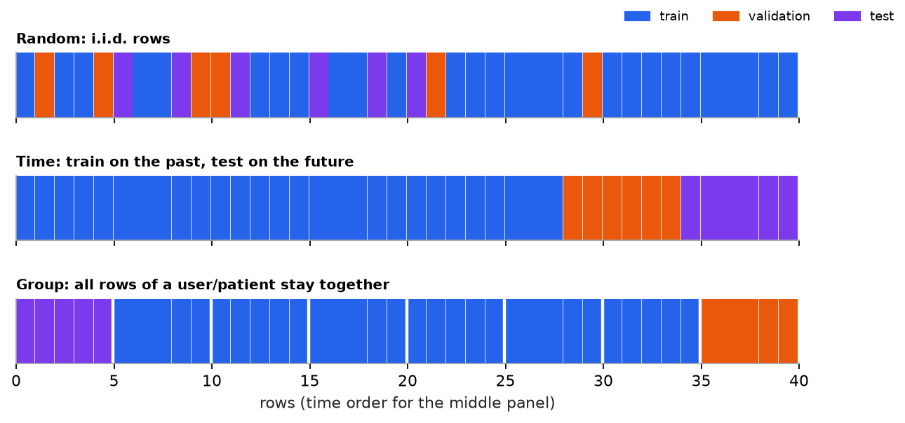

# Workflow, splits, and leakage

> **Mental model.** The test set is a dress rehearsal for production. Every decision about splitting, preprocessing, and features should ask: "Would this information exist at the moment we make a real prediction?"

**You will learn to**
- Walk through the nine-step ML workflow and name each step's deliverable.
- Choose random, stratified, time, or group splits for a problem.
- Detect three kinds of data leakage and measure their effect.
- Build a baseline and a leak-free preprocessing pipeline.
- Plan error analysis, deployment, and monitoring before training.

**Why it matters.** Most models that "worked in the notebook" and failed in production failed here: a random split for a forecasting problem, a feature that encodes the answer, preprocessing fit on all the data, or no monitoring after launch. Leakage produces numbers that look great and mean nothing.

## 1. Intuition

**Splits.** You train on one portion of the data, tune choices on a second (**validation**), and report final performance once on a third (**test**). The test set only estimates production performance if it differs from training the way production will:

- **Random split:** fine when examples are independent and identically distributed (i.i.d.).
- **Stratified split:** random, but preserving class proportions; important when one class is rare.
- **Time split:** train on the past, test on the future. Required for forecasting or any system where tomorrow's data informs nothing about yesterday.
- **Group split:** all rows of the same user, patient, or device go into the same split. Otherwise the model can recognize the *entity* rather than learn the *pattern*.

**Leakage** happens when training uses information that won't be available at prediction time:

- **Target leakage:** a feature recorded after the outcome ("refund issued" when predicting fraud).
- **Train-test contamination:** preprocessing (scaling, imputation, feature selection) fit on all data, or duplicates across splits.
- **Group/temporal leakage:** the same entity or future information appears on both sides of the split.

**Baselines.** Before any model, measure what a trivial rule achieves: predict the mean, the majority class, last week's value. A model that can't beat it isn't learning anything useful.

## 2. Visualization



Two measurements from the script (synthetic data):

| Setup | Score | What it means |
|---|---|---|
| Logistic regression, clean features | test accuracy 0.718 | honest estimate |
| Same, plus a feature recorded after the outcome | test accuracy 0.962 | impossible in production |
| 1-NN on repeated patient measurements, random 5-fold CV | 0.899 | memorizes patients |
| Same model, group 5-fold CV (patients never shared) | 0.498 | the truth: labels were pure noise |

The last two rows use labels that are *random*, unrelated to the features. A random split still reports 90% accuracy, because each patient's ten nearly identical rows land in both train and validation.

## 3. The math

### Symbols

| Symbol | Meaning |
|---|---|
| $\mathcal{D}_{\text{train}}, \mathcal{D}_{\text{val}}, \mathcal{D}_{\text{test}}$ | the three splits |
| $\hat{R}(f)$ | estimated risk (average loss or metric) of model $f$ on a split |
| $T$ | the time a prediction is made |
| $K$ | number of cross-validation folds |

### What a test score estimates

```math
\hat{R}_{\text{test}}(f) = \frac{1}{|\mathcal{D}_{\text{test}}|}\sum_{(x,y)\in \mathcal{D}_{\text{test}}} \ell\big(f(x), y\big) \;\approx\; \mathbb{E}_{(x,y)\sim \text{production}}\big[\ell(f(x), y)\big]
```

The approximation holds only if test examples are drawn like production examples and played no role in building $f$. Every leak breaks the second condition; a mismatched split breaks the first.

### K-fold cross-validation

Split the training data into $K$ folds; train on $K-1$, validate on the held-out fold, rotate, and average. It uses data efficiently for model selection, but the folds must respect the same rules as the final split (time-ordered folds for time series, group folds for grouped data).

### Worked example: is this feature legal?

Predicting at 9:00 on day $T$ whether a delivery will be late:

| Feature | Available at 9:00 on day $T$? | Verdict |
|---|---|---|
| distance to customer | yes | keep |
| driver's average lateness over the previous 30 days | yes, if computed from days before $T$ | keep, carefully |
| driver's average lateness over *all* data | no, includes the future | leak |
| actual delivery duration | no, it *is* the outcome | leak |
| weather forecast issued at 8:00 | yes | keep |
| observed weather at delivery time | no, unless the prediction is made later | leak |

## 4. Implementation

```python
from sklearn.compose import ColumnTransformer
from sklearn.impute import SimpleImputer
from sklearn.linear_model import LogisticRegression
from sklearn.model_selection import GroupKFold, TimeSeriesSplit, cross_val_score, train_test_split
from sklearn.pipeline import make_pipeline
from sklearn.preprocessing import OneHotEncoder, StandardScaler
from sklearn.dummy import DummyClassifier

# Stratified hold-out split (i.i.d. data)
X_train, X_test, y_train, y_test = train_test_split(X, y, test_size=0.2, stratify=y, random_state=42)

# Every preprocessing step lives INSIDE the pipeline, so it is fit on training folds only
pre = ColumnTransformer([
    ("num", make_pipeline(SimpleImputer(strategy="median"), StandardScaler()), numeric_cols),
    ("cat", OneHotEncoder(handle_unknown="ignore"), categorical_cols),
])
model = make_pipeline(pre, LogisticRegression(max_iter=1000))

baseline = cross_val_score(DummyClassifier(strategy="most_frequent"), X_train, y_train, cv=5).mean()
score = cross_val_score(model, X_train, y_train, cv=5).mean()

# Grouped or temporal data: use matching splitters
cross_val_score(model, X, y, cv=GroupKFold(5), groups=user_ids)
cross_val_score(model, X_time_sorted, y_time_sorted, cv=TimeSeriesSplit(5))
```

Runnable script with both leakage demonstrations and the figure: [`code/02-ml-workflow/workflow.py`](../../code/02-ml-workflow/workflow.py).

## 5. Engineering

**Before training.** Write the problem statement: decision, prediction unit, target definition, prediction time, metric, and baseline. Version the dataset. Do EDA: missing values, duplicates (especially near-duplicates across splits), outliers, label balance, time coverage.

**During training.** Use pipelines so preprocessing is part of the model. Track experiments (code version, data version, configuration, seed, metrics). Look at the test set once, at the end.

**After training.** Error analysis: slice performance by segment, time, and input type; read the worst errors. Then deployment (batch scoring versus an online API), and monitoring of input distributions, prediction distributions, and delayed ground-truth performance.

**Reproducibility.** A result you can't regenerate from data version, code version, config, and seed should not ship.

> [!WARNING]
> **Leakage smells.** A score far better than published work or a strong baseline; one feature with overwhelming importance; near-perfect validation scores on a hard problem; a feature whose name contains "status," "final," "outcome," or a timestamp after the event.

### Common mistakes

- Random splits on time series or grouped data.
- Scaling, imputing, or selecting features before splitting.
- Re-using the test set to make decisions until it is effectively a validation set.
- Skipping the baseline, so nobody knows whether 0.82 is good.
- No plan for monitoring, so drift is discovered by customers.

## 6. Knowledge check

<!-- quiz:ml-workflow -->
**[Take the workflow and leakage quiz](../../quizzes/ml-workflow.md)**
<!-- /quiz -->

**Practice exercise.** You predict next-month churn for each customer using data up to the end of this month. Your dataset has 24 monthly snapshots per customer. Describe a split that is both time-correct and group-correct.

<details>
<summary>Solution</summary>

Pick a cutoff month: train on snapshots before it, validate on the month after, test on the month after that (time split). To also prevent per-customer memorization, either accept that the same customers appear across time (realistic, since production scores existing customers) or, if the goal is generalizing to *new* customers, additionally hold out a set of customer IDs entirely. Never let a training snapshot use features computed from months after its own prediction date.
</details>

**Implementation challenge.** Take any classification dataset, deliberately add a leaky feature (the label plus noise), and show the inflated cross-validation score. Then write a check that flags any single feature whose solo cross-validated score is suspiciously close to the full model's.

## Summary

- The workflow is frame, collect, explore, split, baseline, train, evaluate, deploy, monitor.
- Split the way production differs: random for i.i.d., time for forecasting, group for entities.
- Leakage (target, contamination, group, or temporal) inflates scores; ask whether each feature exists at prediction time.
- Keep preprocessing in pipelines; beat a baseline; look at the test set once.

**Next:** [Overfitting and the bias-variance trade-off](02-overfitting-and-bias-variance.md)

**Related:** [Classification metrics](../04-classification/02-classification-metrics.md) · [Reliability, cost, and observability](../18-production-ai/02-reliability-cost-and-observability.md)
