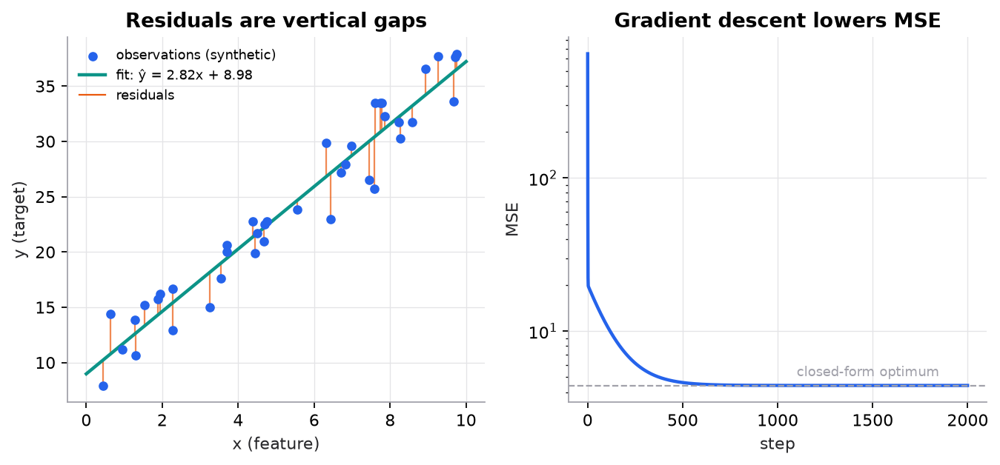

# Linear regression

> **Mental model.** Fit the flat line (or plane) that best explains the target as a weighted sum of features. "Best" means the vertical gaps between the line and the data, squared and averaged, are as small as possible.

**You will learn to**
- Write the prediction equation and name every symbol in it.
- Compute predictions, residuals, squared errors, and MSE by hand.
- Derive the gradient of MSE with respect to the slope and the bias, and take one gradient-descent step.
- Implement linear regression from scratch and with scikit-learn.
- Recognize when linear regression is the wrong tool.

**Why it matters.** Linear regression is the baseline for every continuous-prediction problem: prices, demand, latency, temperature. Its training loop (predict, measure loss, follow the gradient, update) is the same loop that trains neural networks and LLMs. If you understand it completely, the rest of the course is variations on a theme.

## 1. Intuition

Imagine you sell houses. Bigger houses usually cost more, but not perfectly: two houses of the same size can sell for different prices. You want a rule of thumb like:

> price ≈ (price per square foot) × size + (base price)

That rule is a straight line. The **slope** is the price per unit of size, and the **bias** (intercept) is where the line crosses zero size. Linear regression picks the slope and bias automatically, using past sales.

How does it judge a line? For each past sale it looks at the **residual**: the actual price minus the line's prediction. A good line has small residuals. Because residuals can be positive or negative, it squares them (so they cannot cancel, and big misses count extra) and averages them. That average is the **mean squared error** (MSE). Training means sliding and tilting the line until the MSE is as small as it gets.

With more than one feature (size, bedrooms, age), the line becomes a flat plane (or hyperplane), and each feature gets its own weight. The idea is unchanged.

## 2. Visualization

<!-- lab:linear-regression -->


*The data is synthetic (true slope 3, true bias 8, Gaussian noise). Gradient descent recovers slope 2.82 and bias 8.98, matching scikit-learn, because the noise in a sample of 40 points shifts the best fit away from the true values.*

*Interactive version: drag points, tilt the line, toggle L1/L2 penalties, and watch MSE and MAE update live. [Open the lab](https://sreshtalluri.github.io/ml-ai-learn/labs/linear-regression/).*
<!-- /lab -->

**Try it** (predict first, then check):

1. Press **Add outlier** and predict which way the best-fit line will tilt before pressing **Best fit**.
2. Raise the learning rate past 0.04 and press **Gradient step** a few times. Predict what MSE does first.
3. Switch to L1 and raise λ. At what value does the slope hit exactly zero, and why doesn't L2 do the same?

What to notice:
- Each orange segment is one residual. MSE is the average of their squared lengths.
- A single far-away point produces a long segment whose square dominates the sum. That is why MSE is sensitive to outliers.
- On the right, the loss drops fast at first (the gradient is large when the line is far off) and then slowly (the gradient shrinks near the optimum).

## 3. The math

### Symbols

| Symbol | Meaning | Shape |
|---|---|---|
| $n$ | number of examples (rows) | scalar |
| $p$ | number of features (columns) | scalar |
| $x_i$ | feature vector of example $i$ | $[p]$ |
| $X$ | all feature vectors stacked as rows | $[n, p]$ |
| $y_i$ | true target of example $i$ | scalar |
| $w$ | weight vector, one weight per feature (a **parameter**) | $[p]$ |
| $b$ | bias / intercept (a **parameter**) | scalar |
| $\hat{y}_i$ | the model's prediction for example $i$ | scalar |
| $\eta$ | learning rate (a **hyperparameter**) | scalar |

### Prediction

```math
\hat{y}_i = w_1 x_{i1} + w_2 x_{i2} + \dots + w_p x_{ip} + b = w \cdot x_i + b
```

For the whole dataset at once: $\hat{y} = Xw + b$. Check the shapes: $[n, p] \times [p] = [n]$, then $b$ is added to every entry.

### Loss: mean squared error

```math
\text{MSE}(w, b) = \frac{1}{n}\sum_{i=1}^{n}\left(y_i - \hat{y}_i\right)^2
```

The term $y_i - \hat{y}_i$ is the **residual**. MSE is the **loss** the optimizer minimizes. You might *report* a different **metric** to humans (RMSE, MAE, R²). Loss and metric are not the same thing.

### Gradients

With one feature, $\hat{y}_i = w x_i + b$. Apply the chain rule to each squared term. The derivative of $(y_i - \hat{y}_i)^2$ with respect to $\hat{y}_i$ is $-2(y_i - \hat{y}_i) = 2(\hat{y}_i - y_i)$. Then $\partial \hat{y}_i / \partial w = x_i$ and $\partial \hat{y}_i / \partial b = 1$. Averaging:

```math
\frac{\partial\,\text{MSE}}{\partial w} = \frac{2}{n}\sum_{i=1}^{n}(\hat{y}_i - y_i)\,x_i
\qquad
\frac{\partial\,\text{MSE}}{\partial b} = \frac{2}{n}\sum_{i=1}^{n}(\hat{y}_i - y_i)
```

Gradient descent moves each parameter a small step *against* its gradient:

```math
w \leftarrow w - \eta \frac{\partial\,\text{MSE}}{\partial w}
\qquad
b \leftarrow b - \eta \frac{\partial\,\text{MSE}}{\partial b}
```

### Worked example

Data: $x = [1, 2, 3]$, $y = [2, 4, 5]$. Start from $w = 1$, $b = 0$, and use learning rate $\eta = 0.1$.

**Step 1: predictions.** $\hat{y}_i = 1 \cdot x_i + 0$

| $i$ | $x_i$ | $y_i$ | $\hat{y}_i$ |
|---|---|---|---|
| 1 | 1 | 2 | $1 \times 1 + 0 = 1$ |
| 2 | 2 | 4 | $1 \times 2 + 0 = 2$ |
| 3 | 3 | 5 | $1 \times 3 + 0 = 3$ |

**Step 2: residuals** $y_i - \hat{y}_i$: $\;2-1 = 1,\;\; 4-2 = 2,\;\; 5-3 = 2$.

**Step 3: squared errors:** $1^2 = 1,\;\; 2^2 = 4,\;\; 2^2 = 4$.

**Step 4: MSE** $= (1 + 4 + 4)/3 = 9/3 = 3$.

**Step 5: gradient with respect to slope.** The errors $\hat{y}_i - y_i$ are $-1, -2, -2$.

```math
\frac{\partial\,\text{MSE}}{\partial w} = \frac{2}{3}\big[(-1)(1) + (-2)(2) + (-2)(3)\big] = \frac{2}{3}(-1 - 4 - 6) = \frac{2}{3}(-11) = -7.333
```

**Step 6: gradient with respect to bias.**

```math
\frac{\partial\,\text{MSE}}{\partial b} = \frac{2}{3}\big[(-1) + (-2) + (-2)\big] = \frac{2}{3}(-5) = -3.333
```

Both gradients are negative. That means increasing $w$ or $b$ would *decrease* the loss, so the update should increase them.

**Step 7: one gradient-descent update.**

```math
w \leftarrow 1 - 0.1 \times (-7.333) = 1 + 0.7333 = 1.7333
\qquad
b \leftarrow 0 - 0.1 \times (-3.333) = 0.3333
```

**Check.** New predictions are $1.7333 + 0.3333 = 2.067$, then $3.467 + 0.333 = 3.800$, then $5.200 + 0.333 = 5.533$. Residuals are $-0.067, 0.200, -0.533$. New MSE $= (0.0044 + 0.0400 + 0.2844)/3 = 0.1096$. One step took the loss from 3 to about 0.11.

> [!NOTE]
> For linear regression you do not *need* gradient descent. The normal equation $w = (X^\top X)^{-1}X^\top y$ solves it exactly. For this data it gives $w = 1.5$, $b = 0.667$, MSE $= 0.0556$. We use gradient descent here because it is the same algorithm that trains models with no closed form, like neural networks.

## 4. Implementation

**From scratch (NumPy):**

```python
import numpy as np

def fit_linear_regression(x, y, lr=0.01, steps=2000):
    w, b = 0.0, 0.0
    for _ in range(steps):
        y_hat = w * x + b                      # forward pass: predictions
        error = y_hat - y                      # (ŷ - y), shape [n]
        w -= lr * (2 / len(x)) * np.sum(error * x)
        b -= lr * (2 / len(x)) * np.sum(error)
    return w, b
```

**With scikit-learn:**

```python
from sklearn.linear_model import LinearRegression

model = LinearRegression()
model.fit(X_train, y_train)          # X_train shape [n, p], y_train shape [n]
print(model.coef_, model.intercept_) # learned w and b
y_pred = model.predict(X_test)
```

scikit-learn solves the least-squares problem directly (no learning rate to tune). Both approaches arrive at the same answer on the synthetic dataset (w ≈ 2.824, b ≈ 8.98).

Runnable script with the worked example, both implementations, and the figure: [`code/03-regression/linear_regression.py`](../../code/03-regression/linear_regression.py).

## 5. Engineering

**Good use cases.** Fast, interpretable baselines for continuous targets. Pricing and demand models where stakeholders want to read the coefficients. Situations with few examples, where a flexible model would overfit.

**Assumptions to check.**
- *Linearity:* the target changes roughly linearly with each feature. Plot residuals against predictions; a curve means you are missing a nonlinear term (try polynomial features or a tree model).
- *Independent errors:* residuals of one example do not predict another's. Time series often break this.
- *Constant error variance (homoscedasticity):* residual spread does not grow with the prediction. If it fans out, try predicting `log(y)`.
- *Low multicollinearity:* highly correlated features make individual weights unstable even when predictions are fine. Ridge regression fixes this.

**Preprocessing.** Scale features (standardize) when using gradient descent or regularization, otherwise the feature with the largest units dominates the step size and the penalty. Encode categorical features (one-hot). Fit every preprocessing step on the training split only.

**Cost.** Training via the normal equation costs $O(np^2 + p^3)$. Gradient descent costs $O(np)$ per step. Inference is a single dot product, $O(p)$, which is microseconds. Linear models are among the cheapest models to serve.

**Production concerns.** Coefficients drift when the world changes (for example, price per square foot rises). Monitor the residual distribution in production, not just the error average. Clip or validate inputs, because a linear model extrapolates without limit: a 50,000 sq ft input produces a confident, absurd price.

> [!WARNING]
> **Failure modes.** Outliers pull the line toward them, because squared error punishes big misses quadratically (MAE or Huber loss are more robust). Extrapolation far beyond the training range is unreliable. A good fit does not mean a causal relationship: a positive weight on "has a pool" does not mean adding a pool raises the price by exactly that much.

### Common mistakes

- Reporting training MSE as if it were test performance.
- Reading coefficient size as feature importance when features are on different scales.
- Forgetting the bias term, which forces the line through the origin.
- Fitting the scaler on all data before splitting (data leakage).
- Using a learning rate so large that the loss grows each step. Watch the loss curve.

## 6. Knowledge check

<!-- quiz:linear-regression -->
**[Take the linear regression quiz](../../quizzes/linear-regression.md)**: calculation, diagnosis, and design questions with explanations.
<!-- /quiz -->

**Practice exercise.** With data $x = [0, 1, 2]$, $y = [1, 3, 5]$, start at $w = 0$, $b = 0$, $\eta = 0.1$. Compute the MSE, both gradients, and the updated parameters.

<details>
<summary>Solution</summary>

Predictions are all 0. Residuals are 1, 3, 5. Squared errors are 1, 9, 25, so MSE = 35/3 = 11.667.
Errors $\hat{y} - y$ are $-1, -3, -5$.
$\partial/\partial w = \frac{2}{3}[(-1)(0) + (-3)(1) + (-5)(2)] = \frac{2}{3}(-13) = -8.667$.
$\partial/\partial b = \frac{2}{3}(-9) = -6$.
Update: $w = 0 + 0.8667 = 0.8667$, $b = 0 + 0.6 = 0.6$. (The true line is $y = 2x + 1$.)
</details>

**Implementation challenge.** Extend `fit_linear_regression` to multiple features using matrix operations: `y_hat = X @ w + b`, `grad_w = (2/n) * X.T @ (y_hat - y)`. Verify shapes ($X$ is $[n,p]$, $X^\top(\hat{y} - y)$ is $[p]$) and compare your weights with `LinearRegression` on a synthetic dataset with 3 features.

## Summary

- Linear regression predicts $\hat{y} = w \cdot x + b$: a weighted sum of features plus a bias.
- It is trained by minimizing MSE, the average squared residual.
- The gradients are $\frac{2}{n}\sum(\hat{y}-y)x$ for the weight and $\frac{2}{n}\sum(\hat{y}-y)$ for the bias. Gradient descent steps against them.
- It is cheap, interpretable, and a mandatory baseline, but it is sensitive to outliers and cannot capture nonlinear patterns without engineered features.

**Next:** [Regularization and regression metrics](02-regularization-and-regression-metrics.md)

**Related:** [Gradient descent](../11-gradient-descent-backprop/01-gradient-descent.md) · [Logistic regression](../04-classification/01-logistic-regression.md) · [Model card: linear regression](../../models/linear-regression.md)

## Interview angle

<details>
<summary><strong>Derive the gradient of the MSE loss for linear regression with respect to w and b.</strong></summary>

With $\hat{y}_i = w \cdot x_i + b$ and $\text{MSE} = \frac{1}{n}\sum_i (y_i - \hat{y}_i)^2$, apply the chain rule per term. The derivative of $(y_i - \hat{y}_i)^2$ with respect to $\hat{y}_i$ is $-2(y_i - \hat{y}_i) = 2(\hat{y}_i - y_i)$; then $\partial \hat{y}_i/\partial w = x_i$ and $\partial \hat{y}_i/\partial b = 1$. Averaging: $\nabla_w = \frac{2}{n}\sum_i(\hat{y}_i - y_i)\,x_i$ and $\partial_b = \frac{2}{n}\sum_i(\hat{y}_i - y_i)$. In matrix form, $\nabla_w = \frac{2}{n}X^\top(Xw + b - y)$: error times input. Quick check with $x = [1, 2, 3]$, $y = [2, 4, 5]$, $w = 1$, $b = 0$: the errors are $-1, -2, -2$, so $\nabla_w = \frac{2}{3}(-1 - 4 - 6) = -7.33$. Setting the gradient to zero gives the normal equation $X^\top X w = X^\top y$, with the bias absorbed as a column of ones.

</details>

<details>
<summary><strong>Normal equation or gradient descent: when do you use each for linear regression?</strong></summary>

The normal equation $w = (X^\top X)^{-1}X^\top y$ is exact with no learning rate, but costs $O(np^2 + p^3)$ and needs the $p \times p$ matrix in memory: fine for thousands of features, painful beyond roughly $10^4$ to $10^5$. Libraries never actually invert it; they use QR, Cholesky, or SVD, which are more stable when features are nearly collinear and $X^\top X$ is ill-conditioned. Gradient descent costs $O(np)$ per step, streams minibatches when data doesn't fit in memory, supports online updates, and extends to penalties like lasso and to models with no closed form. Its costs: tuning the learning rate, needing scaled features to converge quickly, and only approximate convergence. Rule: for moderate $p$ with data in memory, use a direct solver (scikit-learn's `LinearRegression` does); for huge $n$ or $p$, or streaming data, use SGD.

</details>

<details>
<summary><strong>Your residuals-versus-predictions plot fans out: residual spread grows with the prediction. What does that mean, and what do you do?</strong></summary>

Heteroscedasticity: error variance grows with the size of the target, typical for prices, incomes, and counts, where errors are roughly proportional. Consequences: coefficients remain unbiased, but standard errors and confidence intervals are wrong, and MSE training is dominated by the large-valued examples, so small-valued ones get relatively poor fits. Fixes: model `log(y)` so errors become multiplicative and roughly constant (back-transform carefully: exponentiating the predicted mean log gives the median, not the mean, so apply a smearing correction if you need the mean); weighted least squares with weights inversely proportional to the estimated variance; heteroscedasticity-robust standard errors if you only need inference; or a loss aligned with relative error. A curved pattern in the same plot means something else: a missing nonlinear term.

</details>

<details>
<summary><strong>Two features have correlation 0.98. What happens to their coefficients, and does it hurt predictions?</strong></summary>

The fit can trade weight between them almost freely: many combinations of $w_1$ and $w_2$ give nearly the same predictions, so $X^\top X$ is nearly singular and the coefficients become large, high-variance, sometimes opposite in sign, and they swing between retrains on slightly different data. Predictions on data with the same correlation structure are usually fine, because the combined effect is well determined. The damage is to interpretation ("feature 2 has a negative effect" is meaningless) and to robustness: if production data breaks the correlation, predictions become unstable. Diagnose with variance inflation factors or the condition number of $X$. Fix with ridge regression, which shrinks and shares weight across the pair; drop or combine one feature; or use PCA. Lasso keeps one of the pair somewhat arbitrarily, so don't read its choice as causal.

</details>
