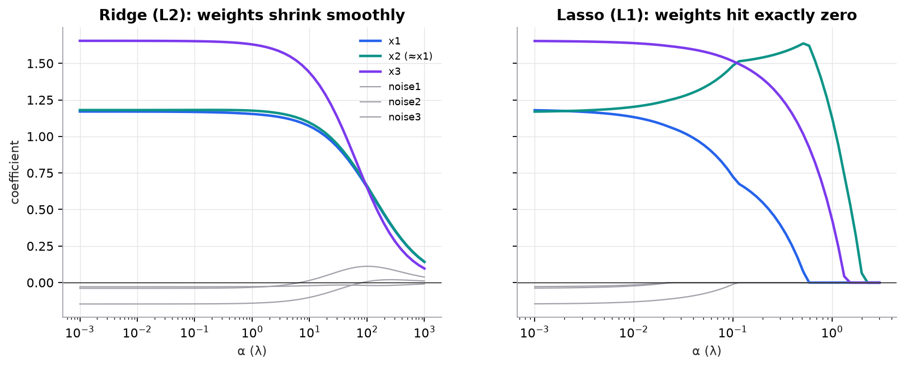

# Regularization and regression metrics

> **Mental model.** Regularization charges the model a fee for large weights. Ridge (L2) charges by the square of each weight, so it shrinks everything a little. Lasso (L1) charges by absolute size, so it pushes unimportant weights all the way to zero.

**You will learn to**
- Write the ridge, lasso, and elastic-net objectives and explain each penalty's effect.
- Compute the regularized weight for a one-feature problem by hand.
- Handle multicollinearity, feature scaling, and polynomial features with regularization.
- Compute MAE, RMSE, R², and MAPE and pick the one that matches the cost of errors.

**Why it matters.** Plain least squares overfits when there are many features, correlated features, or engineered polynomial terms. Regularization is the standard fix, and the same ideas reappear as weight decay in neural networks. Choosing the wrong metric, meanwhile, can make a model look good while its expensive errors go unnoticed.

## 1. Intuition

Least squares only cares about fitting the training data. Give it two nearly identical features and it may assign $+50$ to one and $-47$ to the other: the predictions are fine, the weights are nonsense, and tiny changes in the data swing them wildly (high variance).

Adding a penalty for large weights says: "fit the data, but stay simple." **Ridge** prefers to spread weight evenly across correlated features. **Lasso** prefers to pick one and set the rest to zero, which acts as automatic feature selection. **Elastic net** mixes both.

The penalty strength $\lambda$ is a hyperparameter: $\lambda = 0$ is plain least squares; very large $\lambda$ forces all weights toward zero (underfitting). Choose it by cross-validation.

**Metrics** answer a different question: once trained, how wrong is the model, in terms someone cares about? MAE treats every unit of error the same. RMSE punishes large errors extra. R² compares the model with predicting the mean. MAPE measures percentage error.

## 2. Visualization

<!-- lab:linear-regression -->


*Synthetic data: $y = 3x_1 + 1.5x_3 + \text{noise}$, with $x_2$ a near-copy of $x_1$ and three pure-noise features (gray). With moderate penalties, lasso zeroes all three noise features while ridge only shrinks them.*

*Interactive version: in the linear regression lab, switch the penalty to L1 or L2 and drag λ to watch the optimal slope shrink. [Open the lab](https://sreshtalluri.github.io/ml-ai-learn/labs/linear-regression/).*
<!-- /lab -->

## 3. The math

### Symbols

| Symbol | Meaning |
|---|---|
| $w_j$ | weight of feature $j$ (the bias $b$ is not penalized) |
| $\lambda \ge 0$ | penalty strength (`alpha` in scikit-learn) |
| $\alpha \in [0,1]$ | elastic-net mix between L1 and L2 (`l1_ratio`) |
| $\bar{y}$ | mean of the targets |
| $s_{xy}, s_{xx}$ | (population) covariance of $x$ and $y$, and variance of $x$ |

### Objectives

```math
\text{Ridge: } \frac{1}{n}\sum_i (y_i - \hat{y}_i)^2 + \lambda \sum_j w_j^2
\qquad
\text{Lasso: } \frac{1}{n}\sum_i (y_i - \hat{y}_i)^2 + \lambda \sum_j |w_j|
```

```math
\text{Elastic net: } \frac{1}{n}\sum_i (y_i - \hat{y}_i)^2 + \lambda\Big(\alpha\sum_j |w_j| + (1-\alpha)\sum_j w_j^2\Big)
```

(Libraries scale these terms slightly differently; the shapes of the effects are the same.)

### One feature, solved by hand

With one feature and the objectives above, setting the derivative to zero gives closed forms:

```math
w_{\text{OLS}} = \frac{s_{xy}}{s_{xx}}, \qquad
w_{\text{ridge}} = \frac{s_{xy}}{s_{xx} + \lambda}, \qquad
w_{\text{lasso}} = \frac{\operatorname{sign}(s_{xy})\max\!\big(|s_{xy}| - \lambda/2,\; 0\big)}{s_{xx}}
```

The ridge derivation: $\frac{d}{dw}\big[s_{yy} - 2ws_{xy} + w^2 s_{xx} + \lambda w^2\big] = -2s_{xy} + 2w(s_{xx} + \lambda) = 0$. Lasso's absolute value has a corner at 0, which is exactly why it can land on 0 (soft-thresholding).

### Worked example

Data from the previous lesson: $x = [1, 2, 3]$, $y = [2, 4, 5]$. Means $\bar{x} = 2$, $\bar{y} = 11/3$.

- $s_{xx} = \frac{(-1)^2 + 0^2 + 1^2}{3} = \frac{2}{3} = 0.667$
- $s_{xy} = \frac{(-1)(2 - 3.667) + 0 + (1)(5 - 3.667)}{3} = \frac{1.667 + 1.333}{3} = 1$
- OLS: $w = 1 / 0.667 = 1.5$ (matching the normal equation in the previous lesson).

| $\lambda$ | Ridge $\frac{1}{0.667 + \lambda}$ | Lasso $\frac{\max(1 - \lambda/2,\,0)}{0.667}$ |
|---|---|---|
| 0.5 | 0.857 | 1.125 |
| 1 | 0.600 | 0.750 |
| 2 | 0.375 | **0** |

Ridge keeps shrinking but never reaches zero; lasso hits exactly zero once $\lambda \ge 2|s_{xy}| = 2$.

### Regression metrics

```math
\text{MAE} = \frac{1}{n}\sum|y_i - \hat{y}_i|, \quad
\text{RMSE} = \sqrt{\frac{1}{n}\sum(y_i - \hat{y}_i)^2}, \quad
R^2 = 1 - \frac{\sum(y_i - \hat{y}_i)^2}{\sum(y_i - \bar{y})^2}, \quad
\text{MAPE} = \frac{100\%}{n}\sum\left|\frac{y_i - \hat{y}_i}{y_i}\right|
```

**Worked example.** True prices $[200, 250, 300, 350, 400]$, predictions $[210, 240, 310, 340, 405]$. Errors: $-10, 10, -10, 10, -5$. MAE $= 45/5 = 9.0$. RMSE $= \sqrt{(100+100+100+100+25)/5} = \sqrt{85} = 9.2$.

Now change the last prediction to 300 (one big miss of 100). MAE becomes $(10+10+10+10+100)/5 = 28.0$ while RMSE becomes $\sqrt{(400 + 10{,}000)/5} = \sqrt{2080} = 45.6$. RMSE jumped five-fold because one error dominates the squares. R² drops from 0.983 to 0.584, and MAPE goes from 3.3% to 8.0%.

## 4. Implementation

```python
from sklearn.linear_model import ElasticNetCV, LassoCV, RidgeCV
from sklearn.pipeline import make_pipeline
from sklearn.preprocessing import PolynomialFeatures, StandardScaler

# Scale first: penalties compare weights, so features must share a scale.
ridge = make_pipeline(StandardScaler(), RidgeCV(alphas=[0.01, 0.1, 1, 10, 100])).fit(X_train, y_train)
lasso = make_pipeline(StandardScaler(), LassoCV(cv=5)).fit(X_train, y_train)
poly = make_pipeline(PolynomialFeatures(degree=5), StandardScaler(), RidgeCV()).fit(X_train, y_train)
enet = make_pipeline(StandardScaler(), ElasticNetCV(l1_ratio=[0.2, 0.5, 0.8], cv=5)).fit(X_train, y_train)
print(lasso[-1].coef_)   # exact zeros = features lasso dropped
```

Runnable script (coefficient paths, the one-feature numbers, and the metric comparison): [`code/03-regression/regularization.py`](../../code/03-regression/regularization.py).

## 5. Engineering

**Always scale before penalizing.** A feature measured in millimeters needs a weight 1,000 times smaller than the same feature in meters, so an unscaled penalty punishes features by their units, not their importance.

**Multicollinearity.** Highly correlated features make least-squares weights unstable. Ridge stabilizes them by sharing weight. Lasso picks one somewhat arbitrarily: in the script, lasso kept the near-copy $x_2$ (1.57) over the real $x_1$ (0.40). Don't read lasso's choice among correlated features as "the true cause."

**Polynomial features** let a linear model fit curves but explode the number of features; pair them with regularization.

**Choosing a metric.** MAE when every unit of error costs the same (and when outliers shouldn't dominate). RMSE when large errors are disproportionately bad. R² for "how much better than the mean," and note it can be negative on test data. MAPE when relative error matters, but avoid it when targets can be near zero (division blows up) and remember it penalizes over- and under-prediction asymmetrically.

**Assumptions of linear regression** (linearity, independent errors, constant variance, no severe multicollinearity) still apply to regularized models; regularization helps with the last one.

> [!WARNING]
> **Failure modes.** Penalizing unscaled features; choosing λ on the test set; interpreting lasso's zeros as proof a feature is irrelevant; reporting RMSE alone when a few huge errors drive it; MAPE on targets near zero.

### Common mistakes

- Penalizing the bias term.
- Forgetting that `alpha` in scikit-learn is λ, while `l1_ratio` is the elastic-net mix.
- Comparing R² across different datasets or target transformations.

## 6. Knowledge check

<!-- quiz:regularization-and-regression-metrics -->
**[Take the regularization and metrics quiz](../../quizzes/regularization-and-regression-metrics.md)**
<!-- /quiz -->

**Practice exercise.** For a one-feature problem with $s_{xx} = 2$ and $s_{xy} = 3$, compute the OLS weight, the ridge weight for $\lambda = 1$, and the lasso weight for $\lambda = 2$ and $\lambda = 8$.

<details>
<summary>Solution</summary>

OLS $3/2 = 1.5$. Ridge $3/(2+1) = 1.0$. Lasso $\lambda=2$: $(3 - 1)/2 = 1.0$. Lasso $\lambda = 8$: $\max(3 - 4, 0)/2 = 0$.
</details>

**Implementation challenge.** Fit polynomial regression of degree 12 on 20 noisy points from a sine curve, with and without `RidgeCV`. Plot both fits and report validation RMSE.

## Summary

- Ridge adds $\lambda\sum w^2$ and shrinks weights smoothly; lasso adds $\lambda\sum|w|$ and sets some exactly to zero; elastic net mixes them.
- For one feature: ridge divides by $s_{xx} + \lambda$; lasso soft-thresholds $s_{xy}$ by $\lambda/2$.
- Scale features first; pick λ by cross-validation.
- MAE is robust; RMSE punishes big misses; R² compares with the mean; MAPE is relative and breaks near zero.

**Next:** [Logistic regression](../04-classification/01-logistic-regression.md)

**Related:** [Linear regression](01-linear-regression.md) · [Training and regularization in neural networks](../12-training-regularization/01-training-and-regularization.md) · [Model card: ridge](../../models/ridge-regression.md) · [Model card: lasso](../../models/lasso-regression.md)

## Interview angle

<details>
<summary><strong>Why does L1 regularization produce sparse solutions while L2 doesn't?</strong></summary>

Look at the one-feature solutions. Ridge gives $w = s_{xy}/(s_{xx} + \lambda)$, which shrinks toward zero but only reaches it as $\lambda \to \infty$. Lasso gives soft-thresholding, $w = \operatorname{sign}(s_{xy})\max(|s_{xy}| - \lambda/2, 0)/s_{xx}$, which is exactly zero once $\lambda \ge 2|s_{xy}|$. The reason is the penalty's slope near zero. L2's derivative $2\lambda w$ vanishes as $w \to 0$, so its push weakens and never finishes the job. L1's derivative is $\lambda\,\operatorname{sign}(w)$, a constant force regardless of how small $w$ is; if the data's pull on a weight is weaker than that force, zero is optimal, sitting at the corner of $|w|$ where the subgradient covers the data gradient. Geometrically, the L1 constraint region is a diamond with corners on the axes, and loss contours usually first touch it at a corner.

</details>

<details>
<summary><strong>Ridge, lasso, or elastic net: how do you choose?</strong></summary>

Ridge when you believe many features each contribute a little, or features are correlated: it keeps all of them, shares weight within correlated groups, and gives stable coefficients. Lasso when you expect only a few features to matter and want automatic feature selection for a smaller, more interpretable model; but it picks one feature from a correlated group somewhat arbitrarily, and with $p > n$ it selects at most $n$ features. Elastic net mixes the two through `l1_ratio`: it still produces zeros but tends to keep or drop correlated features together, which makes it the usual default for sparse models over correlated inputs such as n-grams or genomics. In every case: standardize first, don't penalize the bias, and choose $\lambda$ (and the mix) by cross-validation, for example with `ElasticNetCV`. When only predictive accuracy matters, the differences are often small, so try more than one.

</details>

<details>
<summary><strong>You fit lasso on unscaled features: income in dollars and age in years. Income keeps a nonzero weight and age is set to zero. Is age irrelevant?</strong></summary>

Not established. The penalty $\lambda\sum_j|w_j|$ compares raw coefficient sizes, and coefficient size depends on units. Income in dollars spans tens of thousands, so even a strong effect needs only a tiny weight per dollar, which costs almost nothing in penalty. Age spans about 60 units, so the same predictive effect needs a much larger weight and pays a much larger penalty. Lasso zeroed age partly because of its units; rescale income to thousands of dollars and the outcome could change. Fix: standardize all features (fit the scaler on training data inside a pipeline) so each penalty is per standard deviation, then refit with $\lambda$ chosen by cross-validation. Even then, a zero isn't proof of irrelevance: lasso drops features that are redundant given others, and its selection is unstable across resamples. Check with stability selection or permutation importance.

</details>

<details>
<summary><strong>Your model misses by 10 on four houses and by 100 on a fifth. Compute MAE and RMSE. Which would you report?</strong></summary>

MAE $= (10 + 10 + 10 + 10 + 100)/5 = 28$. RMSE $= \sqrt{(4 \times 100 + 10{,}000)/5} = \sqrt{2080} = 45.6$. Without the big miss, both would be 10. RMSE squares errors before averaging, so one large error dominates; MAE grows linearly. Which to report depends on what errors cost. If a single large miss is disproportionately bad (stock-outs, safety margins), RMSE reflects that, and training with MSE is aligned with it. If every unit of error costs the same, or large label errors are partly noise, MAE is more honest and more robust. The ratio is itself a diagnostic: RMSE/MAE of 1.6 here signals heavy-tailed errors, so inspect the worst cases. Also note what each loss estimates: MSE is minimized by the conditional mean, MAE by the conditional median.

</details>
