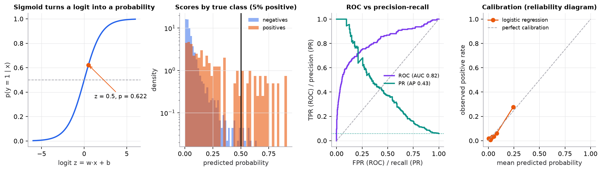

# Classification metrics and thresholds

> **Mental model.** The model produces a score; the threshold turns the score into an action. Lowering the threshold catches more positives and raises more false alarms. Where to put it is a product decision, made with the real cost of each kind of mistake.

**You will learn to**
- Fill in a confusion matrix and compute accuracy, precision, recall, specificity, and F1.
- Explain why accuracy misleads on imbalanced data.
- Read ROC and precision-recall curves and know when each is appropriate.
- Check calibration with a reliability diagram.
- Choose a threshold by minimizing expected cost.

**Why it matters.** Two models with the same AUC can lead to very different products depending on the threshold. And a fraud or medical model with 99% accuracy can be useless. The metric you optimize decides what you ship.

## 1. Intuition

Every binary prediction lands in one of four cells:

| | Predicted positive | Predicted negative |
|---|---|---|
| **Actually positive** | true positive (TP): caught | false negative (FN): missed |
| **Actually negative** | false positive (FP): false alarm | true negative (TN): correctly ignored |

- **Precision**: of the alarms you raised, how many were real? (Wasted reviewer time.)
- **Recall** (sensitivity, true-positive rate): of the real positives, how many did you catch? (Missed fraud, missed disease.)
- **Specificity**: of the real negatives, how many did you correctly leave alone?

Raising the threshold makes the model pickier: precision usually rises, recall falls. Lowering it does the opposite. No threshold maximizes both, so you choose based on which error costs more.

## 2. Visualization

<!-- lab:threshold -->


*Synthetic, imbalanced data (5.9% positive in the test half). At the default threshold of 0.5 the model's accuracy is 0.949, barely above the 0.941 of always predicting "negative," and it catches only 17% of positives. ROC AUC looks respectable (0.82); the precision-recall curve (AP 0.43) is the honest picture for a rare class.*

*Interactive version: move the threshold and the cost of each error, and watch the confusion matrix, metrics, ROC point, and calibration curve update. [Open the lab](https://sreshtalluri.github.io/ml-ai-learn/labs/threshold/).*
<!-- /lab -->

## 3. The math

### Symbols

| Symbol | Meaning |
|---|---|
| $s_i$ | model score (probability) for example $i$ |
| $t$ | decision threshold: predict positive if $s_i \ge t$ |
| TP, FP, FN, TN | confusion-matrix counts at threshold $t$ |
| $c_{FP}, c_{FN}$ | cost of one false positive and one false negative |

### Metrics

```math
\text{Accuracy} = \frac{TP + TN}{TP + FP + FN + TN}, \quad
\text{Precision} = \frac{TP}{TP + FP}, \quad
\text{Recall} = \frac{TP}{TP + FN}, \quad
\text{Specificity} = \frac{TN}{TN + FP}
```

```math
F_1 = \frac{2 \cdot \text{Precision} \cdot \text{Recall}}{\text{Precision} + \text{Recall}}
\qquad
\text{FPR} = 1 - \text{Specificity}
```

F1 is the harmonic mean, so it is low if *either* precision or recall is low.

**ROC curve:** plot recall (TPR) against FPR for every threshold. AUC is the probability that a random positive scores higher than a random negative. **Precision-recall curve:** plot precision against recall; its baseline is the positive rate, so it exposes performance on rare classes that ROC can hide.

**Expected cost at threshold $t$:** $\text{Cost}(t) = c_{FP}\cdot FP(t) + c_{FN}\cdot FN(t)$. Choose $t$ to minimize it on validation data.

**Calibration:** among examples scored around 0.3, about 30% should be positive. A reliability diagram bins scores and plots the observed positive rate against the mean score; perfect calibration lies on the diagonal.

### Worked example

Ten examples with scores and labels:

| Score | 0.95 | 0.85 | 0.80 | 0.70 | 0.55 | 0.45 | 0.40 | 0.30 | 0.20 | 0.10 |
|---|---|---|---|---|---|---|---|---|---|---|
| Label | 1 | 1 | 0 | 1 | 0 | 1 | 0 | 0 | 1 | 0 |

**Threshold 0.5.** Predicted positive: the top five. TP = 3 (0.95, 0.85, 0.70), FP = 2 (0.80, 0.55), FN = 2 (0.45, 0.20), TN = 3.
Precision $= 3/5 = 0.600$; recall $= 3/5 = 0.600$; F1 $= 0.600$; accuracy $= 6/10 = 0.60$.

**Threshold 0.3.** Predicted positive: the top eight. TP = 4, FP = 4, FN = 1, TN = 1.
Precision $= 4/8 = 0.500$; recall $= 4/5 = 0.800$; F1 $= \frac{2(0.5)(0.8)}{1.3} = 0.615$; accuracy $= 5/10 = 0.50$.

**Cost.** If a missed positive costs 10 and a false alarm costs 1: at 0.5, cost $= 2 \times 1 + 2 \times 10 = 22$; at 0.3, cost $= 4 \times 1 + 1 \times 10 = 14$. The lower threshold wins even though accuracy dropped.

## 4. Implementation

```python
import numpy as np
from sklearn.metrics import (average_precision_score, classification_report, confusion_matrix,
                             precision_recall_curve, roc_auc_score)

proba = clf.predict_proba(X_val)[:, 1]
print(roc_auc_score(y_val, proba), average_precision_score(y_val, proba))

# Choose the threshold that minimizes expected cost on VALIDATION data
c_fp, c_fn = 1, 10
thresholds = np.linspace(0, 1, 101)
costs = [c_fp * ((proba >= t) & (y_val == 0)).sum() + c_fn * ((proba < t) & (y_val == 1)).sum() for t in thresholds]
t_best = thresholds[int(np.argmin(costs))]

pred = proba >= t_best
print(confusion_matrix(y_val, pred))
print(classification_report(y_val, pred, digits=3))
```

Runnable script (worked example, imbalanced comparison, ROC/PR, calibration): [`code/04-classification/classification.py`](../../code/04-classification/classification.py).

## 5. Engineering

**When precision matters more:** spam filtering (a lost legitimate email is costly), automated actions with no human review, alerting where reviewers' time is scarce.

**When recall matters more:** cancer screening, fraud detection with human review, safety-critical detection where a miss is far worse than a false alarm.

**Class imbalance.** Report precision, recall, and PR-AUC rather than accuracy. Use stratified splits. Class weights or resampling can help training, but the threshold choice usually matters more.

**Calibration.** If downstream code uses probabilities (expected-cost decisions, ranking across models, showing a risk score), calibrate with Platt scaling or isotonic regression on a held-out set. Trees, boosting, SVMs, and neural nets are often miscalibrated.

**Thresholds drift.** If the positive rate changes in production, the precision at a fixed threshold changes too. Monitor the alert rate and delayed ground truth.

> [!WARNING]
> **Failure modes.** Accuracy on imbalanced data; tuning the threshold on the test set; reporting only ROC AUC for a rare class; treating a model score as a calibrated probability; using the default 0.5 threshold because it is the default.

### Common mistakes

- Swapping precision and recall in the formulas.
- Averaging F1 across classes without saying macro or micro.
- Comparing models at different thresholds and calling it a model comparison.

## 6. Knowledge check

<!-- quiz:classification-metrics -->
**[Take the classification metrics quiz](../../quizzes/classification-metrics.md)**
<!-- /quiz -->

**Practice exercise.** A screening model on 1,000 patients (40 sick) flags 100 people, 32 of whom are sick. Compute precision, recall, specificity, and accuracy.

<details>
<summary>Solution</summary>

TP = 32, FP = 68, FN = 8, TN = 892. Precision $= 32/100 = 0.32$. Recall $= 32/40 = 0.80$. Specificity $= 892/960 = 0.929$. Accuracy $= 924/1000 = 0.924$.
</details>

**Implementation challenge.** On an imbalanced dataset, plot precision, recall, F1, and expected cost against the threshold on one chart, and mark the F1-optimal and cost-optimal thresholds. Explain why they differ.

## Summary

- Four cells: TP, FP, FN, TN. Precision is about alarms; recall is about catches.
- Accuracy hides failure on rare classes; use precision, recall, F1, and PR-AUC.
- ROC AUC measures ranking across all thresholds; PR curves are more honest for rare positives.
- Calibration checks whether scores mean what they say.
- Pick the threshold by minimizing expected cost on validation data.

**Next:** [K-nearest neighbors](../05-instance-and-probabilistic/01-k-nearest-neighbors.md)

**Related:** [Logistic regression](01-logistic-regression.md) · [The ML workflow](../02-ml-workflow/01-ml-workflow.md) · [LLM evaluation](../17-llm-evaluation/01-llm-evaluation.md)
