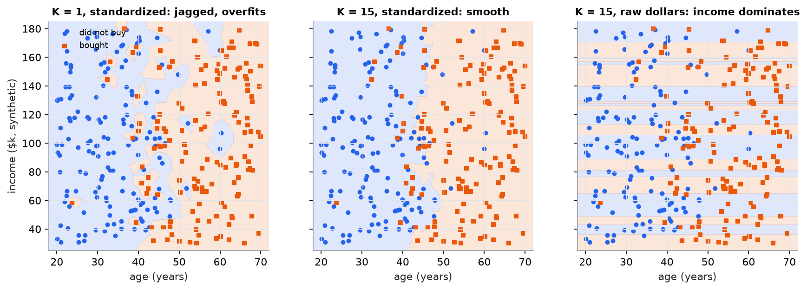

# K-nearest neighbors

> **Mental model.** To label something new, find the K most similar examples you have already seen and let them vote. There is no equation to learn: the training data *is* the model.

**You will learn to**
- Compute Euclidean and Manhattan distances and find the K nearest neighbors by hand.
- Explain how K controls the trade-off between noisy and over-smoothed predictions.
- Show, with numbers, why features must be scaled before using distances.
- Implement KNN from scratch and with scikit-learn, and choose K with cross-validation.
- Explain the curse of dimensionality and why KNN is slow at prediction time.

**Why it matters.** KNN is the simplest model that can draw any decision boundary, which makes it a great baseline and a clear lens on two ideas you will meet everywhere: *distance in feature space* and *the bias-variance trade-off*. The same nearest-neighbor search, done on embeddings with approximate indexes, powers semantic search and retrieval-augmented generation.

## 1. Intuition

You move to a new city and want to guess whether a neighborhood is expensive. You look at the five closest houses that sold recently. If four of them were expensive, you guess "expensive." That is KNN with K = 5.

Three choices define the model:

1. **What "close" means.** You need a distance between two examples. With numeric features, the usual choice is straight-line (Euclidean) distance.
2. **How many neighbors (K).** One neighbor trusts a single, possibly unusual, example. Fifty neighbors average over a wide area and may blur real local differences.
3. **How neighbors combine.** Classification uses a majority vote; regression averages the neighbors' targets. Closer neighbors can be given more weight.

KNN does no work at training time; it just stores the data. All the work happens at prediction time, when it compares the new example against every stored one. That makes it a **lazy** or **instance-based** learner.

## 2. Visualization

<!-- lab:knn -->


*Synthetic data: 300 customers. Purchases depend mostly on age; income is noise. In raw dollars, income differences are thousands of times larger than age differences, so the right panel's neighborhoods are horizontal bands of similar income, and 5-fold accuracy drops from 0.84 (standardized) to 0.60.*

*Interactive version: drag the query point, change K and the distance metric, toggle scaling, and watch the leave-one-out accuracy. [Open the lab](https://sreshtalluri.github.io/ml-ai-learn/labs/knn/).*
<!-- /lab -->

**Try it** (predict first, then check):

1. Leave scaling off and drag the query left and right. Predict whether the prediction changes, then check.
2. Compare leave-one-out accuracy at K = 1 and K = 25 with scaling on. Which generalizes better here?

What to notice:
- **K = 1** draws a region around every single point, including mislabeled or unusual ones. It fits the training data perfectly and generalizes worse (high variance).
- **K = 15** produces a smooth boundary close to the true rule (buy if older than about 45).
- **Raw units** silently turn KNN into "find people with similar income." Nothing errors; the model is just wrong.

## 3. The math

### Symbols

| Symbol | Meaning | Shape |
|---|---|---|
| $x_i$ | stored training example $i$ | $[p]$ |
| $y_i$ | its label (class) or target value | scalar |
| $q$ | the query point we want to predict | $[p]$ |
| $d(q, x_i)$ | distance between query and example $i$ | scalar |
| $N_K(q)$ | the set of the $K$ training examples closest to $q$ | set of size $K$ |
| $\mu_j, \sigma_j$ | mean and standard deviation of feature $j$ on the training set | scalars |

### Distances

```math
d_{\text{Euclidean}}(q, x) = \sqrt{\sum_{j=1}^{p} (q_j - x_j)^2}
\qquad
d_{\text{Manhattan}}(q, x) = \sum_{j=1}^{p} |q_j - x_j|
```

Euclidean is the straight line; Manhattan is the city-block path. Manhattan is less dominated by a single large difference because it does not square.

### Prediction

```math
\hat{y}_{\text{class}} = \operatorname{mode}\{\, y_i : x_i \in N_K(q) \,\}
\qquad
\hat{y}_{\text{regression}} = \frac{1}{K} \sum_{x_i \in N_K(q)} y_i
```

### Standardization

```math
z_j = \frac{x_j - \mu_j}{\sigma_j}
```

After standardizing, every feature has mean 0 and standard deviation 1 *on the training set*, so one unit means "one standard deviation" for every feature.

### Worked example

Five past customers (age in years, income in thousand dollars) and whether they bought. Predict for query $q = (45, 56)$ with $K = 3$.

| Customer | Age | Income | Bought |
|---|---|---|---|
| A | 22 | 54 | 0 |
| B | 26 | 60 | 0 |
| C | 44 | 90 | 1 |
| D | 47 | 30 | 1 |
| E | 60 | 57 | 1 |

**Step 1: raw differences and Euclidean distances.**

| | $\Delta$age | $\Delta$income | Squared sum | Distance |
|---|---|---|---|---|
| A | $22-45=-23$ | $54-56=-2$ | $529+4=533$ | $\sqrt{533}=23.09$ |
| B | $-19$ | $+4$ | $361+16=377$ | $19.42$ |
| C | $-1$ | $+34$ | $1+1156=1157$ | $34.01$ |
| D | $+2$ | $-26$ | $4+676=680$ | $26.08$ |
| E | $+15$ | $+1$ | $225+1=226$ | $15.03$ |

**Step 2: vote.** The three nearest are E (15.03, bought), B (19.42, did not), A (23.09, did not). Votes: 2 to 1 for **did not buy**.

(Manhattan distances are A 25, B 23, C 35, D 28, E 16; same three neighbors, same answer.)

**Step 3: standardize.** On these five rows, age has $\mu = 39.8$, $\sigma = 14.03$ and income has $\mu = 58.2$, $\sigma = 19.12$ (population standard deviation). The query becomes

```math
q_z = \left(\frac{45 - 39.8}{14.03},\; \frac{56 - 58.2}{19.12}\right) = (0.371,\; -0.115)
```

and customer D becomes $\left(\frac{47-39.8}{14.03}, \frac{30-58.2}{19.12}\right) = (0.513, -1.475)$, so its distance is $\sqrt{(0.513-0.371)^2 + (-1.475+0.115)^2} = \sqrt{0.020 + 1.850} = 1.367$. Doing the same for everyone:

| | A | B | C | D | E |
|---|---|---|---|---|---|
| Standardized distance | 1.642 | 1.370 | 1.779 | 1.367 | 1.070 |

**Step 4: vote again.** The three nearest are now E (1.070, bought), D (1.367, bought), B (1.370, did not). Votes: 2 to 1 for **bought**.

Same data, same K, opposite prediction. In raw units, income differences (up to 34) outweighed age differences; D was "far" only because of income. After scaling, D's nearly identical age counts for what it should.

> [!IMPORTANT]
> Fit $\mu$ and $\sigma$ on the training split only, then apply them to validation, test, and production queries. Computing them on all data leaks information from the test set.

## 4. Implementation

**From scratch (NumPy):**

```python
import numpy as np
from collections import Counter

def knn_predict(X_train, y_train, q, k=3):
    dists = np.sqrt(((X_train - q) ** 2).sum(axis=1))   # [n] distances to the query
    nearest = np.argsort(dists, kind="stable")[:k]       # indices of the k smallest
    return Counter(y_train[nearest]).most_common(1)[0][0]
```

**With scikit-learn, scaling included in the pipeline:**

```python
from sklearn.model_selection import GridSearchCV
from sklearn.neighbors import KNeighborsClassifier
from sklearn.pipeline import make_pipeline
from sklearn.preprocessing import StandardScaler

pipe = make_pipeline(StandardScaler(), KNeighborsClassifier())
search = GridSearchCV(pipe, {"kneighborsclassifier__n_neighbors": [1, 3, 5, 9, 15, 25]}, cv=5)
search.fit(X_train, y_train)          # scaler is refit inside every CV fold: no leakage
print(search.best_params_, search.best_score_)
```

Putting the scaler inside the pipeline means each cross-validation fold computes $\mu$ and $\sigma$ from its own training portion.

Runnable script (worked example, both implementations, cross-validated comparison, figure): [`code/05-instance-and-probabilistic/knn.py`](../../code/05-instance-and-probabilistic/knn.py).

## 5. Engineering

**Good use cases.** Small to medium datasets with a meaningful distance; quick baselines; recommendation ("users like you"); anomaly scoring (distance to the k-th neighbor); and, at large scale, semantic search over embeddings.

**Choosing K.** Use cross-validation. Small K means low bias and high variance; large K means the reverse. With two classes, odd K avoids ties. `weights="distance"` lets closer neighbors count more.

**Preprocessing.** Standardize numeric features (or use a metric that suits the data, such as cosine for text embeddings). One-hot categorical features and think about how much each should count. Impute missing values; distances cannot use NaN.

**Cost.** Training is $O(1)$: store the data. A brute-force prediction costs $O(np)$ per query, since it measures the distance to all $n$ examples in $p$ dimensions. Memory holds the whole training set. KD-trees and ball trees speed this up in low dimensions. For millions of high-dimensional vectors, production systems use **approximate nearest neighbor** indexes (HNSW, IVF, product quantization) that trade a little recall for orders of magnitude in speed.

**The curse of dimensionality.** As dimensions grow, the distances between random points concentrate: the nearest and farthest neighbors end up almost equally far away, so "nearest" stops meaning "similar." KNN on hundreds of raw features usually needs feature selection or a learned lower-dimensional representation (PCA, embeddings).

> [!WARNING]
> **Failure modes.** Unscaled features (the model quietly ignores small-range features); irrelevant features adding noise to every distance; class imbalance (the majority class wins votes near the boundary); slow, memory-heavy inference at scale; and data drift, because stored examples go stale.

### Common mistakes

- Fitting the scaler on the full dataset before splitting.
- Choosing K by looking at test-set accuracy.
- Using K = 1 and reporting its perfect training accuracy.
- Using Euclidean distance on one-hot or text-count features without thinking about the metric.
- Forgetting that every prediction scans the training set, then being surprised by latency.

## 6. Knowledge check

<!-- quiz:k-nearest-neighbors -->
**[Take the KNN quiz](../../quizzes/k-nearest-neighbors.md)**: distances, scaling, choosing K, and diagnosing a slow, inaccurate KNN service.
<!-- /quiz -->

**Practice exercise.** Training points: P1 = (1, 1) label 0, P2 = (2, 3) label 1, P3 = (4, 2) label 1, P4 = (0, 3) label 0. Query (2, 2). Compute Euclidean distances and predict with K = 1 and K = 3.

<details>
<summary>Solution</summary>

P1: $\sqrt{1+1} = 1.414$. P2: $\sqrt{0+1} = 1$. P3: $\sqrt{4+0} = 2$. P4: $\sqrt{4+1} = 2.236$.
K = 1: nearest is P2, predict **1**. K = 3: P2 (1), P1 (0), P3 (1), so votes 2 to 1, predict **1**.
</details>

**Implementation challenge.** Extend `knn_predict` to regression (average the neighbors' targets) and to distance weighting (weight $1/d$, handling $d = 0$). Compare uniform and distance-weighted KNN regression on a synthetic $y = \sin(x) + \text{noise}$ dataset with cross-validation.

## Summary

- KNN predicts from the K closest stored examples: majority vote for classes, average for numbers.
- K sets the bias-variance trade-off: small K is flexible and noisy, large K is smooth and can underfit.
- Distances are only meaningful if features are on comparable scales; standardize using training statistics.
- Training is free but prediction is $O(np)$ per query, and distances degrade in high dimensions.
- Nearest-neighbor search on embeddings is the core of modern semantic retrieval.

**Next:** [Naive Bayes](02-naive-bayes.md)

**Related:** [K-means](../07-unsupervised/01-k-means.md) · [Word embeddings](../09-classical-nlp/02-word-embeddings.md) · [Model card: KNN](../../models/k-nearest-neighbors.md)

## Interview angle

<details>
<summary><strong>Why must you scale features before using KNN?</strong></summary>

Distance sums squared differences across features, so the feature with the largest numeric range dominates. In this lesson's example, raw income differences up to 34 outweighed age differences, and with $K = 3$ the query was predicted "did not buy." After standardizing each feature to mean 0 and standard deviation 1, customer D, with almost the same age, became a neighbor and the prediction flipped to "bought." Same data, same $K$, opposite answer, purely because of units. Standardization makes one unit mean one standard deviation for every feature, giving each an equal say by default. Details: fit $\mu$ and $\sigma$ on the training split only and apply them to every query; consider robust scaling when outliers are heavy; and remember equal say isn't always right, since irrelevant features still add noise to every distance, so feature selection or weighting matters too.

</details>

<details>
<summary><strong>How do you choose K in KNN? What happens at K = 1 and at K = n?</strong></summary>

At $K = 1$, training error is zero (each point is its own nearest neighbor) and the boundary is jagged, following every noisy point: low bias, high variance. At $K = n$, every query gets the training set's majority class or global mean: maximal bias, almost no variance. Choose $K$ in between by cross-validation: plot validation error against $K$ and take the minimum, or the largest $K$ within one standard error of it for a simpler model. Practical details: odd $K$ avoids ties in binary problems; `weights="distance"` makes results less sensitive to the exact choice; with class imbalance, large $K$ drifts toward the majority class, so tune against a balanced metric. A starting heuristic is $K \approx \sqrt{n}$, but treat it only as a starting point. Never choose $K$ on the test set, and never report $K = 1$'s training accuracy.

</details>

<details>
<summary><strong>You need nearest neighbors over 100 million 768-dimensional embeddings with a 20 ms latency budget. How do you build it?</strong></summary>

Brute force costs $O(np)$ per query: $10^8 \times 768 \approx 7.7 \times 10^{10}$ multiply-adds, and the float32 vectors alone take about 307 GB. That's too slow on CPU and too large for one machine's RAM, so use approximate nearest neighbor search. HNSW builds a navigable multi-layer graph with high recall and low latency, but it's memory-hungry (vectors plus graph links). IVF clusters vectors with K-means and searches only the few nearest lists; combined with product quantization (IVF-PQ), each vector compresses to tens of bytes, so 100M vectors fit in a few GB, at some recall cost. Recover precision by re-ranking the top few hundred candidates with exact distances, and shard across machines if needed. Measure recall@k against brute force on a sample, and tune `efSearch` or `nprobe` to trade recall for latency.

</details>

<details>
<summary><strong>What is the curse of dimensionality, and why does it hurt KNN in particular?</strong></summary>

In high dimensions, distances concentrate: for random points, the ratio of nearest to farthest neighbor distance approaches 1, so "nearest" carries little information. Each irrelevant dimension adds its own random squared difference to every distance, and those noise terms swamp the few dimensions that carry signal. Volume grows exponentially too: to capture 10% of uniformly distributed data in a sub-cube in 10 dimensions, each side must cover $0.1^{1/10} \approx 79\%$ of that feature's range, so "local" neighborhoods aren't local anymore. For KNN this means you need exponentially more data to keep neighbors close, and accuracy degrades on raw high-dimensional features. Remedies: feature selection, PCA, or learned embeddings, where useful structure lives on a low-dimensional manifold and distances become meaningful. That's why KNN over learned embeddings works and KNN over raw pixels doesn't.

</details>
