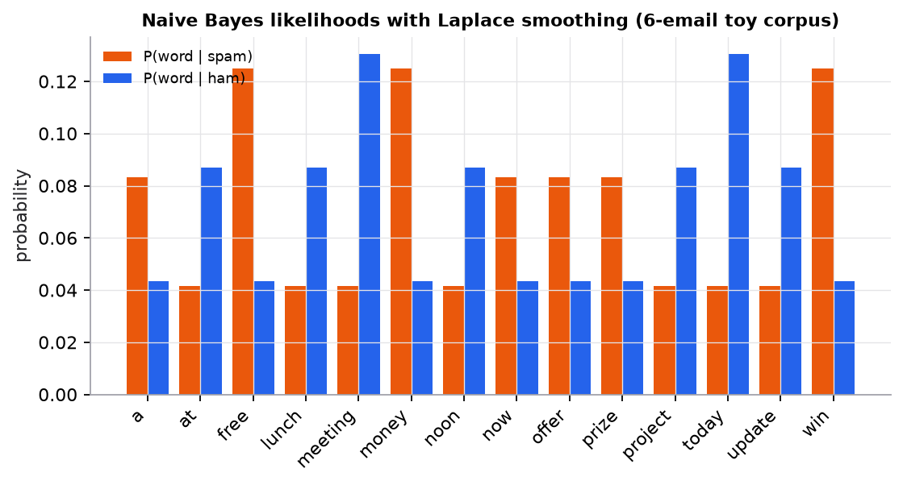

# Naive Bayes

> **Mental model.** Start from how common each class is (the prior). For each feature you observe, ask how typical it is of each class (the likelihood), and multiply. The class with the bigger product wins. "Naive" means treating features as independent given the class, which is false but often good enough.

**You will learn to**
- Write the Naive Bayes decision rule from Bayes' rule.
- Compute priors, smoothed likelihoods, and a posterior for a short email by hand.
- Choose between multinomial, Bernoulli, and Gaussian variants.
- Explain why log-probabilities and Laplace smoothing are needed.
- Describe when the independence assumption makes probabilities unreliable.

**Why it matters.** Naive Bayes trains in one pass over the data, needs very little data, and is a strong baseline for text classification. It is also the clearest worked example of Bayes' rule you will find in ML.

## 1. Intuition

You get an email containing "free," "money," and "today." In past spam, "free" and "money" are common; in normal email ("ham"), "today" is common. Naive Bayes asks, for each class, "how likely is this collection of words if the email were from this class?" and multiplies the word probabilities together, along with how common the class is overall.

The independence assumption says that knowing "free" appears tells you nothing extra about whether "money" appears, once you know the email is spam. In reality, words co-occur ("free money" is a phrase), so the model double-counts correlated evidence. Its *ranking* of classes is often still right even when its *probabilities* are too extreme.

## 2. Visualization



*Toy corpus of six emails. Smoothing gives every word, even unseen ones, a small nonzero probability in both classes.*

## 3. The math

### Symbols

| Symbol | Meaning |
|---|---|
| $c$ | a class (spam, ham) |
| $x = (x_1, \dots, x_p)$ | the features (here, words in the email) |
| $P(c)$ | prior: fraction of training examples in class $c$ |
| $P(x_j \mid c)$ | likelihood of feature $j$ given class $c$ |
| $P(c \mid x)$ | posterior: probability of class $c$ after seeing $x$ |
| $V$ | vocabulary size |
| $\alpha$ | smoothing constant (Laplace smoothing uses $\alpha = 1$) |

### Decision rule

Bayes' rule plus the independence assumption:

```math
P(c \mid x) = \frac{P(c)\,P(x \mid c)}{P(x)} \;\propto\; P(c)\prod_{j=1}^{p} P(x_j \mid c),
\qquad \hat{c} = \arg\max_c \Big[\ln P(c) + \sum_j \ln P(x_j \mid c)\Big]
```

$P(x)$ is the same for every class, so it can be dropped for the decision (or recovered by normalizing). Logs turn a product of many small numbers into a sum, avoiding underflow.

### Multinomial likelihood with smoothing (for word counts)

```math
P(w \mid c) = \frac{\text{count}(w, c) + \alpha}{\sum_{w'} \text{count}(w', c) + \alpha V}
```

Without smoothing, a single word never seen in spam would make $P(\text{spam} \mid x) = 0$ regardless of all other evidence.

### Worked example

Training emails:

| Spam | Ham |
|---|---|
| win money now | meeting at noon |
| win a free prize | lunch meeting today |
| free money offer | project update today |

Classify "free money today."

**Step 1: priors.** 3 spam and 3 ham: $P(\text{spam}) = P(\text{ham}) = 0.5$.

**Step 2: counts.** Spam has 10 words total; ham has 9. The vocabulary has $V = 14$ distinct words.

**Step 3: smoothed likelihoods** ($\alpha = 1$):

| Word | Count in spam | $P(w \mid \text{spam}) = \frac{\text{count}+1}{10+14}$ | Count in ham | $P(w \mid \text{ham}) = \frac{\text{count}+1}{9+14}$ |
|---|---|---|---|---|
| free | 2 | $3/24 = 0.1250$ | 0 | $1/23 = 0.0435$ |
| money | 2 | $3/24 = 0.1250$ | 0 | $1/23 = 0.0435$ |
| today | 0 | $1/24 = 0.0417$ | 2 | $3/23 = 0.1304$ |

**Step 4: unnormalized scores.**
Spam: $0.5 \times 0.125 \times 0.125 \times 0.0417 = 3.255 \times 10^{-4}$.
Ham: $0.5 \times 0.0435 \times 0.0435 \times 0.1304 = 1.233 \times 10^{-4}$.

**Step 5: normalize.** $P(\text{spam} \mid x) = \frac{3.255}{3.255 + 1.233} = 0.7253$. Classified as spam. scikit-learn's `MultinomialNB(alpha=1)` gives exactly 0.7253.

## 4. Implementation

**From scratch:**

```python
import numpy as np

def fit_mnb(X_counts, y, alpha=1.0):
    classes = np.unique(y)
    log_prior = np.log([np.mean(y == c) for c in classes])
    counts = np.array([X_counts[y == c].sum(axis=0) for c in classes]) + alpha   # [C, V]
    log_like = np.log(counts / counts.sum(axis=1, keepdims=True))
    return classes, log_prior, log_like

def predict_mnb(model, X_counts):
    classes, log_prior, log_like = model
    return classes[np.argmax(X_counts @ log_like.T + log_prior, axis=1)]   # sum of logs
```

**With scikit-learn:**

```python
from sklearn.feature_extraction.text import CountVectorizer
from sklearn.naive_bayes import MultinomialNB
from sklearn.pipeline import make_pipeline

spam_filter = make_pipeline(CountVectorizer(), MultinomialNB(alpha=1.0))
spam_filter.fit(train_texts, train_labels)
spam_filter.predict_proba(["free money today"])
```

Runnable script: [`code/05-instance-and-probabilistic/nb_svm.py`](../../code/05-instance-and-probabilistic/nb_svm.py).

## 5. Engineering

**Variants.** Multinomial NB for word counts or TF-IDF; Bernoulli NB for binary present/absent features; Gaussian NB for continuous features (assumes a normal distribution per class and feature); Complement NB for imbalanced text.

**Strengths.** One pass to train, tiny memory, handles thousands of features, works with few examples, easy to update incrementally.

**Weaknesses.** Correlated features are double-counted, so probabilities are poorly calibrated (often very close to 0 or 1). Gaussian NB fails when features are far from normal. Usually beaten by logistic regression or linear SVMs given enough data.

**Cost.** Training $O(np)$; prediction $O(Cp)$ per example for $C$ classes.

> [!WARNING]
> **Failure modes.** Zero probabilities without smoothing; underflow without logs; trusting its probability outputs as calibrated; strongly dependent features (for example, the same information encoded twice).

### Common mistakes

- Forgetting the prior when classes are imbalanced.
- Fitting the vectorizer's vocabulary on all data instead of training data.
- Using Gaussian NB on counts or highly skewed features without transformation.

## 6. Knowledge check

<!-- quiz:naive-bayes -->
**[Take the Naive Bayes quiz](../../quizzes/naive-bayes.md)**
<!-- /quiz -->

**Practice exercise.** Using the same training data, classify "meeting money." Show the scores and posterior.

<details>
<summary>Solution</summary>

Spam: meeting 0 → $1/24$, money 2 → $3/24$. Score $0.5 \times 0.04167 \times 0.125 = 2.604 \times 10^{-3}$.
Ham: meeting 2 → $3/23 = 0.1304$, money 0 → $1/23 = 0.0435$. Score $0.5 \times 0.1304 \times 0.0435 = 2.836 \times 10^{-3}$.
$P(\text{spam}) = 2.604 / (2.604 + 2.836) = 0.479$. Classified as ham, narrowly.
</details>

**Implementation challenge.** Implement Gaussian Naive Bayes from scratch (per-class means and variances, sum of log normal densities) and compare with `GaussianNB` on the iris dataset.

## Summary

- Naive Bayes multiplies a class prior by per-feature likelihoods (summed in log space).
- Laplace smoothing prevents a single unseen feature from zeroing out a class.
- It is fast, needs little data, and is a strong text baseline.
- Independence is assumed, so probabilities are overconfident; rankings are often still useful.

**Next:** [Support vector machines](03-support-vector-machines.md)

**Related:** [Probability and statistics](../00-foundations/03-probability-and-statistics.md) · [From text to vectors](../09-classical-nlp/01-text-to-vectors.md) · [Model card: Naive Bayes](../../models/naive-bayes.md)

## Interview angle

<details>
<summary><strong>What is "naive" about Naive Bayes, and why does it still classify well?</strong></summary>

It assumes features are conditionally independent given the class, so $P(x \mid c) = \prod_j P(x_j \mid c)$. For text, that means "free" and "money" occur independently within spam, which is false. It still classifies well because classification only needs the right argmax, not accurate probabilities: as long as the evidence pushes the correct class's score highest, errors in the joint likelihood don't change the decision. The assumption also lets each $P(x_j \mid c)$ be estimated from simple counts, so NB needs little data, trains in one pass, and handles tens of thousands of features without much overfitting. The price shows up in the probabilities: correlated features are counted repeatedly, so posteriors get pushed toward 0 or 1 and are badly calibrated. Use NB as a fast text baseline, and calibrate it before using its probabilities for decisions.

</details>

<details>
<summary><strong>Why do we need Laplace smoothing? What goes wrong without it?</strong></summary>

The maximum-likelihood estimate $P(w \mid c) = \text{count}(w, c)/\text{total}(c)$ is zero for any word never seen with class $c$ during training. Because the posterior multiplies likelihoods, one unseen word zeroes the class's score no matter how much other evidence supports it: an obvious spam email containing a single word never seen in training spam would be scored 0% spam. Additive smoothing adds $\alpha$ to every count: $P(w \mid c) = \frac{\text{count}(w,c) + \alpha}{\text{total}(c) + \alpha V}$. In this lesson's example, "today" never appears in spam, yet it gets $1/24 = 0.0417$ instead of 0, and the email is still classified as spam at 0.725. $\alpha$ is a hyperparameter: $\alpha = 1$ is the classic default, but smaller values like 0.1 often do better with large vocabularies, so tune it by cross-validation. It's equivalent to a Dirichlet prior on word probabilities.

</details>

<details>
<summary><strong>In this lesson's example, "free money today" is 72.5% spam with equal priors. In production only 20% of email is spam. What's the posterior now?</strong></summary>

The likelihoods don't change; only the prior does. Spam likelihood: $0.125 \times 0.125 \times 0.0417 = 6.51 \times 10^{-4}$. Ham likelihood: $0.0435 \times 0.0435 \times 0.1304 = 2.47 \times 10^{-4}$. Likelihood ratio $= 2.64$. Posterior odds $=$ prior odds $\times$ likelihood ratio $= \frac{0.2}{0.8} \times 2.64 = 0.66$, so $P(\text{spam} \mid x) = 0.66/1.66 \approx 0.40$. The same email flips from spam to ham at a 0.5 threshold. Takeaways: priors matter, so estimate them from data that matches production rather than a rebalanced training set; in log-odds the prior change is a simple additive shift of $\ln 0.25 = -1.39$; and when class proportions drift, you can update the prior without re-estimating any likelihoods.

</details>

<details>
<summary><strong>Naive Bayes or logistic regression for text classification: how do you choose?</strong></summary>

Both are linear classifiers over word features, which is why they're compared so often. NB is generative: it models $P(x \mid c)$ and $P(c)$ and applies Bayes' rule. Logistic regression is discriminative: it fits $P(c \mid x)$ directly. The classic result (Ng and Jordan) is that NB approaches its best error with far fewer examples, but logistic regression reaches a lower error as data grows, because it doesn't assume independence and can down-weight redundant, correlated features instead of double-counting them. So: very few labels, a need for instant one-pass or incremental training, or a quick baseline points to NB (Multinomial, or Complement for imbalance). Thousands of labels, a need for calibrated probabilities, or many correlated features points to regularized logistic regression or a linear SVM on TF-IDF. Both train in seconds, so try both.

</details>
