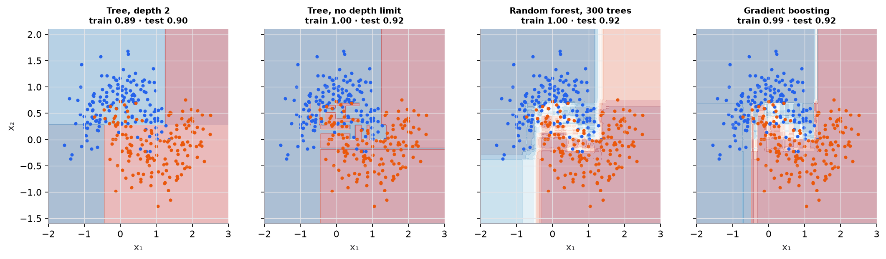

# Decision trees

> **Mental model.** A decision tree is a flowchart of yes/no questions ("age < 35?", "income < 50k?") learned from data. Each question is chosen to make the groups below it as pure as possible. Leaves give the prediction.

**You will learn to**
- Compute Gini impurity, entropy, and information gain.
- Choose the best split for a node by hand.
- Explain how tree depth trades bias for variance, and use pruning controls.
- State why trees need no feature scaling and how they handle interactions.
- Recognize the instability of single trees.

**Why it matters.** Trees are interpretable, handle mixed feature types, and capture nonlinear interactions. Alone they overfit easily, but they are the building block of random forests and gradient boosting, the strongest default models for tabular data.

## 1. Intuition

Picture predicting whether a customer buys. The tree tries every feature and every threshold and asks: which single question best separates buyers from non-buyers? Say "age < 35" sends mostly non-buyers left and mostly buyers right. It then repeats the process inside each side, until the groups are pure enough or a stopping rule kicks in.

Because each question involves one feature and a threshold, scaling doesn't matter (multiplying age by 10 just multiplies the threshold by 10). Interactions come for free: a split on age, then income only within the young group, models "income matters for young customers."

Grow the tree without limit, though, and it carves out a leaf for every odd training point. That is memorization.

## 2. Visualization

<!-- lab:decision-tree -->


*Synthetic "two moons" data with noise. Tree boundaries are always axis-aligned rectangles. The unlimited tree reaches 100% training accuracy.*

*Interactive version: [open the lab](https://sreshtalluri.github.io/ml-ai-learn/labs/decision-tree/).*
<!-- /lab -->

**Try it** (predict first, then check):

1. Before splitting the root, guess which feature (age or income) gives the bigger Gini decrease. Press **Best split** to check.
2. Drag the threshold slowly and watch the decrease. Where does it peak, and why is that the threshold the algorithm picks?
3. Keep splitting small leaves until there are 8 or more. Training accuracy climbs; explain why that is a warning sign, not a success.

Measured on the same data (test half):

| Model | Train | Test |
|---|---|---|
| depth 1 | 0.803 | 0.813 |
| depth 3 | 0.893 | 0.900 |
| depth 6 | 0.943 | 0.923 |
| unlimited depth | 1.000 | 0.920 |

## 3. The math

### Symbols

| Symbol | Meaning |
|---|---|
| $p_k$ | fraction of examples in a node belonging to class $k$ |
| $G$ | Gini impurity of a node |
| $H$ | entropy of a node (bits) |
| $n, n_L, n_R$ | examples in the parent, left child, right child |

### Impurity measures

```math
G = 1 - \sum_k p_k^2 \qquad H = -\sum_k p_k \log_2 p_k
```

Both are 0 for a pure node and largest when classes are evenly mixed (Gini 0.5, entropy 1 bit for two classes).

### Choosing a split

The best split maximizes the impurity decrease (information gain when using entropy):

```math
\Delta = I(\text{parent}) - \left(\frac{n_L}{n} I(\text{left}) + \frac{n_R}{n} I(\text{right})\right)
```

Regression trees use the same procedure with variance (squared error) as the impurity, and predict the mean of each leaf.

### Worked example

A node holds 10 customers: 5 buyers, 5 non-buyers. $G_{\text{parent}} = 1 - (0.5^2 + 0.5^2) = 0.5$.

**Candidate A: age < 35** sends [4 non-buyers, 1 buyer] left and [1, 4] right.
$G_L = 1 - (0.8^2 + 0.2^2) = 1 - 0.68 = 0.32$, and $G_R = 0.32$.
Weighted: $\frac{5}{10}(0.32) + \frac{5}{10}(0.32) = 0.32$. Decrease: $0.5 - 0.32 = 0.18$.

**Candidate B: income < 50k** sends [3, 2] left and [2, 3] right.
$G_L = G_R = 1 - (0.6^2 + 0.4^2) = 0.48$. Weighted 0.48. Decrease: $0.02$.

The tree splits on age. With entropy instead, A gives weighted entropy 0.722 bits (gain 0.278) and B gives 0.971 (gain 0.029): same choice.

## 4. Implementation

```python
from sklearn.tree import DecisionTreeClassifier, export_text

tree = DecisionTreeClassifier(criterion="gini", max_depth=4, min_samples_leaf=10, random_state=0)
tree.fit(X_train, y_train)
print(export_text(tree, feature_names=feature_names))   # the learned rules, readable
print(tree.feature_importances_)                         # total impurity decrease per feature
```

From scratch, the core is a search: for each feature, sort its values, try each midpoint between consecutive values, compute the weighted child impurity, keep the best, and recurse.

Runnable script (split arithmetic, depth comparison, and figures): [`code/06-trees-and-ensembles/trees.py`](../../code/06-trees-and-ensembles/trees.py).

## 5. Engineering

**Controls against overfitting (pre-pruning):** `max_depth`, `min_samples_leaf`, `min_samples_split`, `max_leaf_nodes`. **Post-pruning:** cost-complexity pruning (`ccp_alpha`) grows a full tree and trims branches that don't pay for themselves. Choose by cross-validation.

**Strengths.** Interpretable when shallow; no scaling; handles nonlinearity and interactions; fast inference ($O(\text{depth})$).

**Weaknesses.** High variance: a small change in the data can change the top split and the whole tree. Axis-aligned boundaries approximate diagonal ones with staircases. Can't extrapolate beyond the training range (leaves predict constants).

**Feature importance caveat.** Impurity-based importances favor features with many possible split points (continuous or high-cardinality). Prefer permutation importance or SHAP for decisions.

> [!WARNING]
> **Failure modes.** Unlimited depth memorizes; splits on ID-like columns look highly informative and are useless; unstable trees make interpretations unreliable; leaf predictions are constant, so regression trees cannot extrapolate trends.

### Common mistakes

- Reporting the training accuracy of a deep tree.
- Interpreting a deep tree as "the model's reasoning."
- Scaling features for trees (harmless, but a sign of cargo-culting).

## 6. Knowledge check

<!-- quiz:decision-trees -->
**[Take the decision trees quiz](../../quizzes/decision-trees.md)**
<!-- /quiz -->

**Practice exercise.** A node has 8 examples, [6 of class A, 2 of class B]. A split produces left [6, 0] and right [0, 2]. Compute the parent Gini, the weighted child Gini, and the decrease.

<details>
<summary>Solution</summary>

Parent: $1 - (0.75^2 + 0.25^2) = 1 - 0.625 = 0.375$. Both children are pure (0), so the weighted Gini is 0 and the decrease is 0.375, the maximum possible here.
</details>

**Implementation challenge.** Write `best_split(X, y)` that returns the feature, threshold, and Gini decrease of the best split, then grow a depth-2 tree recursively and compare its splits with scikit-learn's.

## Summary

- Trees ask a sequence of single-feature threshold questions learned to maximize impurity decrease.
- Gini $1 - \sum p_k^2$ and entropy $-\sum p_k\log_2 p_k$ measure node purity.
- Depth controls complexity; unlimited trees memorize; prune with depth limits or cost-complexity pruning.
- No scaling needed, interactions built in, but single trees are unstable and can't extrapolate.

**Next:** [Random forests and gradient boosting](02-random-forests-and-boosting.md)

**Related:** [Overfitting and bias-variance](../02-ml-workflow/02-overfitting-and-bias-variance.md) · [Model card: decision tree](../../models/decision-tree.md)

## Interview angle

<details>
<summary><strong>How does a decision tree choose a split? Does Gini versus entropy matter?</strong></summary>

At each node, the tree tries every feature and every candidate threshold (midpoints between sorted values) and picks the split with the largest impurity decrease: parent impurity minus the size-weighted impurity of the two children. Gini is $1 - \sum_k p_k^2$; entropy is $-\sum_k p_k \log_2 p_k$. In this lesson's example, splitting a 5/5 node by age into [4, 1] and [1, 4] drops Gini from 0.5 to 0.32, while the income split only reaches 0.48, so age wins, and entropy agrees. In practice the two criteria pick the same split in the vast majority of cases. Gini is slightly cheaper (no logarithm) and is scikit-learn's default; entropy is slightly more sensitive to rare-class purity. The choices that matter far more are depth, minimum leaf size, and pruning. Splitting is greedy, so the tree is not globally optimal.

</details>

<details>
<summary><strong>Why do decision trees overfit, and how do you control it?</strong></summary>

An unrestricted tree keeps splitting until every leaf is pure, which can mean one training example per leaf: zero training error and a model that has memorized noise. Trees are also high variance, because a small change in the data can change the top split, and everything below it changes too. Controls: pre-pruning with `max_depth`, `min_samples_leaf` (often the most effective single knob, since it forces each prediction to average several examples), `min_samples_split`, and `max_leaf_nodes`; post-pruning with cost-complexity pruning, which grows the full tree and then removes branches whose impurity reduction doesn't justify a per-leaf penalty `ccp_alpha`. Choose these by cross-validation. The other answer is to stop relying on a single tree: random forests average many deep trees to cut variance, and boosting combines many shallow ones to cut bias.

</details>

<details>
<summary><strong>Your tree's most important feature is `customer_id`. What's going on?</strong></summary>

The tree is memorizing. A unique or near-unique column offers a split point between almost every pair of examples, so the greedy search can always find a threshold that isolates a few examples into pure leaves, and those impurity decreases add up to high impurity-based importance. None of it generalizes: new customers get new IDs. More broadly, impurity-based importance is biased toward continuous and high-cardinality features, because they get more chances to find a lucky split. Fix: drop identifier columns, and check for timestamps or row order that encode the target. Then measure importance with permutation importance on validation data, which asks how much the validation metric drops when a column is shuffled. If an ID-like column still matters there, suspect leakage, for example IDs assigned in a way that correlates with the outcome.

</details>

<details>
<summary><strong>Why can't tree models extrapolate, and when would you choose a linear model over a tree ensemble?</strong></summary>

Each leaf predicts a constant, the mean of its training examples, so a regression tree's output is bounded by the range of training targets. Train on houses up to 3,000 sq ft where price rises steadily, and a 6,000 sq ft house lands in the right-most leaf and gets the price of the largest training houses; a linear model would continue the trend (sometimes absurdly, but in the right direction). Forests and boosting inherit this. It matters for growth trends (sales rising year over year), prices under inflation, and any feature drifting beyond its training range. Choose a linear model, or add a linear trend, detrend the target, or model differences, when the relationship is roughly monotonic and extrapolation is required, data is small, or coefficients must be explained. Choose trees for interactions, nonlinearity, mixed feature types, and no scaling.

</details>
