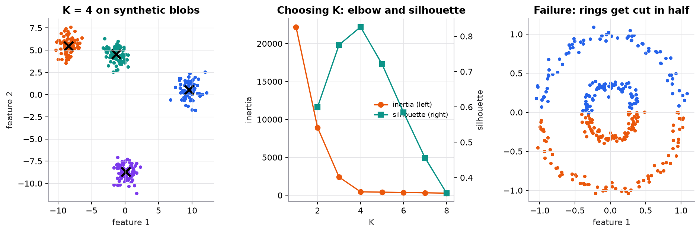

# K-means clustering

> **Mental model.** Drop K pins on the map. Every point joins its nearest pin; then every pin moves to the middle of its group. Repeat until nothing moves. The pins are the cluster centers.

**You will learn to**
- State the K-means objective and explain why each step can only lower it.
- Run one full assignment-and-update iteration by hand.
- Choose K with the elbow plot, silhouette score, and domain review.
- Explain why initialization matters and what k-means++ does.
- Recognize data where K-means gives confident but wrong clusters.

**Why it matters.** Clustering is the workhorse of unsupervised learning: customer segmentation, grouping support tickets or log lines, compressing colors, building retrieval indexes (IVF indexes cluster embedding vectors with K-means). K-means is fast and simple, and its failure modes teach you to treat any discovered cluster as a hypothesis, not a fact.

## 1. Intuition

You run a delivery company and want to open three depots so that, on average, customers are close to one. You don't know where the depots should go, so you guess three spots. Each customer is served by the nearest depot. Then you move each depot to the center of the customers it serves. Some customers now have a different nearest depot, so you reassign them, and move the depots again. After a few rounds, nothing changes: you have found three clusters and their centers.

Two things are worth noticing:

- **You picked K.** The algorithm never decides how many groups exist. It finds the best K groups it can, even if the data has no real groups at all.
- **Your first guess matters.** Start with two depots in one city and one in the far countryside, and the process may settle into a poor arrangement it cannot escape. This is a **local optimum**.

## 2. Visualization

<!-- lab:kmeans -->


*Synthetic data. On well-separated blobs K-means works well, and both the elbow and the silhouette point to K = 4. On rings no placement of two centers can separate inner from outer, because K-means boundaries are straight lines.*

*Interactive version: place centroids yourself, step through assignment and update, change K and the initialization seed, and try the stretched, uneven, and ring datasets. [Open the lab](https://sreshtalluri.github.io/ml-ai-learn/labs/kmeans/).*
<!-- /lab -->

**Try it** (predict first, then check):

1. Load **Rings** and predict whether any choice of 2 centroids can separate the inner ring from the outer one. Run it.
2. On **Blobs**, change the seed a few times with K = 3. Do all runs end at the same inertia? Why not?

What to notice:
- Inertia (the total squared distance to centers) always decreases as K grows, so "lowest inertia" would pick K = n. Look for the **elbow** where adding clusters stops helping much.
- Silhouette rewards clusters that are tight *and* far apart, so it can peak and then fall.
- K-means splits the plane into regions around each center (a Voronoi diagram). Any cluster that is not roughly round and convex will be cut wrongly.

## 3. The math

### Symbols

| Symbol | Meaning | Shape |
|---|---|---|
| $x_i$ | data point $i$ | $[p]$ |
| $K$ | number of clusters (a **hyperparameter**) | scalar |
| $\mu_k$ | centroid (center) of cluster $k$ | $[p]$ |
| $c(i)$ | index of the cluster point $i$ is assigned to | integer in $1..K$ |
| $C_k$ | the set of points currently assigned to cluster $k$ | set |
| $J$ | the objective, also called **inertia** or within-cluster sum of squares | scalar |

### Objective

```math
J = \sum_{i=1}^{n} \lVert x_i - \mu_{c(i)} \rVert^2
```

$\lVert a \rVert^2$ is the squared Euclidean length: $\sum_j a_j^2$.

### The two steps (Lloyd's algorithm)

**Assignment:** with centroids fixed, give each point to its nearest centroid.

```math
c(i) \leftarrow \arg\min_{k} \lVert x_i - \mu_k \rVert^2
```

**Update:** with assignments fixed, move each centroid to the mean of its points.

```math
\mu_k \leftarrow \frac{1}{|C_k|} \sum_{i \in C_k} x_i
```

Why does $J$ never increase? The assignment step picks, for each point separately, the centroid that minimizes its term, so no term can grow. The update step uses the fact that for a fixed set of points, the single location minimizing the sum of squared distances is their mean (set the derivative $\sum_{i \in C_k} -2(x_i - \mu_k)$ to zero and solve). Since $J$ never increases and there are finitely many possible assignments, the algorithm always stops, though possibly at a local optimum.

### Worked example

Six points, $K = 2$. Initialize the centroids at A and F: $\mu_1 = (1, 1)$, $\mu_2 = (4.5, 5)$.

| Point | Coordinates |
|---|---|
| A | (1, 1) |
| B | (1.5, 2) |
| C | (3, 4) |
| D | (5, 7) |
| E | (3.5, 5) |
| F | (4.5, 5) |

**Step 1: squared distances to each centroid.** For C to $\mu_1$: $(3-1)^2 + (4-1)^2 = 4 + 9 = 13$. To $\mu_2$: $(3-4.5)^2 + (4-5)^2 = 2.25 + 1 = 3.25$.

| Point | $d^2$ to $\mu_1$ | $d^2$ to $\mu_2$ | Assigned |
|---|---|---|---|
| A | 0 | 28.25 | 1 |
| B | $0.25 + 1 = 1.25$ | 18.00 | 1 |
| C | 13.00 | 3.25 | 2 |
| D | 52.00 | $0.25 + 4 = 4.25$ | 2 |
| E | 22.25 | $1 + 0 = 1.00$ | 2 |
| F | 28.25 | 0 | 2 |

**Step 2: inertia after assignment.** Add each point's distance to its own centroid: $0 + 1.25 + 3.25 + 4.25 + 1.00 + 0 = 9.75$.

**Step 3: update.**

```math
\mu_1 = \frac{(1,1) + (1.5,2)}{2} = (1.25,\; 1.5)
\qquad
\mu_2 = \frac{(3,4) + (5,7) + (3.5,5) + (4.5,5)}{4} = \left(\frac{16}{4}, \frac{21}{4}\right) = (4,\; 5.25)
```

**Step 4: inertia after update.** For cluster 1: A $(0.25^2 + 0.5^2 = 0.3125)$, B $(0.25^2 + 0.5^2 = 0.3125)$. For cluster 2: C $(1 + 1.5625 = 2.5625)$, D $(1 + 3.0625 = 4.0625)$, E $(0.25 + 0.0625 = 0.3125)$, F $(0.25 + 0.0625 = 0.3125)$. Total $= 7.875$, down from 9.75.

**Step 5: assign again.** Every point keeps its cluster (C is still much closer to $\mu_2$: 2.56 versus 9.31), so the centroids no longer move. K-means has **converged** in one update.

## 4. Implementation

**From scratch (NumPy):**

```python
import numpy as np

def kmeans(X, k, seed=0, iters=100):
    rng = np.random.default_rng(seed)
    mu = X[rng.choice(len(X), k, replace=False)]              # [k, p] random initial centroids
    for _ in range(iters):
        d2 = ((X[:, None, :] - mu[None, :, :]) ** 2).sum(-1)  # [n, k] squared distances
        assign = d2.argmin(axis=1)                            # assignment step
        new = np.array([X[assign == j].mean(0) if (assign == j).any() else mu[j] for j in range(k)])
        if np.allclose(new, mu):
            break
        mu = new                                              # update step
    return mu, assign
```

**With scikit-learn:**

```python
from sklearn.cluster import KMeans
from sklearn.metrics import silhouette_score
from sklearn.preprocessing import StandardScaler

X_scaled = StandardScaler().fit_transform(X)
km = KMeans(n_clusters=4, init="k-means++", n_init=10, random_state=0).fit(X_scaled)
print(km.inertia_, silhouette_score(X_scaled, km.labels_))
```

On the synthetic blobs, a single random start of the from-scratch version got stuck at inertia 2359.7 (two true blobs merged, one split). The best of 10 random starts and scikit-learn both reach 462.8. That is why `n_init` exists.

Runnable script (worked example, both implementations, elbow and silhouette, figure): [`code/07-unsupervised/kmeans.py`](../../code/07-unsupervised/kmeans.py).

## 5. Engineering

**Initialization.** k-means++ picks the first centroid at random, then picks each next centroid with probability proportional to its squared distance from the nearest centroid already chosen. That spreads the starts out and usually avoids bad local optima. Still run several initializations (`n_init`) and keep the lowest inertia.

**Choosing K.** Combine signals: the elbow in inertia, the silhouette score (from −1 to 1; higher means tighter, better-separated clusters), stability across seeds and data subsamples, and above all whether the clusters are useful and interpretable to the people who will act on them.

**Preprocessing.** Scale features, because K-means uses Euclidean distance (the same issue as KNN). Consider PCA first for very high-dimensional data. One-hot categorical features distort means; use k-modes or a different method for mostly categorical data.

**Cost.** Each iteration costs $O(nKp)$. It is fast and scales to millions of points; `MiniBatchKMeans` updates centroids from small random batches for even larger data.

**Where it breaks.** K-means assumes roughly spherical, similarly sized, similarly dense clusters. It fails on elongated or curved shapes, very different cluster sizes, and outliers (one far point drags a centroid). Use DBSCAN for arbitrary shapes and noise, Gaussian mixtures for elliptical clusters and soft membership, and hierarchical clustering when you want nested structure.

> [!IMPORTANT]
> **A cluster is not a category.** K-means always returns K groups, even for uniform random data. A discovered cluster is a hypothesis about structure. Validate it with domain experts, stability checks, and downstream usefulness before naming it "high-value customers."

### Common mistakes

- Forgetting to scale features, so one large-unit feature decides every cluster.
- Choosing K by the lowest inertia (which always favors more clusters).
- Running a single initialization and trusting the result.
- Treating cluster labels as stable IDs across retrains; the numbering is arbitrary and changes between runs.
- Applying K-means to data whose groups are not convex and concluding "there is no structure."

## 6. Knowledge check

<!-- quiz:k-means -->
**[Take the K-means quiz](../../quizzes/k-means.md)**: centroid updates, inertia, choosing K, and spotting assumption failures.
<!-- /quiz -->

**Practice exercise.** Points on a line: 1, 2, 3, 10, 11, 12. Start with $\mu_1 = 1$, $\mu_2 = 2$. Run K-means until it converges. What are the final centroids and inertia?

<details>
<summary>Solution</summary>

Iteration 1: point 1 goes to $\mu_1$; 2, 3, 10, 11, 12 go to $\mu_2$ (they are closer to 2). Update: $\mu_1 = 1$, $\mu_2 = (2+3+10+11+12)/5 = 7.6$.
Iteration 2: 1, 2, 3 are closer to 1 than to 7.6 (3 is at distance 2 from 1 and 4.6 from 7.6); 10, 11, 12 go to 7.6. Update: $\mu_1 = 2$, $\mu_2 = 11$.
Iteration 3: no change. Final centroids 2 and 11. Inertia $= (1 + 0 + 1) + (1 + 0 + 1) = 4$.
</details>

**Implementation challenge.** Implement k-means++ initialization for the from-scratch version, then run both initializations 50 times on the synthetic blobs and compare the distribution of final inertias.

## Summary

- K-means minimizes the total squared distance from points to their assigned centroids.
- It alternates two steps that can only lower the objective: assign to the nearest centroid, move centroids to means.
- It converges to a local optimum; use k-means++ and multiple initializations.
- Choose K with the elbow, silhouette, stability, and domain judgment, never inertia alone.
- It assumes round, similar-size clusters and scaled features; a discovered cluster is a hypothesis, not a fact.

**Next:** [DBSCAN, hierarchical clustering, and Gaussian mixtures](02-density-hierarchical-and-mixture-clustering.md)

**Related:** [K-nearest neighbors](../05-instance-and-probabilistic/01-k-nearest-neighbors.md) · [PCA](../08-dimensionality-reduction/01-pca.md) · [Model card: K-means](../../models/k-means.md)
