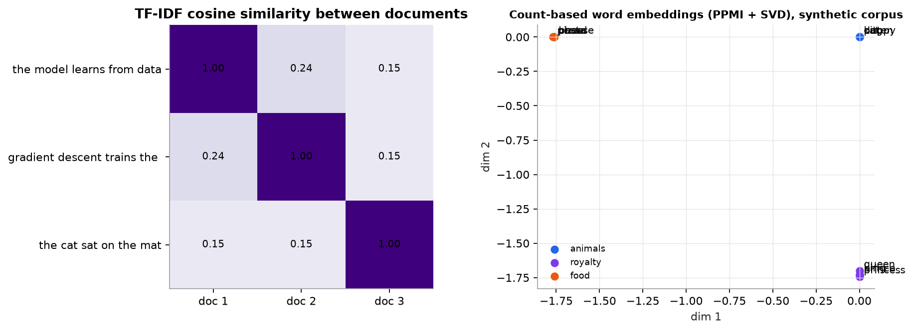

# From text to vectors

> **Mental model.** Give every word in the vocabulary its own column and count how often it appears in each document. Then down-weight words that appear everywhere ("the") and up-weight words that are frequent in this document but rare elsewhere. That weighted count vector is TF-IDF.

**You will learn to**
- Tokenize and normalize text, and know which cleaning steps matter for which models.
- Build a document-term matrix with unigrams and n-grams.
- Compute term frequency, document frequency, IDF, and TF-IDF for a word by hand.
- Compute cosine similarity between documents.
- Build a TF-IDF plus linear-model classifier and know its limits.

**Why it matters.** TF-IDF with a linear model is fast, cheap, interpretable, and an excellent baseline that transformers must beat to justify their cost. Sparse retrieval (BM25, a TF-IDF relative) is still a core part of production search and hybrid RAG.

## 1. Intuition

Models need numbers. The simplest way to turn a document into numbers:

1. **Tokenize:** split text into units (words, subwords, or characters).
2. **Normalize:** lowercase, normalize Unicode, maybe remove punctuation. Aggressive cleaning can destroy meaning ("not" removed as a stop word flips sentiment), and transformers generally need none of it.
3. **Build a vocabulary** from the training set.
4. **Count:** each document becomes a vector with one entry per vocabulary word. This is **bag-of-words**: word order is thrown away.

**N-grams** recover a little order by also counting adjacent pairs ("not good") or triples.

Raw counts overweight common words. **TF-IDF** multiplies each count by how rare the word is across documents, so distinctive words dominate.

**Cosine similarity** compares two document vectors by angle, not length, so a long and a short document about the same topic still look similar.

## 2. Visualization

<!-- lab:tfidf -->


*Synthetic corpora. Left: similarity comes only from shared words ("the", "model"). Right: a preview of the next lesson, where words get dense vectors from the contexts they appear in.*

*Interactive version: edit a corpus and see TF, DF, IDF, and TF-IDF for every word, with a worked calculation for any cell and a document-similarity matrix. [Open the lab](https://sreshtalluri.github.io/ml-ai-learn/labs/tfidf/).*
<!-- /lab -->

**Try it** (predict first, then check):

1. Predict the IDF of "the" before clicking its column. Then check the worked calculation.
2. Add a near-duplicate document. Which pair of documents gets the highest cosine similarity?

## 3. The math

### Symbols

| Symbol | Meaning |
|---|---|
| $t$ | a term (word or n-gram) |
| $d$ | a document |
| $N$ | number of documents |
| $\text{TF}(t, d)$ | count of $t$ in $d$ (other variants normalize by length) |
| $\text{DF}(t)$ | number of documents containing $t$ |
| $\text{IDF}(t)$ | inverse document frequency |

### Formulas

```math
\text{IDF}(t) = \ln\frac{N}{\text{DF}(t)}, \qquad \text{TF-IDF}(t, d) = \text{TF}(t, d) \times \text{IDF}(t), \qquad \cos(a, b) = \frac{a \cdot b}{\lVert a\rVert\,\lVert b\rVert}
```

A word in every document has $\text{IDF} = \ln 1 = 0$. scikit-learn's default uses a smoothed variant, $\ln\frac{1+N}{1+\text{DF}} + 1$, and L2-normalizes each row, so its numbers differ from hand calculations.

### Worked example 1: bag-of-words

Documents "machine learning is useful" and "machine learning learning." Vocabulary (alphabetical): is, learning, machine, useful.

| | is | learning | machine | useful |
|---|---|---|---|---|
| doc 1 | 1 | 1 | 1 | 1 |
| doc 2 | 0 | 2 | 1 | 0 |

With bigrams, "the movie was not good" contributes "not good" as its own feature, which a unigram model can't represent.

### Worked example 2: TF-IDF (the course example)

$N = 100$ documents. "gradient" occurs 3 times in document $d$ and appears in 5 documents overall.

```math
\text{IDF} = \ln\frac{100}{5} = \ln 20 = 2.996, \qquad \text{TF-IDF} = 3 \times 2.996 = 8.99
```

### Worked example 3: a three-document corpus

Corpus: (1) "the model learns from data", (2) "gradient descent trains the model", (3) "the cat sat on the mat". For document 2:

| Word | TF | DF | IDF $= \ln(3/\text{DF})$ | TF-IDF |
|---|---|---|---|---|
| the | 1 | 3 | $\ln 1 = 0$ | 0 |
| model | 1 | 2 | $\ln 1.5 = 0.405$ | 0.405 |
| gradient | 1 | 1 | $\ln 3 = 1.099$ | 1.099 |

"gradient" is the most distinctive word in document 2; "the" carries nothing.

### Worked example 4: cosine similarity

$a = [1, 2, 0]$ and $b = [2, 1, 1]$: $a \cdot b = 2 + 2 + 0 = 4$; $\lVert a\rVert = \sqrt{5} = 2.236$; $\lVert b\rVert = \sqrt{6} = 2.449$. $\cos = 4/(2.236 \times 2.449) = 0.730$.

## 4. Implementation

```python
from sklearn.feature_extraction.text import TfidfVectorizer
from sklearn.linear_model import LogisticRegression
from sklearn.pipeline import make_pipeline

text_model = make_pipeline(
    TfidfVectorizer(ngram_range=(1, 2), min_df=2, max_features=50_000, sublinear_tf=True),
    LogisticRegression(max_iter=1000, C=4.0),
)
text_model.fit(train_texts, train_labels)

# Which words push predictions most? (interpretability for free)
vec, clf = text_model[0], text_model[-1]
top = clf.coef_[0].argsort()[-15:]
print(vec.get_feature_names_out()[top])
```

Runnable script (bag-of-words, bigrams, TF-IDF by hand and in scikit-learn, cosine similarity, embedding preview): [`code/09-classical-nlp/nlp.py`](../../code/09-classical-nlp/nlp.py).

## 5. Engineering

**Strengths.** Trains in seconds on millions of documents; runs on a CPU in microseconds; coefficients explain predictions; works with little labeled data; strong for topic and keyword-driven tasks (spam, ticket routing, document categorization).

**Limits.** No semantics: "cat" and "kitten" are unrelated columns, so "my cat sleeps" and "a kitten sleeps" share only "sleeps." Order is lost beyond the n-gram window. The vocabulary is frozen at training time, so new words are ignored. Vectors are huge and sparse.

**Preprocessing.** Fit the vocabulary and IDF on training data only. Stop-word removal and stemming can help classical models on small data; test rather than assume. Keep negations. Use `min_df` to drop typos and `max_df` to drop near-universal words.

**Sparse retrieval.** BM25 refines TF-IDF with term-frequency saturation and document-length normalization, and remains a strong first-stage retriever, often combined with dense embeddings (hybrid search).

> [!WARNING]
> **Failure modes.** Fitting the vectorizer on all data (leakage); removing words that carry meaning ("not", "no"); assuming two documents are unrelated because they share no words; a vocabulary that goes stale as language drifts.

### Common mistakes

- Comparing hand-computed TF-IDF with scikit-learn's smoothed, normalized values and assuming a bug.
- Using raw counts with cosine similarity and forgetting how stop words dominate.
- Huge n-gram ranges that explode the feature count with mostly unique features.

## 6. Knowledge check

<!-- quiz:text-to-vectors -->
**[Take the text-to-vectors quiz](../../quizzes/text-to-vectors.md)**
<!-- /quiz -->

**Practice exercise.** In a corpus of 50 documents, "transformer" appears in 2 documents and occurs 4 times in document $d$. Compute its TF-IDF in $d$ with the course formula.

<details>
<summary>Solution</summary>

IDF $= \ln(50/2) = \ln 25 = 3.219$. TF-IDF $= 4 \times 3.219 = 12.88$.
</details>

**Implementation challenge.** Implement TF-IDF from scratch with NumPy (vocabulary, counts, DF, IDF, L2 row normalization), match scikit-learn's output with `smooth_idf=True`, and use it to retrieve the most similar document to a query by cosine similarity.

## Summary

- Tokenize, build a training vocabulary, and count: bag-of-words; n-grams keep short phrases.
- TF-IDF $= \text{TF} \times \ln(N/\text{DF})$ up-weights distinctive words and zeroes words found everywhere.
- Cosine similarity compares direction, not length.
- TF-IDF plus a linear model is a fast, interpretable baseline; it has no notion of meaning beyond shared words.

**Next:** [Word embeddings](02-word-embeddings.md)

**Related:** [Naive Bayes](../05-instance-and-probabilistic/02-naive-bayes.md) · [The RAG pipeline](../16-rag/01-rag-pipeline.md)

## Interview angle

<details>
<summary><strong>Explain TF-IDF. Why is the IDF term needed?</strong></summary>

TF-IDF weights a term in a document by how often it appears there (TF) times how rare it is across the corpus, $\text{IDF}(t) = \ln\frac{N}{\text{DF}(t)}$. Raw counts are dominated by frequent words like "the" and "is" that appear everywhere and say nothing about topic; IDF scales them toward zero (a word in every document gets $\ln 1 = 0$) and boosts distinctive words. With $N = 100$ documents, a term found in 5 of them gets $\text{IDF} = \ln 20 = 3.0$, and three occurrences give TF-IDF $\approx 9.0$. Rows are usually L2-normalized so long documents don't dominate cosine similarity. Libraries differ: scikit-learn uses a smoothed $\ln\frac{1+N}{1+\text{DF}} + 1$, so hand calculations won't match exactly. Limits: no semantics and no word order beyond n-grams. BM25 refines TF-IDF with term-frequency saturation and length normalization and remains a strong retrieval baseline.

</details>

<details>
<summary><strong>TF-IDF with logistic regression, or a fine-tuned transformer, for text classification? How do you decide?</strong></summary>

Start with TF-IDF plus a linear model: it trains in seconds on a CPU, serves in microseconds, needs little labeled data, and its coefficients explain predictions. On keyword-driven tasks (spam, ticket routing, topic labeling) it's often within a few points of a transformer. Choose a transformer when meaning depends on context, word order, negation, or paraphrase ("not bad at all"), when vocabulary varies widely (synonyms, misspellings, many languages), or when labels are scarce and pretrained knowledge helps; sentiment and intent tasks usually gain the most. The costs: GPU training, tens of milliseconds or more of inference latency, more memory, and harder debugging. A middle option is frozen sentence embeddings plus logistic regression. Decide by measurement: build the TF-IDF baseline first and take on transformer complexity only if the gap matters for the business metric.

</details>

<details>
<summary><strong>Your bag-of-words sentiment classifier, built with stop-word removal, labels "not good" reviews as positive. What went wrong?</strong></summary>

Two compounding issues. Many standard stop-word lists include negations such as "not," "no," and "nor," so removal turns "not good" into "good." And even with negations kept, a unigram bag-of-words treats "not" and "good" as independent features, so it can't represent that "not" flips "good." Fixes: keep negation words (use a custom stop-word list, or skip stop-word removal, which rarely helps regularized linear models anyway); add bigrams with `ngram_range=(1, 2)` so "not good" becomes its own feature, which usually gives a clear gain on sentiment; or apply negation marking, prefixing tokens after "not" until the next punctuation. Long-range negation and sarcasm need contextual models. The broader lesson: validate preprocessing choices on held-out data instead of applying them by default, and read the misclassified examples.

</details>

<details>
<summary><strong>In a 1,000-document corpus, "refund" appears in 10 documents and "the" in all 1,000. A ticket contains "refund" twice and "the" 20 times. Compute their TF-IDF weights. What would raw counts have said?</strong></summary>

IDF of "refund" is $\ln(1000/10) = \ln 100 = 4.605$, so its TF-IDF is $2 \times 4.605 = 9.21$. IDF of "the" is $\ln(1000/1000) = \ln 1 = 0$, so its weight is $0$ despite 20 occurrences. With raw counts, "the" would be the ticket's largest coordinate, ten times "refund," and cosine similarity between tickets would mostly measure how many function words they share. TF-IDF flips this: the vector points toward "refund," which is what a router or search engine needs. Two follow-ups: scikit-learn's smoothed IDF gives "the" a weight of $\ln\frac{1001}{1001} + 1 = 1$ per occurrence rather than zero, which row normalization then dilutes; and TF is often made sublinear, $1 + \ln \text{TF}$, so that 20 repetitions don't count 20 times as much as one.

</details>
