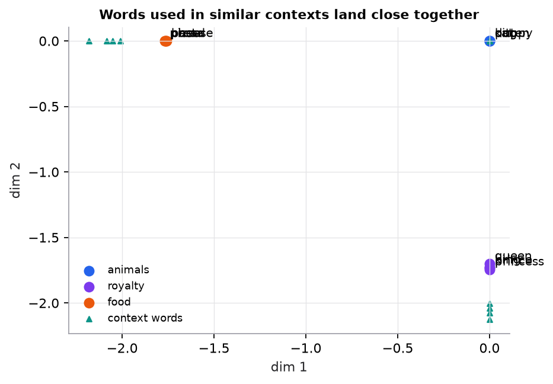

# Word embeddings

> **Mental model.** "You shall know a word by the company it keeps." Words that appear in similar contexts get similar vectors, so "cat" ends up near "kitten" even if the two never appear in the same sentence.

**You will learn to**
- Explain the distributional hypothesis and why it produces useful vectors.
- Describe the skip-gram and CBOW objectives and negative sampling.
- Compute similarity between embeddings and read a 2D embedding map critically.
- Explain an embedding matrix as a lookup table with shape $[V, d]$.
- Distinguish static embeddings (one vector per word) from contextual ones (one vector per occurrence).

**Why it matters.** Dense embeddings are how neural models represent everything discrete: words, tokens, users, products, documents. LLMs start with an embedding table, and retrieval systems search over embedding vectors.

## 1. Intuition

With TF-IDF, every word is its own axis, so all words are equally unrelated. Embeddings instead squeeze each word into a short dense vector (50 to 1,000 numbers) where *direction* carries meaning.

How do we find those vectors without labels? Self-supervision. **Word2Vec** slides a window over text and plays a prediction game:

- **Skip-gram:** given the center word, predict the words around it.
- **CBOW (continuous bag of words):** given the surrounding words, predict the center word.

To win, the model must give words that share contexts similar vectors, because similar vectors make similar predictions. "Cat" and "kitten" both appear near "pet," "fur," and "vet," so they end up close together.

**Static embeddings** give "bank" one vector whether it means a riverbank or a financial bank. **Contextual embeddings** from transformers compute a different vector for each occurrence, using the surrounding sentence. That is what modern NLP uses.

## 2. Visualization



*Synthetic corpus where each group of words appears with its own context words. A count-based method (co-occurrence, positive PMI, then SVD to 2 dimensions) recovers the three groups: cosine similarity is 0.997 for cat and dog but −0.997 for cat and king. Real embeddings are learned from billions of words and have hundreds of dimensions.*

## 3. The math

### Symbols

| Symbol | Meaning | Shape |
|---|---|---|
| $V$ | vocabulary size | scalar |
| $d$ | embedding dimension | scalar |
| $E$ | embedding matrix (input vectors) | $[V, d]$ |
| $e_w$ | embedding of word $w$ (a row of $E$) | $[d]$ |
| $u_c$ | output ("context") vector of word $c$ | $[d]$ |
| $\sigma$ | sigmoid | |

### Embedding lookup

A token ID $i$ selects row $i$ of $E$. Equivalently, multiply a one-hot vector by $E$: $e = \text{onehot}(i)^\top E$. Gradients during training update only the rows that were used.

### Skip-gram with negative sampling

For each (center word $w$, true context word $c$) pair, plus $k$ random "negative" words $n_1..n_k$, maximize

```math
\log \sigma(e_w \cdot u_c) + \sum_{j=1}^{k} \log \sigma(-e_w \cdot u_{n_j})
```

That is binary classification: push the dot product up for real pairs and down for random pairs. Words that share contexts get pushed toward the same context vectors, so their embeddings become similar.

### Count-based alternative

Build a word-word co-occurrence matrix, convert counts to positive pointwise mutual information, $\text{PPMI}(w, c) = \max\left(0, \ln\frac{P(w, c)}{P(w)P(c)}\right)$, and reduce dimensions with SVD. Word2Vec has been shown to implicitly factorize a matrix closely related to this one; the script uses this method because it needs no deep-learning library.

### Worked example: similarity and analogy

Toy 3D embeddings: king $= [0.9, 0.8, 0.1]$, queen $= [0.9, 0.1, 0.8]$, man $= [0.1, 0.9, 0.0]$, woman $= [0.1, 0.1, 0.9]$.

**Analogy.** king − man + woman $= [0.9 - 0.1 + 0.1,\; 0.8 - 0.9 + 0.1,\; 0.1 - 0.0 + 0.9] = [0.9, 0.0, 1.0]$.
Cosine with queen: dot $= 0.81 + 0 + 0.8 = 1.61$; norms $\sqrt{0.81 + 1} = 1.345$ and $\sqrt{0.81 + 0.01 + 0.64} = 1.208$; cosine $= 1.61 / 1.625 = 0.991$. The nearest word to the analogy vector is "queen." (These numbers are hand-picked to illustrate the idea; real analogies hold only approximately.)

## 4. Implementation

```python
import numpy as np

# An embedding layer is just a lookup table
V, d = 10_000, 128
E = np.random.default_rng(0).normal(0, 0.1, (V, d))   # [V, d], learned during training
token_ids = np.array([12, 845, 3])
vectors = E[token_ids]                                # [3, d]

def most_similar(word_vec, E, k=5):
    En = E / np.linalg.norm(E, axis=1, keepdims=True)
    sims = En @ (word_vec / np.linalg.norm(word_vec))
    return np.argsort(-sims)[:k]
```

Training Word2Vec in practice (`pip install gensim`):

```python
from gensim.models import Word2Vec
model = Word2Vec(sentences=tokenized_sentences, vector_size=100, window=5, sg=1, negative=5, min_count=5)
model.wv.most_similar("kitten")
```

Contextual embeddings with a pretrained transformer (`pip install sentence-transformers`):

```python
from sentence_transformers import SentenceTransformer
encoder = SentenceTransformer("all-MiniLM-L6-v2")
vecs = encoder.encode(["my cat sleeps", "a kitten naps"], normalize_embeddings=True)
print(vecs[0] @ vecs[1])     # high similarity despite no shared words
```

Runnable script (PPMI + SVD embeddings and the TF-IDF comparison): [`code/09-classical-nlp/nlp.py`](../../code/09-classical-nlp/nlp.py).

## 5. Engineering

| Approach | Advantages | Limitations |
|---|---|---|
| TF-IDF + linear model | fast, cheap, interpretable, excellent baseline | sparse; no semantics beyond shared words |
| Static embeddings (Word2Vec, GloVe) | dense semantics, reusable | one vector per word; weak with ambiguity |
| Transformer embeddings | contextual, transferable | more compute, latency, and complexity |

**Uses.** Features for downstream models; semantic search and RAG (embed documents and queries, retrieve by cosine similarity); clustering and deduplication; recommendation (user and item embeddings).

**Choosing an embedding model.** Match the domain and language; check the maximum input length; benchmark on *your* retrieval or similarity task rather than trusting leaderboards; consider dimension (storage and speed) and whether vectors are normalized.

**Bias.** Embeddings learned from web text encode social biases present in that text (for example, gender associations with occupations). Audit before using them in decisions about people.

> [!WARNING]
> **Failure modes.** Out-of-vocabulary words with static embeddings (subword models fix this); ambiguous words averaged into one vector; mixing vectors from different embedding models in one index; re-embedding documents with a new model but not the queries (or vice versa).

### Common mistakes

- Reading 2D projections of embeddings as exact geometry.
- Comparing unnormalized vectors with dot products when the model expects cosine.
- Assuming analogies always work; they are approximate and cherry-picked in demos.

## 6. Knowledge check

<!-- quiz:word-embeddings -->
**[Take the word embeddings quiz](../../quizzes/word-embeddings.md)**
<!-- /quiz -->

**Practice exercise.** An embedding matrix has a vocabulary of 50,000 tokens and dimension 768. How many parameters does it have, and what is the shape of the output for a batch of 8 sequences of 128 tokens?

<details>
<summary>Solution</summary>

$50{,}000 \times 768 = 38{,}400{,}000$ parameters. Output shape $[8, 128, 768]$.
</details>

**Implementation challenge.** Implement skip-gram with negative sampling in NumPy on a small corpus: generate (center, context) pairs with a window of 2, sample 5 negatives per pair, and update input and output vectors with the gradient of the objective above. Check that words from the same synthetic group become nearest neighbors.

## Summary

- Embeddings are dense vectors where words with similar contexts are close, learned by self-supervised prediction (skip-gram, CBOW) or count factorization.
- An embedding layer is a lookup table of shape $[V, d]$.
- Cosine similarity compares embeddings; analogies are a fun but approximate property.
- Static embeddings give one vector per word; contextual (transformer) embeddings give one per occurrence.

**Next:** [The neural-network forward pass](../10-neural-networks/01-neural-network-forward-pass.md)

**Related:** [From text to vectors](01-text-to-vectors.md) · [Self-attention](../14-transformers/01-self-attention.md) · [Model card: embedding model](../../models/embedding-model.md)

## Interview angle

<details>
<summary><strong>How does skip-gram with negative sampling learn word embeddings?</strong></summary>

Slide a window over text to form (center word, context word) pairs. For each true pair $(w, c)$, sample $k$ "negative" words from a smoothed unigram distribution (frequency raised to the 3/4 power). Then train a binary classifier: maximize $\log\sigma(e_w \cdot u_c) + \sum_j \log\sigma(-e_w \cdot u_{n_j})$, raising the dot product for real pairs and lowering it for random ones. Words that occur in similar contexts receive similar updates, pulled toward the same context vectors, so their embeddings end up close: the distributional hypothesis in action. Negative sampling replaces a softmax over the whole vocabulary, which costs $O(V)$ per example, with $k + 1$ binary classifications ($k$ is typically 5 to 20), which makes training cheap. Only the embedding rows used in a batch get updated. Levy and Goldberg showed it implicitly factorizes a shifted PMI matrix.

</details>

<details>
<summary><strong>Static embeddings or contextual transformer embeddings: when does each fit?</strong></summary>

Static embeddings (Word2Vec, GloVe, fastText) give one vector per word type regardless of context, so "bank" in "river bank" and "bank account" share a single averaged vector. They're small, fast (a table lookup), and good features for lightweight models or tight compute budgets. Contextual embeddings from transformers compute a vector per token from the whole input, so ambiguity is resolved and word order matters; sentence-embedding models trained contrastively produce strong vectors for whole passages, the basis of semantic search and RAG. Costs: a forward pass per input, GPU or slower CPU inference, larger vectors, and versioning, since a new model means re-embedding the corpus. Rule of thumb: for retrieval, meaning-sensitive classification, or anything with ambiguity, use a modern embedding model benchmarked on your own data; use static embeddings when latency or footprint dominate, or as a baseline.

</details>

<details>
<summary><strong>Semantic search quality collapsed right after you upgraded the embedding model. What happened?</strong></summary>

Almost certainly an embedding-space mismatch: queries are embedded with the new model while the index still holds document vectors from the old one, or only partly re-embedded ones. Vectors from different models, even different versions of the same model, live in unrelated coordinate systems, so their cosine similarities are meaningless, even when the dimensions match. Check whether query and document vectors carry the same model version tag. Other suspects: the new model expects normalized vectors or cosine but the index uses raw inner product; it requires instruction prefixes such as "query: " and "passage: " for asymmetric search; its maximum input length is shorter, silently truncating chunks; or the dimension changed and the index was misconfigured. Fix: re-embed the entire corpus, store the model version with every vector, build the new index alongside the old one, and compare recall@k on a labeled query set before switching traffic.

</details>

<details>
<summary><strong>You need to index 50 million documents with 1,024-dimensional float32 embeddings. How much memory do the vectors need, and how would you cut it?</strong></summary>

$5 \times 10^7 \times 1024 \times 4$ bytes $= 2.05 \times 10^{11}$ bytes, about 205 GB for the raw vectors, before index overhead (an HNSW graph adds more). Ways to cut it: store float16, halving it to about 102 GB with negligible quality loss; scalar-quantize to int8, about 51 GB, with a small recall loss that re-ranking recovers; product quantization to around 64 bytes per vector, about 3.2 GB, with a larger loss, so re-rank the top candidates using full vectors kept on disk; binary quantization at 128 bytes per vector as a fast first pass; or fewer dimensions, from a smaller model or one trained to allow truncation (Matryoshka embeddings), for example 256 dimensions. Measure recall@k against exact search on a labeled query set for each option, because the quality loss depends on the model and the data.

</details>
