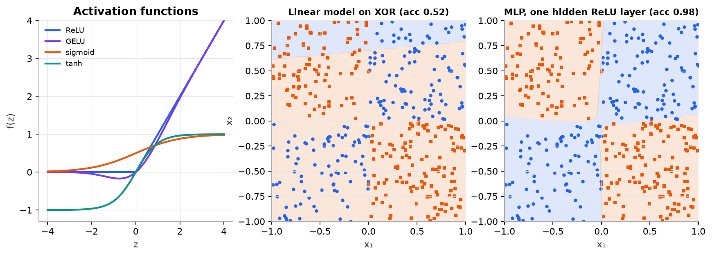

# The neural-network forward pass

> **Mental model.** A neural network is a stack of simple steps: mix the inputs with weights, add a bias, bend the result with a nonlinear function, and pass it on. Each layer turns its input into a slightly more useful representation for the next.

**You will learn to**
- Describe a neuron, a layer, weights, biases, and activations precisely.
- Compute the forward pass of a small network by hand.
- Write and check tensor shapes for single examples and for batches.
- Explain why stacking layers without activations collapses into one linear model.
- Choose activation functions and output layers for regression and classification.

**Why it matters.** Every deep model, from a tabular MLP to a transformer, runs a forward pass to make a prediction. Training (backpropagation) is just the forward pass run in reverse. If you can follow numbers and shapes through a two-layer network, you can read the code of any modern architecture.

## 1. Intuition

You already know logistic regression: compute a weighted sum of the inputs plus a bias, then squeeze it through a sigmoid. That is exactly one **neuron**.

A **layer** is many neurons looking at the same inputs, each with its own weights. A layer with 3 neurons turns 2 input numbers into 3 new numbers, three different "views" of the input. Each view goes through an **activation function**, usually something simple like ReLU (keep positives, zero out negatives).

Stack layers and each one builds on the previous: in an image model, early layers respond to edges, later ones to textures, later still to object parts. The final layer turns the last representation into the answer: one number for regression, a probability for yes/no, or a probability distribution over classes.

Why the activation function? Without it, every layer is a weighted sum of a weighted sum, which is still just a weighted sum. A hundred linear layers can do no more than one. The bends introduced by activations are what let the network draw curved decision boundaries.

## 2. Visualization

<!-- lab:nn-forward -->


*Synthetic XOR data: the label is 1 when $x_1$ and $x_2$ have different signs. No straight line separates the classes, so a linear model is stuck at chance. One hidden ReLU layer is enough.*

*Interactive version: change the number of inputs, hidden units, and outputs, switch activations, click any weight to edit it, and follow every number and shape. [Open the lab](https://sreshtalluri.github.io/ml-ai-learn/labs/nn-forward/).*
<!-- /lab -->

**Try it** (predict first, then check):

1. Pick a hidden neuron whose z is negative with ReLU. Predict what changing its outgoing weight does to the output, then try.
2. Switch the activation to sigmoid and watch the hidden values. What range do they stay in?

What to notice:
- ReLU is zero for all negative inputs and has a slope of exactly 1 for positive ones. It is cheap and its gradient doesn't shrink for positive values, which is why it is the default in hidden layers.
- Sigmoid and tanh flatten out at both ends. Large inputs give gradients near zero ("saturation"), which slows learning in deep stacks.
- GELU is a smooth version of ReLU used in transformers.

## 3. The math

### Symbols

| Symbol | Meaning | Shape (single example) |
|---|---|---|
| $x$ | input features | $[d_{\text{in}}]$ |
| $W^{(1)}$ | first-layer weights: row $i$ holds hidden neuron $i$'s weights | $[d_h, d_{\text{in}}]$ |
| $b^{(1)}$ | first-layer biases, one per hidden neuron | $[d_h]$ |
| $z^{(1)}$ | pre-activations of the hidden layer | $[d_h]$ |
| $f$ | activation function, applied element-wise | |
| $a^{(1)}$ | hidden activations, $f(z^{(1)})$ | $[d_h]$ |
| $W^{(2)}, b^{(2)}$ | output-layer weights and biases | $[d_{\text{out}}, d_h]$, $[d_{\text{out}}]$ |
| $\hat{y}$ | network output | $[d_{\text{out}}]$ |

### One layer

```math
z = Wx + b, \qquad a = f(z)
```

Hidden neuron $i$ computes $z_i = \sum_j W_{ij} x_j + b_i$: a dot product of its weight row with the input, plus its bias.

### A two-layer network (one hidden layer)

```math
\hat{y} = g\!\left(W^{(2)} f\!\left(W^{(1)} x + b^{(1)}\right) + b^{(2)}\right)
```

Here $g$ is the output activation, chosen by the task:

| Task | Output layer | Output activation $g$ | Loss |
|---|---|---|---|
| Regression | 1 unit | none (identity) | MSE |
| Binary classification | 1 unit | sigmoid | binary cross-entropy |
| $K$-class classification | $K$ units | softmax | categorical cross-entropy |

### Common activations

```math
\text{ReLU}(z) = \max(0, z), \quad \sigma(z) = \frac{1}{1+e^{-z}}, \quad \tanh(z) = \frac{e^z - e^{-z}}{e^z + e^{-z}}, \quad \text{GELU}(z) = z\,\Phi(z)
```

$\Phi$ is the standard normal cumulative distribution function.

### Why depth needs nonlinearity

Without $f$:

```math
W^{(2)}(W^{(1)}x + b^{(1)}) + b^{(2)} = \underbrace{(W^{(2)}W^{(1)})}_{W_c}\,x + \underbrace{(W^{(2)}b^{(1)} + b^{(2)})}_{b_c}
```

which is a single linear layer with weights $W_c$ and bias $b_c$. Any number of linear layers collapses the same way.

### Worked example

A network with 2 inputs, 3 hidden ReLU units, and 1 sigmoid output.

```math
x = \begin{bmatrix}1\\2\end{bmatrix},\quad
W^{(1)} = \begin{bmatrix}0.5 & -1\\ 1 & 1\\ -0.5 & 0.25\end{bmatrix},\quad
b^{(1)} = \begin{bmatrix}0\\-1\\0.5\end{bmatrix},\quad
W^{(2)} = \begin{bmatrix}1 & -0.5 & 2\end{bmatrix},\quad
b^{(2)} = 0.25
```

**Step 1: hidden pre-activations** $z^{(1)} = W^{(1)}x + b^{(1)}$. Shape check: $[3,2]\times[2] = [3]$.

| Neuron | Weighted sum | + bias | $z$ |
|---|---|---|---|
| 1 | $0.5(1) + (-1)(2) = -1.5$ | $+0$ | $-1.5$ |
| 2 | $1(1) + 1(2) = 3$ | $-1$ | $2$ |
| 3 | $-0.5(1) + 0.25(2) = 0$ | $+0.5$ | $0.5$ |

**Step 2: ReLU.** $a^{(1)} = [\max(0,-1.5),\, \max(0,2),\, \max(0,0.5)] = [0,\; 2,\; 0.5]$. Neuron 1 is "off" for this input.

**Step 3: output pre-activation.** $z^{(2)} = W^{(2)}a^{(1)} + b^{(2)} = 1(0) + (-0.5)(2) + 2(0.5) + 0.25 = 0 - 1 + 1 + 0.25 = 0.25$. Shape: $[1,3]\times[3] = [1]$.

**Step 4: sigmoid.** $\hat{y} = 1/(1 + e^{-0.25}) = 1/(1 + 0.7788) = 0.5622$.

**Parameter count:** $W^{(1)}$ has 6 entries, $b^{(1)}$ 3, $W^{(2)}$ 3, $b^{(2)}$ 1, so 13 parameters.

**Without the ReLU**, neuron 1's $-1.5$ would pass through: $z^{(2)} = 1(-1.5) - 0.5(2) + 2(0.5) + 0.25 = -1.25$, exactly what the collapsed single layer $W_c x + b_c$ gives.

### Batches

In code, examples are rows. A batch $X$ has shape $[B, d_{\text{in}}]$, and frameworks store weights so that

```math
H = f(XW_1^\top + b_1) \quad [B, d_h], \qquad \hat{Y} = g(HW_2^\top + b_2) \quad [B, d_{\text{out}}]
```

with the bias broadcast across the $B$ rows. For a batch of 4 examples: $X$ is $[4, 2]$, $H$ is $[4, 3]$, and $\hat{Y}$ is $[4, 1]$.

## 4. Implementation

**From scratch (NumPy):**

```python
import numpy as np

def relu(z): return np.maximum(0, z)
def sigmoid(z): return 1 / (1 + np.exp(-z))

def forward(X, W1, b1, W2, b2):
    H = relu(X @ W1.T + b1)        # [B, d_in] @ [d_in, d_h] -> [B, d_h]
    return sigmoid(H @ W2.T + b2)  # [B, d_h] @ [d_h, 1]    -> [B, 1]
```

**In PyTorch:**

```python
import torch
from torch import nn

model = nn.Sequential(
    nn.Linear(2, 3),   # stores weight [3, 2] and bias [3]; computes X @ W.T + b
    nn.ReLU(),
    nn.Linear(3, 1),
)
logits = model(torch.randn(4, 2))     # [4, 1] raw scores
probs = torch.sigmoid(logits)
# For training, pass logits to nn.BCEWithLogitsLoss, which is more numerically stable.
```

Runnable script (worked example, batched shapes, the linear-collapse check, the XOR figure): [`code/10-neural-networks/forward_pass.py`](../../code/10-neural-networks/forward_pass.py).

## 5. Engineering

**Where MLPs fit.** As standalone models they are fine for medium-size tabular data, though gradient-boosted trees usually beat them there. Their real importance is as building blocks: the feed-forward sublayer in every transformer block, prediction heads on top of pretrained encoders, and projection layers everywhere.

**Width, depth, and parameters.** A layer from $d_{\text{in}}$ to $d_{\text{out}}$ has $d_{\text{in}} \times d_{\text{out}} + d_{\text{out}}$ parameters. Compute for a batch is about $2 \times B \times$ (parameters) multiply-adds per forward pass, so wide layers dominate cost. Depth adds expressiveness cheaply but makes optimization harder without residual connections and normalization.

**Initialization.** Weights must start random (identical weights would make every neuron in a layer compute the same thing forever) and appropriately scaled. He initialization (variance $2/d_{\text{in}}$) suits ReLU; Xavier/Glorot suits tanh. Frameworks apply sensible defaults.

**Preprocessing.** Standardize numeric inputs. Large raw values push activations into saturated or exploding regions on the first step.

**Numerical stability.** Return logits from the model and let the loss function apply sigmoid or softmax internally (`BCEWithLogitsLoss`, `CrossEntropyLoss`). Computing `log(sigmoid(z))` yourself overflows for large $|z|$.

> [!WARNING]
> **Failure modes.** Dead ReLUs: a neuron whose pre-activation is negative for every input outputs zero and receives zero gradient, so it never recovers (often caused by a large learning rate or a bad bias). Saturation with sigmoid or tanh in hidden layers slows learning. Shape bugs that broadcast silently (a `[B]` target against a `[B, 1]` prediction) produce wrong losses without errors.

### Common mistakes

- Applying softmax in the model *and* using `CrossEntropyLoss`, which applies it again.
- Forgetting the activation between layers, which quietly turns the network into a linear model.
- Mixing up `[d_out, d_in]` (PyTorch weight storage) with `[d_in, d_out]` when implementing from scratch.
- Not tracking shapes, then "fixing" an error with a transpose that changes the meaning.
- Initializing all weights to zero.

## 6. Knowledge check

<!-- quiz:neural-network-forward-pass -->
**[Take the forward-pass quiz](../../quizzes/neural-network-forward-pass.md)**: compute activations, count parameters, check shapes, and diagnose broken networks.
<!-- /quiz -->

**Practice exercise.** Using the same network, compute $\hat{y}$ for $x = (0, 0)$.

<details>
<summary>Solution</summary>

$z^{(1)} = b^{(1)} = [0, -1, 0.5]$. ReLU gives $[0, 0, 0.5]$.
$z^{(2)} = 1(0) - 0.5(0) + 2(0.5) + 0.25 = 1.25$, so $\hat{y} = \sigma(1.25) = 1/(1 + e^{-1.25}) = 1/(1 + 0.2865) = 0.7773$.
This matches the second row of the batched output in the script.
</details>

**Implementation challenge.** Extend `forward` to any number of layers given lists of weight matrices and biases, with a softmax output. Verify it against `torch.nn.Sequential` with the same weights copied in (use `torch.allclose`).

## Summary

- A layer computes $f(Wx + b)$: dot products with weight rows, plus biases, then an element-wise nonlinearity.
- A network composes layers; the output activation (none, sigmoid, softmax) depends on the task.
- Track shapes: $[B, d_{\text{in}}] \to [B, d_h] \to [B, d_{\text{out}}]$; a layer has $d_{\text{in}} d_{\text{out}} + d_{\text{out}}$ parameters.
- Without nonlinear activations, any stack of layers collapses into one linear layer.
- ReLU (and GELU in transformers) are the defaults; return logits and let the loss apply the final squashing.

**Next:** [Gradient descent](../11-gradient-descent-backprop/01-gradient-descent.md)

**Related:** [Logistic regression](../04-classification/01-logistic-regression.md) · [Backpropagation](../11-gradient-descent-backprop/02-backpropagation.md) · [Model card: MLP](../../models/multilayer-perceptron.md)

## Interview angle

<details>
<summary><strong>Why does a neural network need nonlinear activations? What happens if you remove them?</strong></summary>

Without them, depth buys you nothing. A layer computes $Wx + b$, and a linear function of a linear function is still linear: $W^{(2)}(W^{(1)}x + b^{(1)}) + b^{(2)} = W_c x + b_c$ with $W_c = W^{(2)}W^{(1)}$. A hundred linear layers have exactly the expressive power of one, so the model can only draw a single hyperplane. That is why logistic regression is stuck near 50% on XOR while one hidden ReLU layer separates it. The activation $f$ bends each layer's output, and stacking bends lets the network build piecewise or curved decision boundaries. In the course example, ReLU zeroes neuron 1's $-1.5$; without it the output pre-activation changes from $0.25$ to $-1.25$, which is exactly what the collapsed single layer gives. A related bug: forgetting the activation between two `nn.Linear` layers trains fine and silently gives you a linear model.

</details>

<details>
<summary><strong>ReLU, GELU, sigmoid, tanh: which would you use in hidden layers, and why?</strong></summary>

Default to ReLU in MLPs and CNNs and GELU (or SwiGLU-style gated units) in transformers. ReLU is cheap and has slope exactly 1 for positive inputs, so gradients don't shrink as they pass through active units. Its weakness is dead units: a neuron whose pre-activation is negative for every input outputs 0 and gets 0 gradient forever. GELU, $z\,\Phi(z)$, is a smooth ReLU that lets small negative values through, which empirically trains a little better in large transformers. Sigmoid and tanh saturate: for large $|z|$ their derivatives approach 0 (sigmoid's is at most 0.25), so deep stacks of them suffer vanishing gradients. They still belong in specific places: sigmoid for a binary output or a gate (LSTM gates), tanh where you need a bounded, zero-centered state. Pair the activation with its initialization: He for ReLU-family, Xavier for tanh.

</details>

<details>
<summary><strong>A few hundred steps into training, 40% of your hidden units output zero for every input. What happened and what do you do?</strong></summary>

Those are dead ReLUs. Each one's pre-activation $z = w \cdot x + b$ became negative for every example, so its output is 0 and its gradient is exactly 0; nothing will ever move it back. The usual causes are a learning rate that is too high (one large update pushes the bias far negative), poor initialization, or unscaled inputs that make early updates huge. To confirm, log the fraction of units with zero activation per layer over a batch, and check whether the deaths coincide with a loss spike. Fixes, in order: lower the learning rate or add warmup, standardize inputs, use He initialization, add normalization before the activation, and clip gradients. If it persists, swap to Leaky ReLU or GELU, which have nonzero gradient for negative inputs. Restart from a checkpoint before the collapse; dead units won't recover on their own.

</details>

<details>
<summary><strong>An MLP maps 784 inputs to 256 hidden units to 10 classes. How many parameters does it have, and what are the shapes for a batch of 64?</strong></summary>

About 203.5 thousand parameters. Layer 1 has $784 \times 256 = 200{,}704$ weights plus 256 biases, so 200,960. Layer 2 has $256 \times 10 = 2{,}560$ weights plus 10 biases, so 2,570. Total: $203{,}530$. Shapes: $X$ is $[64, 784]$, the hidden activations $H = \text{ReLU}(XW_1^\top + b_1)$ are $[64, 256]$, and the logits are $[64, 10]$, with each bias broadcast across the 64 rows. In PyTorch, `nn.Linear(784, 256).weight` is stored as $[256, 784]$, which is why the forward pass uses the transpose. Compute is about one multiply-add per weight per example: $64 \times 203{,}264 \approx 13$ million multiply-adds, or about 26 million FLOPs. The first layer holds 99% of the parameters and compute, which is the general pattern: the widest matrix dominates cost. Return the raw logits and let `CrossEntropyLoss` apply softmax.

</details>
