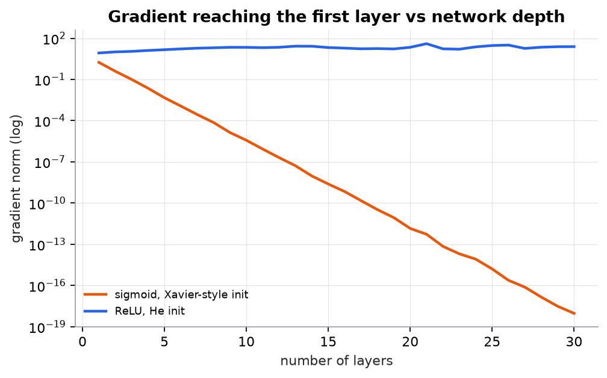

# Backpropagation

> **Mental model.** Backpropagation is the chain rule, applied in reverse order through the computation. It assigns each upstream parameter its share of responsibility for the final loss, reusing intermediate results so every gradient costs about as much as one extra forward pass.

**You will learn to**
- Draw a computational graph and label each node's local derivative.
- Run the nine-step backpropagation example for a one-neuron classifier by hand.
- Explain why sigmoid plus cross-entropy gives the simple error signal $\hat{y} - y$.
- Check gradients with finite differences.
- Explain vanishing and exploding gradients and the standard fixes.

**Why it matters.** Every deep-learning framework's `loss.backward()` is backpropagation (reverse-mode automatic differentiation). Understanding it explains why some networks don't train, why ReLU and residual connections matter, and what gradient clipping does.

## 1. Intuition

The forward pass computes the loss through a chain of simple steps: weighted sum, activation, loss. Each step knows its own **local derivative**: how much its output moves when its input moves.

To find how the loss depends on a weight deep in the chain, multiply the local derivatives along the path from the weight to the loss. Backpropagation does this efficiently: start at the loss with a gradient of 1, and walk backward, multiplying by each node's local derivative and passing the result upstream. When a value feeds into several places, the gradients arriving from each place are added.

The work done for later layers is reused by earlier ones, so computing gradients for millions of parameters costs only a small constant times the forward pass.

## 2. Visualization

<!-- lab:backprop -->


*Synthetic random networks, width 64. At depth 20, the gradient reaching the first sigmoid layer has norm about $10^{-12}$: those weights effectively stop learning. ReLU with He initialization keeps the gradient in a healthy range.*

*Interactive version: the one-neuron example below, with every input editable and all nine steps recomputed live. [Open the lab](https://sreshtalluri.github.io/ml-ai-learn/labs/backprop/).*
<!-- /lab -->

**Try it** (predict first, then check):

1. Change the label to y = 0. Predict the sign of each gradient before looking.
2. Set η to 5 and predict whether the loss goes down. Why can a correct gradient still make things worse?

## 3. The math

### Symbols

| Symbol | Meaning |
|---|---|
| $x_1, x_2$ | inputs |
| $w_1, w_2, b$ | parameters |
| $z$ | weighted sum $w_1x_1 + w_2x_2 + b$ |
| $\hat{y} = \sigma(z)$ | predicted probability |
| $y$ | true label |
| $L$ | binary cross-entropy loss |
| $\eta$ | learning rate |

### Computational graph

| Forward step | Local derivative | Backward contribution |
|---|---|---|
| $z = w_1x_1 + w_2x_2 + b$ | $\partial z/\partial w_1 = x_1$, $\partial z/\partial b = 1$ | $\partial L/\partial w_1 = (\partial L/\partial z)\,x_1$ |
| $\hat{y} = \sigma(z)$ | $\partial \hat{y}/\partial z = \hat{y}(1 - \hat{y})$ | passes sensitivity through the sigmoid |
| $L = -[y\ln\hat{y} + (1-y)\ln(1-\hat{y})]$ | $\partial L/\partial \hat{y} = \frac{\hat{y} - y}{\hat{y}(1-\hat{y})}$ | combined: $\partial L/\partial z = \hat{y} - y$ |

The sigmoid derivative and the cross-entropy derivative cancel, leaving the clean error signal $\hat{y} - y$. That is why sigmoid (and softmax) outputs are paired with cross-entropy.

### Worked example: nine steps

Inputs $x_1 = 2$, $x_2 = 1$. Weights $w_1 = 0.5$, $w_2 = -1$, bias $b = 0$. True label $y = 1$. Learning rate $\eta = 0.1$.

1. **Weighted sum:** $z = 0.5 \times 2 + (-1) \times 1 + 0 = 1 - 1 = 0$.
2. **Sigmoid output:** $\hat{y} = \sigma(0) = 0.5$.
3. **Loss:** $L = -\ln 0.5 = 0.6931$.
4. **Error signal:** $\partial L/\partial z = \hat{y} - y = 0.5 - 1 = -0.5$.
5. **Gradient for $w_1$:** $\partial L/\partial w_1 = (\partial L/\partial z)\,x_1 = -0.5 \times 2 = -1$.
6. **Gradient for $w_2$:** $\partial L/\partial w_2 = -0.5 \times 1 = -0.5$.
7. **Gradient for $b$:** $\partial L/\partial b = -0.5 \times 1 = -0.5$.
8. **Update:** $w_1 = 0.5 - 0.1(-1) = 0.6$; $w_2 = -1 - 0.1(-0.5) = -0.95$; $b = 0 - 0.1(-0.5) = 0.05$.
9. **New prediction:** $z = 0.6 \times 2 - 0.95 \times 1 + 0.05 = 0.30$, so $\hat{y} = \sigma(0.30) = 0.574$. The prediction moved toward $y = 1$.

A finite-difference check, $\frac{L(w_1 + h) - L(w_1 - h)}{2h}$ with $h = 10^{-6}$, gives exactly $-1, -0.5, -0.5$.

Notice that $w_1$ moved twice as much as $w_2$, because its input $x_1 = 2$ was twice as large: a weight's gradient is proportional to the input it multiplies.

### Vanishing and exploding gradients

In a deep network, the gradient reaching layer 1 is a product of many factors: one weight matrix and one activation derivative per layer. The sigmoid's derivative is at most 0.25, so ten sigmoid layers multiply the signal by at most $0.25^{10} \approx 10^{-6}$. Factors consistently greater than 1 cause the opposite: **exploding** gradients and NaN losses.

## 4. Implementation

**From scratch, for a batch:**

```python
import numpy as np

def sigmoid(z): return 1 / (1 + np.exp(-z))

def forward_backward(X, y, w, b):
    z = X @ w + b                       # forward  [n]
    p = sigmoid(z)
    loss = -np.mean(y * np.log(p) + (1 - y) * np.log(1 - p))
    dz = (p - y) / len(y)               # backward: dL/dz for each example (mean loss)
    dw = X.T @ dz                       # dL/dw  [d]
    db = dz.sum()
    return loss, dw, db
```

**In PyTorch** autograd builds the graph during the forward pass and runs it backward:

```python
import torch
w = torch.tensor([0.5, -1.0], requires_grad=True)
b = torch.tensor(0.0, requires_grad=True)
x, y = torch.tensor([2.0, 1.0]), torch.tensor(1.0)
loss = torch.nn.functional.binary_cross_entropy_with_logits(w @ x + b, y)
loss.backward()
print(w.grad, b.grad)        # tensor([-1.0000, -0.5000]) tensor(-0.5000)
```

Runnable script (the nine steps, a finite-difference check, the vanishing-gradient experiment): [`code/11-gradient-descent-backprop/backprop_training.py`](../../code/11-gradient-descent-backprop/backprop_training.py).

## 5. Engineering

**Fixes for vanishing gradients:** ReLU-family activations in hidden layers; careful initialization (He for ReLU, Xavier for tanh); normalization layers (batch norm, layer norm); residual connections, which give gradients a direct path around each block; gated recurrent units (LSTM, GRU) for sequences.

**Fixes for exploding gradients:** gradient clipping (rescale the gradient if its norm exceeds a threshold), lower learning rates, normalization, and careful initialization.

**Memory.** Backpropagation stores the forward activations to reuse them in the backward pass, so training uses much more memory than inference. Gradient checkpointing trades compute for memory by recomputing some activations.

**Debugging.** Check that the loss decreases on a tiny batch you deliberately overfit; check gradients numerically for custom layers; monitor gradient norms per layer (all zeros means a broken path or dead units; enormous values signal explosion).

> [!WARNING]
> **Failure modes.** Gradients that vanish in early layers (they barely learn), explode into NaN, or are silently zero because an operation is non-differentiable or detached from the graph (`.detach()`, `.item()`, NumPy conversions inside the model).

### Common mistakes

- Forgetting to zero gradients between steps, so they accumulate.
- Computing sigmoid then log separately, causing overflow; use fused, stable losses.
- Assuming a lower loss after one step proves the gradients are correct; verify numerically.

## 6. Knowledge check

<!-- quiz:backpropagation -->
**[Take the backpropagation quiz](../../quizzes/backpropagation.md)**
<!-- /quiz -->

**Practice exercise.** Repeat the nine steps with the label changed to $y = 0$ (everything else the same).

<details>
<summary>Solution</summary>

$z = 0$, $\hat{y} = 0.5$, $L = -\ln 0.5 = 0.6931$. Error signal $0.5 - 0 = 0.5$. Gradients: $w_1$: $1$, $w_2$: $0.5$, $b$: $0.5$. Update: $w_1 = 0.4$, $w_2 = -1.05$, $b = -0.05$. New $z = 0.8 - 1.05 - 0.05 = -0.30$, $\hat{y} = 0.426$, which moved toward 0.
</details>

**Implementation challenge.** Extend `forward_backward` to a network with one hidden ReLU layer: store $z^{(1)}$ and $a^{(1)}$ in the forward pass, then compute $\partial L/\partial W^{(2)}$, $\partial L/\partial a^{(1)}$, $\partial L/\partial z^{(1)}$ (multiply by $z^{(1)} > 0$), and $\partial L/\partial W^{(1)}$. Verify every gradient against finite differences.

## Summary

- Backpropagation applies the chain rule backward through the computational graph, multiplying local derivatives.
- With sigmoid plus cross-entropy, the error signal is simply $\hat{y} - y$; each weight's gradient is the error signal times its input.
- In the course example, one step moves the prediction from 0.5 to 0.574.
- Deep stacks multiply many factors: below 1 vanishes, above 1 explodes. ReLU, good initialization, normalization, residuals, and clipping are the fixes.

**Next:** [Training and regularization](../12-training-regularization/01-training-and-regularization.md)

**Related:** [Gradient descent](01-gradient-descent.md) · [Calculus for ML](../00-foundations/02-calculus-for-ml.md) · [Recurrent networks](../13-deep-architectures/02-recurrent-networks.md)

## Interview angle

<details>
<summary><strong>Explain backpropagation. Why is it so much cheaper than estimating gradients numerically?</strong></summary>

Backpropagation is reverse-mode automatic differentiation: the chain rule applied from the loss backward through the computational graph. The forward pass stores every intermediate value. The backward pass starts with $\partial L/\partial L = 1$ and, at each node, multiplies the incoming gradient by that node's local derivative and passes it upstream, adding contributions when a value fed several places. Work done for later layers is reused by earlier ones, so one backward pass costs about two forward passes and yields the gradient for every parameter at once. Finite differences need two forward passes per parameter: for a model with $P = 10^9$ parameters, that is $2 \times 10^9$ forward passes versus about 3 for backprop. The price is memory: the stored activations are why training uses far more memory than inference, and gradient checkpointing trades recomputation for that memory.

</details>

<details>
<summary><strong>Why is sigmoid paired with cross-entropy rather than with mean squared error?</strong></summary>

Because cross-entropy cancels the sigmoid's derivative and leaves the clean error signal $\partial L/\partial z = \hat{y} - y$. The cross-entropy derivative is $\partial L/\partial \hat{y} = (\hat{y} - y)/(\hat{y}(1-\hat{y}))$ and the sigmoid's is $\hat{y}(1-\hat{y})$; their product is $\hat{y} - y$. With MSE, $L = \tfrac12(\hat{y} - y)^2$, the gradient is $(\hat{y} - y)\,\hat{y}(1-\hat{y})$, and the extra factor goes to zero exactly when the model is confidently wrong. Example: $y = 1$, $\hat{y} = 0.01$. Cross-entropy gives $\partial L/\partial z = -0.99$, a strong push. MSE gives $-0.99 \times 0.01 \times 0.99 \approx -0.0098$, about 100 times weaker, so learning stalls on the examples that most need fixing. The same holds for softmax with categorical cross-entropy: the gradient on the logits is $\hat{p} - \text{onehot}(y)$.

</details>

<details>
<summary><strong>Your later layers learn, but the first layers' gradients are near zero. What's wrong and how do you fix it?</strong></summary>

Distinguish "tiny" from "exactly zero" first. Exactly zero usually means the graph is broken: a `.detach()`, `.item()`, NumPy conversion, or a frozen parameter cuts the path, or every unit in a layer is a dead ReLU. Tiny but nonzero is vanishing gradients: the gradient reaching layer 1 is a product of one weight matrix and one activation derivative per layer, and sigmoid's derivative is at most 0.25, so ten sigmoid layers scale the signal by at most $0.25^{10} \approx 10^{-6}$. Log per-layer gradient norms to see where it shrinks. Fixes: ReLU-family activations; He initialization for ReLU (Xavier for tanh); normalization layers; and residual connections, which give the gradient an identity path around each block. For sequences, gated cells (LSTM, GRU) or attention instead of a vanilla RNN.

</details>

<details>
<summary><strong>You wrote a custom layer with a hand-derived backward pass. How do you verify the gradients?</strong></summary>

Use a centered finite-difference check: for a few parameter entries, compute $(L(w + h) - L(w - h))/(2h)$ and compare with your analytic gradient. The centered version has error of order $h^2$, much better than the one-sided version's order $h$. Run it in float64 with $h$ around $10^{-5}$ to $10^{-6}$; in float32, rounding error swamps the difference. Compare with a relative error, $|g_a - g_n| / \max(|g_a|, |g_n|)$: around $10^{-7}$ or smaller is correct, above $10^{-3}$ is almost certainly a bug. Test random inputs rather than special values like zeros, and avoid points sitting exactly on a ReLU kink, where the numeric estimate is meaningless. In the course example the check returns exactly $-1, -0.5, -0.5$. PyTorch's `torch.autograd.gradcheck` automates this. A loss that drops after one step does not prove the gradient is right.

</details>
