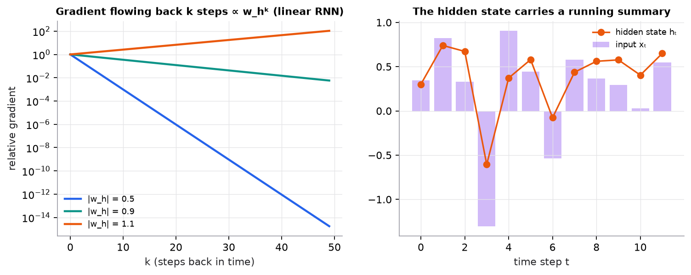

# Recurrent networks, LSTMs, and GRUs

> **Mental model.** A recurrent network reads a sequence one step at a time and keeps a running summary, its hidden state. Each step combines the new input with the previous summary using the same weights.

**You will learn to**
- Write the RNN recurrence and unroll it for a short sequence by hand.
- Explain backpropagation through time and why gradients vanish or explode over long sequences.
- Describe the LSTM's cell state and gates, and the GRU's simplification.
- Compare RNNs with transformers on parallelism and long-range dependencies.

**Why it matters.** RNNs, LSTMs, and GRUs powered speech recognition and machine translation before transformers, and are still used for streaming and small-footprint time-series models. Their failure mode, vanishing gradients through time, motivated attention.

## 1. Intuition

To read "the cat that the dog chased ran away," you carry context forward: who is doing what. An RNN does the same with a vector $h_t$. At each step it mixes the current word's embedding with the previous $h_{t-1}$ and squashes the result. The same weight matrices are used at every step (weight sharing across time, just like a CNN shares across space).

The problem: information from early steps has to survive many multiplications to influence a late step, and so does the gradient flowing back. If the effective multiplier per step is below 1, early information fades (vanishing gradients); above 1, it blows up.

**LSTMs** add a separate **cell state**, a conveyor belt that information can ride along with little change, controlled by gates that decide what to forget, what to write, and what to output. **GRUs** merge some gates for a simpler, similarly effective design.

## 2. Visualization



*Synthetic. With a recurrent weight of 0.9, the gradient from 40 steps back is about $0.9^{40} = 0.015$ of its original size; with 0.5 it is effectively zero after 15 steps.*

## 3. The math

### Symbols

| Symbol | Meaning | Shape |
|---|---|---|
| $x_t$ | input at step $t$ | $[d_x]$ |
| $h_t$ | hidden state at step $t$ | $[d_h]$ |
| $W_x, W_h, b$ | input weights, recurrent weights, bias (shared across time) | $[d_h, d_x]$, $[d_h, d_h]$, $[d_h]$ |
| $c_t$ | LSTM cell state | $[d_h]$ |
| $f_t, i_t, o_t$ | forget, input, and output gates, each in $(0, 1)$ | $[d_h]$ |
| $\odot$ | element-wise multiplication | |

### Vanilla RNN

```math
h_t = \tanh(W_x x_t + W_h h_{t-1} + b)
```

### Backpropagation through time

Unroll the network across all steps and backpropagate. The gradient from step $t$ to step $t - k$ includes a product of $k$ Jacobians, roughly $\prod W_h^\top \operatorname{diag}(\tanh')$. Its size behaves like the $k$-th power of the recurrent weight's largest singular value times activation derivatives, which is why long dependencies vanish or explode.

### LSTM

```math
f_t = \sigma(W_f[h_{t-1}, x_t] + b_f), \quad i_t = \sigma(W_i[h_{t-1}, x_t] + b_i), \quad o_t = \sigma(W_o[h_{t-1}, x_t] + b_o)
```

```math
\tilde{c}_t = \tanh(W_c[h_{t-1}, x_t] + b_c), \quad c_t = f_t \odot c_{t-1} + i_t \odot \tilde{c}_t, \quad h_t = o_t \odot \tanh(c_t)
```

The key line is $c_t = f_t \odot c_{t-1} + \dots$: when the forget gate is near 1, the cell state (and its gradient) passes through almost unchanged, like a residual connection through time.

### Worked example: unrolling a scalar RNN

Scalar weights $w_x = 0.5$, $w_h = 0.8$, $b = 0$; inputs $x = [1, 0, 2]$; $h_0 = 0$.

| $t$ | Pre-activation $w_x x_t + w_h h_{t-1}$ | $h_t = \tanh(\cdot)$ |
|---|---|---|
| 1 | $0.5(1) + 0.8(0) = 0.5$ | $0.4621$ |
| 2 | $0.5(0) + 0.8(0.4621) = 0.3697$ | $0.3537$ |
| 3 | $0.5(2) + 0.8(0.3537) = 1.2830$ | $0.8573$ |

At $t = 2$ there is no input, but the hidden state still remembers the first input (decaying from 0.46 to 0.35).

**Gradient through time, linear simplification.** Ignoring tanh, $\partial h_3/\partial h_0 = w_h^3 = 0.8^3 = 0.512$. After 30 steps, $0.8^{30} = 0.0012$; with $w_h = 1.1$ it would be $1.1^{30} = 17.4$.

## 4. Implementation

```python
import numpy as np

def rnn_forward(xs, Wx, Wh, b, h0):
    h, hs = h0, []
    for x in xs:                         # sequential: step t needs step t-1
        h = np.tanh(Wx @ x + Wh @ h + b)
        hs.append(h)
    return np.stack(hs)                  # [T, d_h]
```

```python
import torch
from torch import nn

lstm = nn.LSTM(input_size=16, hidden_size=64, num_layers=2, batch_first=True)
out, (h_n, c_n) = lstm(torch.randn(8, 50, 16))   # out: [8, 50, 64]; h_n, c_n: [2, 8, 64]
```

Runnable script (unrolled RNN numbers and figure): [`code/13-deep-architectures/architectures.py`](../../code/13-deep-architectures/architectures.py).

## 5. Engineering

**Where RNNs still fit.** Streaming inputs where you must update a state per step with constant memory; tiny on-device models; some time-series forecasting. For tabular time series, gradient boosting on lagged features is often a stronger baseline.

**Why transformers replaced them for language.** RNNs must process tokens sequentially, so training can't be parallelized across time, and long-range information must survive many steps. Self-attention connects any two positions in one step and processes all positions in parallel during training. (Recent state-space models revisit recurrence with better long-range behavior.)

**Training tips.** Gradient clipping is standard; use LSTM or GRU cells rather than vanilla RNNs; truncated backpropagation through time limits memory for long sequences.

> [!WARNING]
> **Failure modes.** Exploding gradients (NaN losses) without clipping; forgetting information beyond a few dozen steps; slow training due to sequential computation; leakage in time-series evaluation through shuffled splits.

### Common mistakes

- Using random splits for sequential data.
- Confusing `batch_first` layouts (`[B, T, F]` versus `[T, B, F]`).
- Assuming an LSTM's hidden state remembers arbitrarily long histories.

## 6. Knowledge check

<!-- quiz:recurrent-networks -->
**[Take the recurrent networks quiz](../../quizzes/recurrent-networks.md)**
<!-- /quiz -->

**Practice exercise.** Continue the worked example one more step with $x_4 = -1$.

<details>
<summary>Solution</summary>

Pre-activation $= 0.5(-1) + 0.8(0.8573) = -0.5 + 0.6858 = 0.1858$. $h_4 = \tanh(0.1858) = 0.1837$.
</details>

**Implementation challenge.** Train a small LSTM and a vanilla RNN to remember the first token of a sequence and output it at the end, for sequence lengths 10, 50, and 100. Plot accuracy versus length for both.

## Summary

- An RNN updates a hidden state with shared weights: $h_t = \tanh(W_x x_t + W_h h_{t-1} + b)$.
- Backpropagation through time multiplies many factors, so gradients vanish or explode over long sequences.
- LSTMs and GRUs add gated paths (the cell state) that preserve information and gradients.
- Transformers replaced RNNs for language thanks to parallel training and direct long-range connections.

**Next:** [Autoencoders, diffusion, and transfer learning](03-autoencoders-diffusion-and-transfer.md)

**Related:** [Backpropagation](../11-gradient-descent-backprop/02-backpropagation.md) · [Self-attention](../14-transformers/01-self-attention.md) · [Model card: LSTM](../../models/lstm.md)

## Interview angle

<details>
<summary><strong>Why do vanilla RNNs struggle to learn long-range dependencies?</strong></summary>

Because backpropagation through time multiplies the gradient by one Jacobian per step, and long products of the same factor vanish or explode. With $h_t = \tanh(W_x x_t + W_h h_{t-1} + b)$, the gradient from step $t$ back to $t - k$ contains $\prod W_h^\top \operatorname{diag}(\tanh')$ over $k$ steps. Its size behaves roughly like the $k$-th power of $W_h$'s largest singular value times the tanh derivatives, which are at most 1. In the scalar example with $w_h = 0.8$, $\partial h_3/\partial h_0$ is about $0.8^3 = 0.512$ ignoring tanh, but over 30 steps it is $0.8^{30} \approx 0.0012$: the early input barely affects learning. With $w_h = 1.1$, $1.1^{30} \approx 17.4$ and the gradients explode. Clipping handles explosion; vanishing needs an architectural fix, which is what LSTM gates and attention provide.

</details>

<details>
<summary><strong>How does an LSTM's cell state fix the vanishing gradient problem?</strong></summary>

It adds a path through time that is updated additively rather than by repeated matrix multiplication. The cell state updates as $c_t = f_t \odot c_{t-1} + i_t \odot \tilde{c}_t$, so the direct derivative $\partial c_t/\partial c_{t-1}$ is just the forget gate $f_t$, element-wise, with no weight matrix and no squashing derivative in the way. When the network learns $f_t \approx 1$ for a unit, information and gradient pass through many steps almost unchanged, like a residual connection through time. The input gate $i_t$ decides what new content to write, and the output gate $o_t$ decides what to expose as $h_t = o_t \odot \tanh(c_t)$. A GRU merges the gates into update and reset gates and drops the separate cell state, with fewer parameters and usually similar accuracy. Both extend usable memory to hundreds of steps, not arbitrarily far.

</details>

<details>
<summary><strong>Transformers replaced RNNs for language. When would you still choose an RNN?</strong></summary>

Transformers won on training: every position is computed in parallel, and any two tokens are one attention step apart instead of $n$ recurrent steps, so long-range dependencies are easier to learn. RNNs process steps sequentially, which underuses GPUs. But recurrence has an inference advantage: constant memory and constant compute per step, regardless of how long the stream has run. A transformer's KV cache and per-token attention cost grow with context length. So an RNN (LSTM or GRU) is still reasonable for streaming signals, on-device models with tight memory, low-latency time-series and sensor processing, and small datasets where a large transformer would overfit. State-space models and other linear-recurrent architectures revisit this trade-off: parallel training like a transformer, constant-size state at inference like an RNN. For text with any pretrained-model option available, I'd start with a transformer.

</details>

<details>
<summary><strong>Your LSTM demand forecaster looks excellent in validation but performs poorly once deployed. What went wrong?</strong></summary>

The most likely cause is temporal leakage in evaluation, not the model. Check the split first: a random or shuffled split lets the model train on days after the ones it is evaluated on, so it interpolates instead of forecasting. Use a time-based split or walk-forward validation that always trains on the past and tests on the future. Second, check feature construction: normalization statistics computed on the whole series, rolling features that include the current target, or inputs like actual weather that aren't known at prediction time all leak the future. Third, check for training-serving skew: production features computed by different code, arriving late, or missing. Finally, compare against a seasonal naive baseline (same period last week) on the honest split; if the LSTM barely beats it, a simpler model may be the better choice.

</details>
