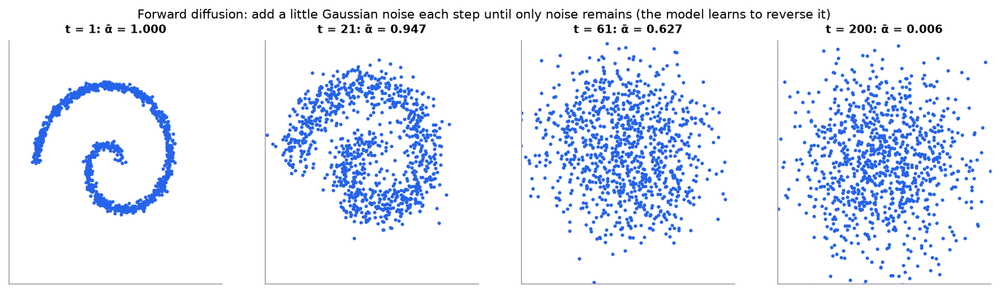

# Autoencoders, diffusion, and transfer learning

> **Mental model.** An autoencoder squeezes data through a narrow bottleneck and learns to rebuild it, so the bottleneck must capture what matters. A diffusion model learns to undo noise one small step at a time, so starting from pure noise it can walk back to a realistic sample. Transfer learning reuses what a big model already learned instead of starting from zero.

**You will learn to**
- Describe the encoder, bottleneck, and decoder of an autoencoder, and its reconstruction loss.
- Explain latent spaces and uses such as denoising and anomaly detection.
- Explain diffusion's forward (noising) and reverse (denoising) processes and compute a noised sample.
- Apply transfer learning: feature extraction versus fine-tuning.

**Why it matters.** Representation learning underlies embeddings, anomaly detection, and generative models. Diffusion models generate most state-of-the-art images and audio. Transfer learning is how nearly every practical deep-learning project starts, including LLM fine-tuning.

## 1. Intuition

**Autoencoders.** Train a network to output its own input, with a deliberately narrow middle layer. It can't copy pixel by pixel, so it must learn a compact code, the **latent representation**. Uses: compression, denoising (train on noisy input, clean target), and anomaly detection (unusual inputs reconstruct poorly). A linear autoencoder with squared error learns the same subspace as PCA; nonlinear ones can capture curved structure.

**Diffusion models.** Take real data and add a little Gaussian noise, again and again, until nothing but noise remains (the **forward process**, fixed and easy). Train a network to predict the noise that was added at each step. To generate, start from random noise and repeatedly subtract the predicted noise (the **reverse process**). Conditioning on text lets you steer what gets generated.

**Transfer learning.** A model pretrained on a huge, broad dataset has learned general features (edges and textures for images; syntax and facts for language). For a new task, keep those features and train only a small new head (**feature extraction**), or continue training all or part of the model with a small learning rate (**fine-tuning**). This needs far less labeled data and compute.

## 2. Visualization



*Synthetic spiral with a linear noise schedule over 200 steps. By the last step $\bar\alpha = 0.006$: almost none of the original signal remains. A diffusion model learns to run this movie backward.*

## 3. The math

### Symbols

| Symbol | Meaning |
|---|---|
| $f_\phi$, $g_\theta$ | encoder and decoder |
| $z = f_\phi(x)$ | latent code (bottleneck) |
| $\beta_t$ | noise added at diffusion step $t$ (a small variance) |
| $\bar\alpha_t = \prod_{s=1}^{t}(1 - \beta_s)$ | fraction of signal variance remaining after $t$ steps |
| $\epsilon \sim \mathcal{N}(0, I)$ | standard Gaussian noise |
| $\epsilon_\theta(x_t, t)$ | the network's prediction of the added noise |

### Autoencoder

```math
\hat{x} = g_\theta(f_\phi(x)), \qquad L = \lVert x - \hat{x}\rVert^2
```

Variational autoencoders (VAEs) make the latent space probabilistic and smooth by adding a KL-divergence term, so you can sample new data from it.

### Diffusion

Forward process in closed form (jump directly to any step):

```math
x_t = \sqrt{\bar\alpha_t}\, x_0 + \sqrt{1 - \bar\alpha_t}\,\epsilon
```

Training objective (simplified DDPM loss): predict the noise.

```math
L = \mathbb{E}_{x_0, t, \epsilon}\big\lVert \epsilon - \epsilon_\theta(x_t, t) \big\rVert^2
```

### Worked example: one noised sample

A data point $x_0 = 2.0$ at a step where $\bar\alpha_t = 0.64$, with sampled noise $\epsilon = -0.5$:

```math
x_t = \sqrt{0.64}(2.0) + \sqrt{0.36}(-0.5) = 0.8 \times 2.0 + 0.6 \times (-0.5) = 1.6 - 0.3 = 1.3
```

If the trained network predicts $\epsilon_\theta = -0.5$ exactly, we can recover $x_0 = (x_t - \sqrt{1 - \bar\alpha_t}\,\epsilon_\theta)/\sqrt{\bar\alpha_t} = (1.3 + 0.3)/0.8 = 2.0$. Generation does this gradually, from pure noise, over many steps.

### Worked example: transfer-learning parameter budget

A pretrained image backbone has 25 million parameters and outputs a 2,048-dimensional feature vector. A new 5-class head adds $2048 \times 5 + 5 = 10{,}245$ parameters. Feature extraction trains only those 10,245 (0.04% of the model), which is why it works with a few hundred labeled images.

## 4. Implementation

```python
import torch
from torch import nn

# A small autoencoder for 28x28 images
autoencoder = nn.Sequential(
    nn.Flatten(), nn.Linear(784, 128), nn.ReLU(), nn.Linear(128, 16),   # encoder -> 16-d latent
    nn.ReLU(), nn.Linear(16, 128), nn.ReLU(), nn.Linear(128, 784), nn.Sigmoid(),
)
# loss = F.mse_loss(autoencoder(x), x.flatten(1))

# Transfer learning with torchvision: freeze the backbone, train a new head
from torchvision.models import resnet50, ResNet50_Weights
model = resnet50(weights=ResNet50_Weights.DEFAULT)
for p in model.parameters():
    p.requires_grad = False
model.fc = nn.Linear(model.fc.in_features, 5)      # only this layer trains at first
```

Runnable script (diffusion forward-process figure): [`code/13-deep-architectures/architectures.py`](../../code/13-deep-architectures/architectures.py).

## 5. Engineering

**Autoencoders for anomaly detection.** Train on normal data only; flag inputs whose reconstruction error exceeds a threshold set on validation data. Watch out: a powerful autoencoder can reconstruct anomalies well too.

**Diffusion in practice.** Generation needs many network evaluations (tens to hundreds of steps), so it is expensive; distillation and faster samplers reduce steps. Latent diffusion runs the process in an autoencoder's latent space to cut cost. Evaluate generative models with human review and task-specific checks, not just automated scores.

**Transfer learning choices.**

| Situation | Approach |
|---|---|
| Little data, task similar to pretraining | freeze the backbone, train a head |
| Moderate data | fine-tune the top layers with a small learning rate |
| Lots of data, different domain | fine-tune everything, or pretrain on in-domain data |

Use a lower learning rate for pretrained layers than for the new head, and match the pretrained model's preprocessing (normalization, resolution, tokenizer).

> [!WARNING]
> **Failure modes.** Catastrophic forgetting when fine-tuning too aggressively; preprocessing mismatches with the pretrained model; licensing restrictions on pretrained weights; generative models reproducing training data or harmful content; anomaly detectors that reconstruct anomalies too well.

### Common mistakes

- Fine-tuning a large model with a large learning rate and destroying its features.
- Forgetting to put the frozen backbone in eval mode (batch-norm statistics drift).
- Treating reconstruction error as calibrated anomaly probability.

## 6. Knowledge check

<!-- quiz:autoencoders-diffusion-and-transfer -->
**[Take the quiz](../../quizzes/autoencoders-diffusion-and-transfer.md)**
<!-- /quiz -->

**Practice exercise.** With $\bar\alpha_t = 0.36$, $x_0 = 1.0$, and $\epsilon = 2.0$, compute $x_t$.

<details>
<summary>Solution</summary>

$\sqrt{0.36} = 0.6$ and $\sqrt{0.64} = 0.8$: $x_t = 0.6(1.0) + 0.8(2.0) = 2.2$. At this step noise dominates the signal.
</details>

**Implementation challenge.** Train the small autoencoder on MNIST digits, plot reconstructions for latent sizes 2, 8, and 32, and use reconstruction error to flag a set of images that are not digits.

## Summary

- Autoencoders learn compact latent codes by reconstructing inputs through a bottleneck; they power denoising and anomaly detection.
- Diffusion models add noise in a fixed forward process ($x_t = \sqrt{\bar\alpha_t}x_0 + \sqrt{1-\bar\alpha_t}\epsilon$) and learn to predict and remove it.
- Transfer learning reuses pretrained features: train a head for small data, fine-tune more with more data, always with care for learning rates and preprocessing.

**Next:** [Self-attention](../14-transformers/01-self-attention.md)

**Related:** [PCA](../08-dimensionality-reduction/01-pca.md) · [Adapting LLMs](../15-llms/03-adapting-llms.md) · [Model card: autoencoder](../../models/autoencoder.md) · [Model card: diffusion model](../../models/diffusion-model.md)

## Interview angle

<details>
<summary><strong>Explain how a diffusion model is trained and how it generates a sample.</strong></summary>

Training teaches a network to predict the noise that was added to data; generation runs that denoiser repeatedly starting from pure noise. The forward process has a closed form, so you can jump straight to any step: $x_t = \sqrt{\bar\alpha_t}\,x_0 + \sqrt{1 - \bar\alpha_t}\,\epsilon$ with $\epsilon \sim \mathcal{N}(0, I)$. Each training step samples a data point, a random step $t$, and fresh noise, builds $x_t$, and minimizes $\lVert \epsilon - \epsilon_\theta(x_t, t)\rVert^2$. In the course example, $x_0 = 2.0$, $\bar\alpha_t = 0.64$, $\epsilon = -0.5$ gives $x_t = 0.8 \times 2.0 + 0.6 \times (-0.5) = 1.3$, and a perfect noise prediction recovers $x_0 = (1.3 + 0.3)/0.8 = 2.0$. To generate, start from Gaussian noise and take many small denoising steps from $t = T$ down to 0. Conditioning on text or class steers the result. Faster samplers cut the number of steps.

</details>

<details>
<summary><strong>Feature extraction or full fine-tuning: how do you decide for a new task?</strong></summary>

Decide by how much labeled data you have and how close your domain is to the pretraining data. With little data and a similar domain, freeze the backbone and train only a new head: for a 25M-parameter backbone with 2,048-dimensional features and 5 classes, that is $2048 \times 5 + 5 = 10{,}245$ parameters, about 0.04% of the model, and it works with a few hundred labeled images. With moderate data, also unfreeze the top layers. With lots of data or a distant domain, such as medical scans versus web photos, fine-tune everything, possibly after continued pretraining on in-domain data. Use a smaller learning rate for pretrained layers than for the new head, or you destroy the features. Match the pretrained model's preprocessing exactly, and keep frozen batch-norm layers in eval mode. Always compare against the frozen-backbone baseline, which is cheap and often close.

</details>

<details>
<summary><strong>Your autoencoder-based anomaly detector misses obvious anomalies. What would you investigate?</strong></summary>

The detector assumes anomalies reconstruct badly, and that assumption fails in a few predictable ways. First, the autoencoder may generalize too well: with a wide bottleneck or high capacity, it learns something close to the identity and reconstructs anomalies as well as normal data. Shrink the latent size and check the reconstruction-error gap between normal and known-anomalous examples. Second, the training data may contain anomalies, teaching the model to reconstruct them; clean or filter the training set. Third, the error measure may hide the signal: a per-pixel average can be dominated by background, so try per-region or feature-space error. Fourth, the threshold may be badly chosen, because reconstruction error is not a calibrated probability. Pick it on a labeled validation set at the false-alarm rate you can afford. Compare against simple baselines like PCA reconstruction or isolation forest before tuning further.

</details>

<details>
<summary><strong>A diffusion noise schedule ends with ᾱ_T = 0.006. What does that number mean, and what is the signal-to-noise ratio at ᾱ_t = 0.64?</strong></summary>

$\bar\alpha_t = \prod_{s \le t}(1 - \beta_s)$ is the fraction of signal variance left after $t$ steps; the rest, $1 - \bar\alpha_t$, is noise. The signal-to-noise ratio is $\text{SNR} = \bar\alpha_t/(1 - \bar\alpha_t)$. At $\bar\alpha_t = 0.64$: $0.64/0.36 \approx 1.78$, so signal still dominates and the data shape is recognizable. At $\bar\alpha_T = 0.006$: $0.006/0.994 \approx 0.006$, so essentially no signal remains, which is what you want. Generation starts from pure Gaussian noise, so the final training step must look like pure noise too. If $\bar\alpha_T$ stayed noticeably above zero, the model would be trained on inputs that still contain data but sampled from inputs that don't, a train/inference mismatch that shows up as washed-out or biased samples. Schedule design is largely about how SNR is spread across steps.

</details>
