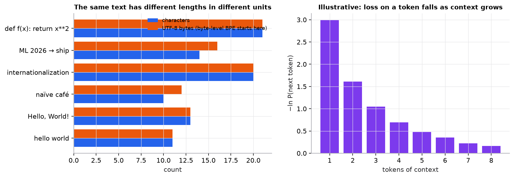

# Tokenization and pretraining

> **Mental model.** An LLM never sees text, only token IDs. Pretraining shows it trillions of tokens and asks one question at every position: what token comes next? Getting good at that single game requires learning grammar, facts, and patterns of reasoning, because they all help predict the next token.

**You will learn to**
- Explain why LLMs use subword tokens and run byte-pair-encoding merges by hand.
- Follow token IDs to embeddings to logits, and explain the context window.
- Compute next-token cross-entropy and perplexity for a short sequence.
- Describe pretraining data, checkpoints, and what pretraining does and does not produce.

**Why it matters.** Token counts, not characters, drive context limits, latency, and API cost. Cross-entropy and perplexity are how language models are trained and compared. And knowing that the objective is "predict likely text" explains both what LLMs are good at and why they hallucinate.

## 1. Intuition

**Tokens.** Word-level vocabularies can't handle new words, typos, or code; character-level sequences get very long. Subword tokenization is the compromise: common words become one token, rare words split into pieces ("unbelievable" might be "un", "believ", "able"). Byte-level BPE starts from raw bytes, so any string, in any language, can be encoded.

**The pipeline.** Text → tokens → integer IDs → embedding vectors → transformer blocks → a vector per position → logits over the vocabulary → softmax probabilities for the next token.

**The context window** is the maximum number of tokens the model can attend to at once (prompt plus generated output). Anything outside it does not exist for the model.

**Pretraining** is self-supervised: every position in every document is a training example whose label is the next token. The loss is cross-entropy, the negative log of the probability assigned to the true next token. The result is a **base model** that continues text fluently; it is not yet an assistant that follows instructions (that comes from [adaptation](03-adapting-llms.md)).

## 2. Visualization

<!-- lab:tokenizer -->


*Right panel is illustrative (not from a real model): more context usually makes the next token more predictable, which is why the same word costs less loss late in a document than at its start.*

*Interactive version: [open the lab](https://sreshtalluri.github.io/ml-ai-learn/labs/tokenizer/).*
<!-- /lab -->

**Try it** (predict first, then check):

1. Start at 0 merges and predict how many tokens your sentence has. Then step merges up and watch which pairs join first.
2. Type a word that never appears in the training corpus. Predict how it will be split, then check.
3. Press **Fill the context** and shrink the window. What has to give when text no longer fits?

## 3. The math

### Symbols

| Symbol | Meaning | Shape |
|---|---|---|
| $t_1, \dots, t_T$ | token IDs of a sequence | integers |
| $V$ | vocabulary size | scalar |
| $E$ | token embedding table | $[V, d]$ |
| $z_t$ | logits for the token after position $t$ | $[V]$ |
| $P_\theta(t_{k} \mid t_{<k})$ | model probability of token $k$ given all earlier tokens | scalar |

### Autoregressive objective

```math
\max_\theta \sum_{k=1}^{T} \log P_\theta(t_k \mid t_{<k})
\quad\Longleftrightarrow\quad
\min_\theta\; \mathcal{L} = -\frac{1}{T}\sum_{k=1}^{T} \log P_\theta(t_k \mid t_{<k})
```

Thanks to the causal mask, one forward pass over a sequence computes the loss for all $T$ positions in parallel.

### Perplexity

```math
\text{PPL} = \exp(\mathcal{L})
```

Perplexity is the effective number of tokens the model is "choosing between." A model guessing uniformly over 50,000 tokens has loss $\ln 50000 = 10.82$ and perplexity 50,000.

### Byte-pair encoding

Start with characters (or bytes). Repeatedly count every adjacent pair across the corpus and merge the most frequent pair into a new token, until the vocabulary reaches the target size.

### Worked example 1: BPE merges

Toy corpus word counts: "low" ×5, "lower" ×2, "newest" ×6, "widest" ×3 (with an end-of-word marker `</w>`).

1. Most frequent pair: `e s` (6 in "newest" + 3 in "widest" = 9). Merge into `es`.
2. Next: `es t` (9). Merge into `est`.
3. Next: `est </w>` (9). Merge into `est</w>`.
4. Next: `l o` (5 + 2 = 7). Merge into `lo`.
5. Next: `lo w` (7). Merge into `low`.

After five merges, "newest" is `n e w est</w>` and "low" is `low </w>`. Frequent fragments become single tokens.

### Worked example 2: cross-entropy and perplexity

A model assigns these probabilities to the actual next tokens in a 4-token sequence: $0.6, 0.25, 0.9, 0.05$.

| Token | $P(\text{true})$ | Loss $-\ln P$ |
|---|---|---|
| 1 | 0.60 | 0.511 |
| 2 | 0.25 | 1.386 |
| 3 | 0.90 | 0.105 |
| 4 | 0.05 | 2.996 |

Mean loss $= (0.511 + 1.386 + 0.105 + 2.996)/4 = 1.250$. Perplexity $= e^{1.250} = 3.49$. One surprising token (probability 0.05) contributes more than half the loss.

## 4. Implementation

```python
import torch
import torch.nn.functional as F

# logits: [B, T, V] from the model; tokens: [B, T] input IDs
logits = model(tokens[:, :-1])                    # predict positions 1..T-1
targets = tokens[:, 1:]                           # the "next tokens", shifted by one
loss = F.cross_entropy(logits.reshape(-1, logits.size(-1)), targets.reshape(-1))
perplexity = loss.exp()
```

Tokenizing with a real tokenizer (`pip install tiktoken`):

```python
import tiktoken
enc = tiktoken.get_encoding("cl100k_base")
ids = enc.encode("Tokenization splits text into subword units; unbelievable!")
print(len(ids), [enc.decode([i]) for i in ids])
```

Runnable script (BPE merges, perplexity arithmetic, and figures; no tokenizer download needed): [`code/15-llms/llms.py`](../../code/15-llms/llms.py).

## 5. Engineering

**Token economics.** Cost and latency scale with tokens. The same content can take very different token counts across languages and tokenizers (non-English text and code often take more). Measure with the actual tokenizer of the model you deploy.

**Context management.** Long prompts cost more and attention over long contexts is expensive; models can also attend poorly to material buried in the middle of very long contexts. Retrieve and include only what is relevant ([RAG](../16-rag/01-rag-pipeline.md)).

**Pretraining data** quality (deduplication, filtering, mixing) matters as much as quantity. Training saves **checkpoints**: snapshots of the weights you can resume from or evaluate.

**What pretraining does not give you:** instruction following, refusal behavior, or calibrated truthfulness. The model learned to produce likely text, which is not the same as true text.

> [!IMPORTANT]
> An LLM produces a probability distribution over the next token. It is not a database of facts. High probability means "this is the kind of thing that tends to come next," not "this is correct."

> [!WARNING]
> **Failure modes.** Tokenization quirks (arithmetic on numbers split into odd chunks, trailing-space differences, words split differently with and without capitalization); prompts silently truncated at the context limit; comparing perplexities across models with different tokenizers (not comparable).

### Common mistakes

- Estimating cost from characters or words instead of tokens.
- Forgetting to shift targets by one position when computing the language-modeling loss.
- Treating a base model's fluent continuation as an answer to a question.

## 6. Knowledge check

<!-- quiz:tokenization-and-pretraining -->
**[Take the tokenization and pretraining quiz](../../quizzes/tokenization-and-pretraining.md)**
<!-- /quiz -->

**Practice exercise.** A model assigns probabilities 0.5, 0.5, 0.125 to three actual next tokens. Compute the mean loss and perplexity.

<details>
<summary>Solution</summary>

Losses: $\ln 2 = 0.693$, $0.693$, and $\ln 8 = 2.079$. Mean $= 3.466/3 = 1.155$. Perplexity $= e^{1.155} = 3.17$ (equivalently $(2 \times 2 \times 8)^{1/3} = 32^{1/3} = 3.17$).
</details>

**Implementation challenge.** Implement BPE training on a paragraph of text (merge until 200 tokens), then write `encode` and `decode` functions and verify that `decode(encode(s)) == s` on new sentences.

## Summary

- Subword tokenization (BPE) balances vocabulary size and sequence length; byte-level BPE can encode any text.
- Tokens become IDs, then embeddings, then logits over the vocabulary; the context window caps how many tokens the model sees.
- Pretraining minimizes next-token cross-entropy over massive text; perplexity $= e^{\text{loss}}$.
- A pretrained base model predicts likely text, not guaranteed truth.

**Next:** [Decoding](02-decoding.md)

**Related:** [The transformer architecture](../14-transformers/02-transformer-architecture.md) · [Learning paradigms](../01-ml-vocabulary/02-learning-paradigms.md) · [Model card: large language model](../../models/large-language-model.md)
