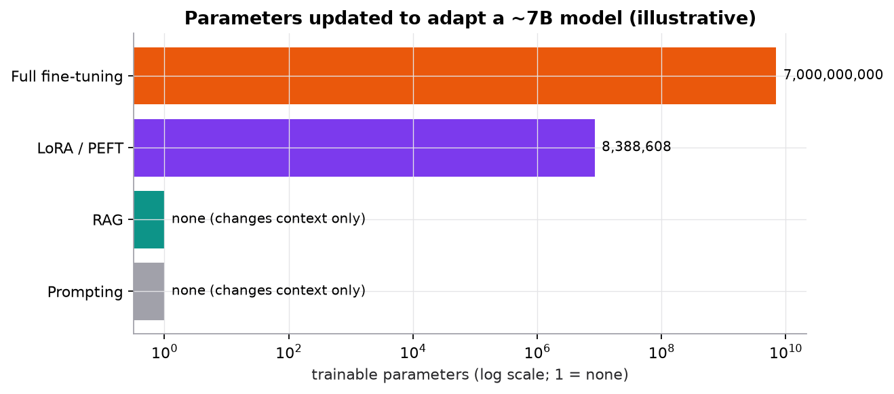

# Adapting LLMs

> **Mental model.** There are two places to change an LLM's behavior: its context (what you put in the prompt at runtime) and its weights (what it learned in training). Prompting and RAG change the context. Fine-tuning, LoRA, and preference optimization change the weights. Facts that change belong in the context; behavior, format, and style belong in the weights.

**You will learn to**
- Compare prompting, RAG, full fine-tuning, LoRA/PEFT, and preference optimization by what they change and what they cost.
- Explain instruction tuning and alignment at a high level.
- Compute LoRA's trainable-parameter savings.
- Explain why LLMs hallucinate and which mitigations actually help.
- Choose an adaptation strategy for a concrete product requirement.

**Why it matters.** "Should we fine-tune?" is one of the most common and most expensive questions in AI engineering. Answering it well saves months and avoids building systems that confidently state outdated or invented facts.

## 1. Intuition

A pretrained base model continues text. To make it useful:

- **Prompting:** describe the task, give examples (few-shot), and specify the output format. Fastest; no training. Limited by context length and by what the model already knows.
- **RAG:** retrieve relevant documents at query time and put them in the prompt. Adds fresh or private knowledge and enables citations without retraining.
- **Instruction tuning (supervised fine-tuning):** train on (instruction, good response) pairs so the model follows instructions. This is how base models become assistants.
- **Full fine-tuning:** update all weights on your task data. Most powerful, most expensive, risks forgetting general skills.
- **LoRA / PEFT (parameter-efficient fine-tuning):** freeze the base weights and train small add-on matrices. Most of the benefit of fine-tuning at a fraction of the memory and storage.
- **Preference optimization (RLHF, DPO):** train on pairs of responses ranked by humans (or models) so the model prefers helpful, harmless, honest answers. Shapes behavior and style.

**Hallucinations** are fluent but unsupported claims. They follow from the objective: the model produces likely text, and a plausible-sounding answer is likely even when false.

## 2. Visualization



*Illustrative sizes: LoRA with rank 8 on the four attention projections of 32 layers with width 4096 trains about 8.4 million parameters, about 0.1% of a 7B model.*

## 3. The math

### Symbols

| Symbol | Meaning | Shape |
|---|---|---|
| $W_0$ | a frozen pretrained weight matrix | $[d_{\text{out}}, d_{\text{in}}]$ |
| $A, B$ | LoRA low-rank factors | $[r, d_{\text{in}}]$, $[d_{\text{out}}, r]$ |
| $r$ | LoRA rank, much smaller than $d$ | scalar |
| $\alpha$ | LoRA scaling factor | scalar |
| $y_w, y_l$ | preferred and rejected responses | text |

### LoRA

```math
W = W_0 + \frac{\alpha}{r} B A, \qquad \text{trainable parameters} = r\,(d_{\text{in}} + d_{\text{out}}) \;\ll\; d_{\text{in}} d_{\text{out}}
```

$B$ starts at zero, so training begins exactly at the pretrained model. After training, $BA$ can be merged into $W_0$, adding no inference latency, or kept separate so many small adapters can share one base model.

### Supervised fine-tuning loss

The same next-token cross-entropy as pretraining, computed only on the response tokens of (instruction, response) pairs.

### Direct preference optimization (DPO), intuition

Given a prompt with a preferred response $y_w$ and a rejected one $y_l$, increase the model's log-probability of $y_w$ relative to $y_l$, measured against a frozen reference model so the policy doesn't drift too far. It reaches a similar goal to RLHF without training a separate reward model or running reinforcement learning.

### Worked example: LoRA savings

One attention projection is $4096 \times 4096$: $16{,}777{,}216$ parameters. LoRA with $r = 8$ trains $8 \times (4096 + 4096) = 65{,}536$, which is $0.39\%$ of that matrix. Applied to Q, K, V, and O in 32 layers: $65{,}536 \times 4 \times 32 = 8{,}388{,}608$ trainable parameters, about 0.12% of a 7-billion-parameter model. Storing that adapter in 16-bit precision takes about 17 MB instead of about 14 GB for a full copy.

### Worked example: choosing an approach

| Requirement | Best first approach | Why |
|---|---|---|
| Answer questions about internal docs that change weekly | RAG | facts live in context; update by re-indexing, with citations |
| Always output a specific JSON schema | prompting plus structured outputs; LoRA if still unreliable | format is behavior |
| Write in the company's support tone | few-shot prompting, then LoRA on examples | style is behavior |
| Classify tickets into 30 categories with 50,000 labeled examples | fine-tune a small model (or LoRA) | cheaper and faster than prompting a large model per ticket |
| Know this year's product prices | RAG or tool calls | fine-tuning is a poor way to inject frequently changing facts |

## 4. Implementation

```python
# Prompting with few-shot examples and an explicit format
messages = [
    {"role": "system", "content": "Classify the ticket. Reply with JSON: {\"category\": ..., \"urgency\": 1-5}."},
    {"role": "user", "content": "Ticket: 'Cannot log in since the update.'"},
    {"role": "assistant", "content": "{\"category\": \"auth\", \"urgency\": 4}"},
    {"role": "user", "content": f"Ticket: '{ticket}'"},
]

# LoRA with Hugging Face PEFT (pip install peft transformers)
from peft import LoraConfig, get_peft_model
config = LoraConfig(r=8, lora_alpha=16, target_modules=["q_proj", "k_proj", "v_proj", "o_proj"], lora_dropout=0.05)
model = get_peft_model(base_model, config)
model.print_trainable_parameters()     # e.g. "trainable params: 8,388,608 || all params: ~6.7B || trainable%: ~0.12"
```

Runnable script (LoRA arithmetic and the figure): [`code/15-llms/llms.py`](../../code/15-llms/llms.py).

## 5. Engineering

**Decision order.** Try prompting first (cheapest, fastest to iterate). Add RAG when the model lacks knowledge or you need citations. Fine-tune (usually LoRA) when you need consistent behavior, format, or domain style that prompting can't reliably produce, or to make a smaller, cheaper model match a larger one on a narrow task. Every step needs an evaluation set to prove it helped.

**Fine-tuning data.** Quality beats quantity: a few thousand clean, representative examples often beat a large noisy set. Hold out evaluation data. Watch for regressions on general capabilities (catastrophic forgetting) and safety behavior.

**Hallucination mitigations that work:** grounding answers in retrieved sources with citations; tool calls for facts that live in systems (prices, inventory, calculations); constrained output formats; verification steps (check claims against sources); allowing and rewarding "I don't know"; human review for consequential decisions; evaluation on realistic, adversarial cases.

**Uncertainty.** Token probabilities reflect how likely the text is, not whether a claim is true. Verbal confidence ("I'm certain") is not calibrated. Measure calibration empirically if you plan to use confidence for routing.

> [!IMPORTANT]
> **RAG changes the model's context; fine-tuning changes its weights.** RAG is usually preferable for private or frequently changing facts (update the index, cite sources). Fine-tuning is useful for changing behavior, format, or specialization, and is not a reliable way to inject facts that change.

> [!WARNING]
> **Failure modes.** Fine-tuning to teach facts and getting confident hallucinations of those facts; overfitting a small fine-tuning set; losing safety behavior after fine-tuning; prompt changes shipped without evaluation; mistaking fluency for correctness.

### Common mistakes

- Reaching for fine-tuning before trying a well-engineered prompt and RAG.
- Evaluating adaptations by reading a handful of outputs.
- Assuming lower temperature reduces hallucinations meaningfully.

## 6. Knowledge check

<!-- quiz:adapting-llms -->
**[Take the adapting LLMs quiz](../../quizzes/adapting-llms.md)**
<!-- /quiz -->

**Practice exercise.** A layer has $d_{\text{in}} = 2048$ and $d_{\text{out}} = 8192$. How many parameters does LoRA with $r = 16$ train, and what fraction of the full matrix is that?

<details>
<summary>Solution</summary>

$16 \times (2048 + 8192) = 16 \times 10{,}240 = 163{,}840$. Full matrix: $2048 \times 8192 = 16{,}777{,}216$. Fraction: $0.98\%$.
</details>

**Implementation challenge.** Pick a small open model and a narrow task (for example, rewriting support replies in a fixed style). Build a 50-example evaluation set, measure a zero-shot prompt, a few-shot prompt, and a LoRA fine-tune, and report quality and cost per request for each.

## Summary

- Prompting and RAG change context; fine-tuning, LoRA, and preference optimization change weights.
- LoRA trains low-rank updates $BA$ with $r(d_{\text{in}} + d_{\text{out}})$ parameters, often well under 1% of the model.
- Instruction tuning creates assistants; preference optimization (RLHF, DPO) shapes behavior.
- Use RAG or tools for changing facts, fine-tuning for behavior and format, and always evaluate.
- Hallucinations come from the objective; grounding, tools, verification, and abstention reduce them.

**Next:** [The RAG pipeline](../16-rag/01-rag-pipeline.md)

**Related:** [LLM evaluation](../17-llm-evaluation/01-llm-evaluation.md) · [Transfer learning](../13-deep-architectures/03-autoencoders-diffusion-and-transfer.md) · [Model card: large language model](../../models/large-language-model.md)
