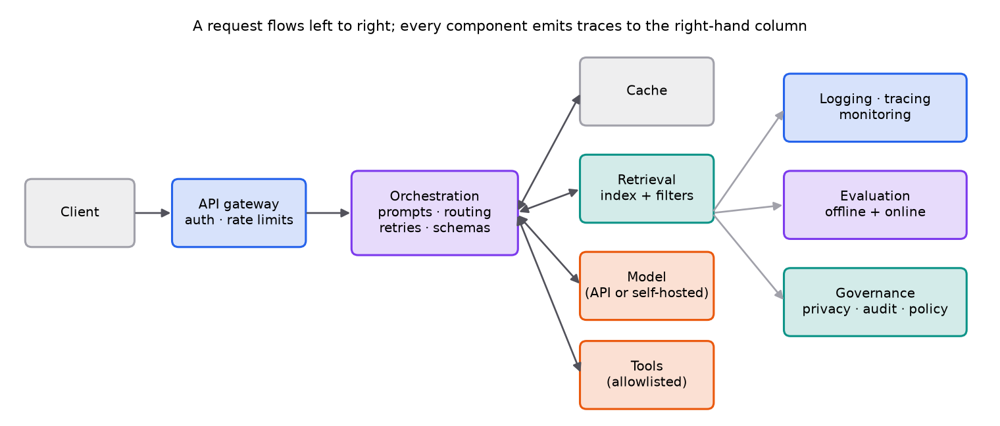

# Production architecture

> **Mental model.** The model is one component in a distributed system. Most of the engineering is around it: authenticating requests, assembling context, calling tools safely, validating outputs, caching, observing everything, and governing data. Design the system so a bad model output is caught and contained, not executed.

**You will learn to**
- Name the components of a production LLM application and what each is responsible for.
- Choose between batch and online inference and between hosted APIs and self-hosting.
- Use prompt templates, structured outputs, schemas, and validation.
- Design tool calling with permissions, idempotency, and timeouts.
- Route requests across models by quality, latency, cost, and privacy.

**Why it matters.** An AI engineer combines model understanding with software engineering, data pipelines, evaluation, deployment, security, and product judgment. Prototypes become products in this layer.

## 1. Intuition

Follow one request through a support assistant:

1. The **client** sends a question.
2. The **API gateway** authenticates the user, enforces rate limits and quotas, and rejects oversized inputs.
3. **Orchestration** picks a prompt template and a model (routing), checks the **cache**, calls **retrieval** with the user's permission filters, assembles the prompt, calls the **model**, and validates the output against a schema. If the model proposes a **tool** call ("look up order 123"), orchestration checks it against an allowlist and the user's permissions, executes it with a timeout, and feeds the result back.
4. Every step emits **traces and logs** (with secrets and personal data redacted) to **monitoring**.
5. Samples of traffic flow into **evaluation** (offline test sets, online feedback), and **governance** controls retention, access, audits, and policy.

**Batch versus online.** Batch inference processes large volumes on a schedule (nightly classification of all tickets): cheap, high throughput, latency doesn't matter. Online inference answers live requests: latency and availability matter, and capacity must handle peaks.

**Hosted API versus self-hosted.** Hosted APIs give top models with no infrastructure, at per-token prices and with data leaving your network. Self-hosting open models gives control over data, latency, and cost at scale, but you own GPUs, serving software, and upgrades.

## 2. Visualization

<!-- lab:architecture -->


*Interactive version: [open the lab](https://sreshtalluri.github.io/ml-ai-learn/labs/architecture/).*
<!-- /lab -->

**Try it** (predict first, then check):

1. Trace the **Normal** scenario and predict which hop dominates the latency before you reach it.
2. Switch to **Outage**. Which two patterns keep the request from failing, and what would happen without a timeout?
3. In **Tool call**, find the step where the application, not the model, decides whether the refund runs.

## 3. The math

### Symbols

| Symbol | Meaning |
|---|---|
| $\lambda$ | request arrival rate (requests per second) |
| $W$ | average time a request spends in the system (seconds) |
| $L$ | average number of requests in flight |
| $c_{\text{in}}, c_{\text{out}}$ | price per input and output token |
| $n_{\text{in}}, n_{\text{out}}$ | tokens per request |

### Capacity: Little's law

```math
L = \lambda\, W
```

At 20 requests per second with an average of 3 seconds per request, about 60 requests are in flight at once, so the model backend and connection pools must support at least 60 concurrent requests, with headroom for peaks.

### Cost per request

```math
\text{cost} = n_{\text{in}} c_{\text{in}} + n_{\text{out}} c_{\text{out}}
```

### Worked example: routing

Two models: a small one costs 0.1 cents per request and is good enough on 80% of traffic (simple FAQ questions); a large one costs 1.5 cents. Sending everything to the large model costs 1.5 cents per request. A router that sends the easy 80% to the small model and the rest to the large model costs $0.8 \times 0.1 + 0.2 \times 1.5 = 0.08 + 0.30 = 0.38$ cents, a 75% saving, *if* the router's misroutes don't hurt quality. Measure quality per route on the evaluation set before trusting the saving.

### Worked example: capacity

Peak traffic is 50 requests per second; p95 end-to-end latency is 4 seconds. Little's law with $W = 4$ as a conservative bound gives $L = 200$ concurrent requests at peak. If one GPU server handles 25 concurrent generations at acceptable latency, you need 8 servers, plus redundancy for failures and deployments.

## 4. Implementation

Structured output with validation, so free text never flows into code unchecked:

```python
from pydantic import BaseModel, Field, ValidationError

class TicketTriage(BaseModel):
    category: str = Field(pattern="^(billing|auth|shipping|other)$")
    urgency: int = Field(ge=1, le=5)
    summary: str = Field(max_length=280)

def triage(ticket: str) -> TicketTriage:
    for attempt in range(2):                                   # one bounded retry
        raw = llm(PROMPT.format(ticket=ticket), response_format="json")
        try:
            return TicketTriage.model_validate_json(raw)
        except ValidationError as e:
            log.warning("invalid model output", extra={"attempt": attempt, "error": str(e)})
    return TicketTriage(category="other", urgency=3, summary="needs human review")   # safe fallback
```

A tool call is a *request* from the model; the application decides whether to run it:

```python
ALLOWED = {"get_order_status": get_order_status}           # explicit allowlist

def run_tool(call, user):
    fn = ALLOWED.get(call.name)
    if fn is None:
        raise PermissionError(f"tool not allowed: {call.name}")
    args = OrderLookup.model_validate(call.arguments)      # validate arguments with a schema
    if not user.can_view(args.order_id):                   # authorization uses the USER's rights
        raise PermissionError("forbidden")
    return with_timeout(fn, args, seconds=5)
```

## 5. Engineering

| Component | Responsibility | Inputs → outputs | Common failures | Metrics | Security | Scaling |
|---|---|---|---|---|---|---|
| Client | collect input, render output, gather feedback | user actions → requests | double submits, stale UI | client latency, feedback rate | never hold secrets or model keys | CDN, streaming responses |
| API gateway | authentication, rate limits, quotas, size limits | requests → authenticated requests | auth bypass, abuse, overload | requests/sec, 4xx/5xx, throttles | authn, authz, input size caps | horizontal, stateless |
| Orchestration | templates, routing, context assembly, retries, validation, tool loop | request → validated response | invalid outputs, retry storms, runaway tool loops | step latency, retries, validation failures | separate trusted and untrusted text; tool allowlists | stateless workers, queues |
| Retrieval | find permitted, relevant context | query + filters → chunks | low recall, stale index, permission leaks | recall@k, latency, index freshness | permission filters at query time | sharded indexes, ANN |
| Model | generate tokens | prompt → tokens | timeouts, hallucinations, provider outages | tokens/sec, TTFT, error rate, cost | data residency, prompt logging policy | batching, replicas, fallbacks |
| Tools | perform actions or fetch live data | validated call → result | side effects on retry, slow APIs | success rate, latency | least privilege, idempotency keys, approvals | per-tool rate limits |
| Cache | reuse answers or computation | key → cached result | stale or cross-user leakage | hit rate, staleness | key on user/tenant where needed | TTLs, eviction |
| Evaluation | measure quality offline and online | traces + labels → scores | unrepresentative sets | quality by segment, regressions | test injection and data leaks | sampled, automated |
| Logging and monitoring | traces, metrics, alerts | events → dashboards | missing context, PII in logs | coverage, alert latency | redaction, access control | sampling, retention tiers |
| Governance | privacy, retention, access, audit, policy | policies → enforced rules | shadow data copies | audit completeness | least privilege, deletion requests | central policy service |

**Prompt templates are code.** Version them, review changes, and evaluate before deploying.

**Model versioning.** Pin model versions; upgrades are deployments that need evaluation and gradual rollout. Record prompt, model, and index versions in every trace.

**Agents.** An agent is a system that plans or loops across model and tool calls. Bound it: maximum steps, maximum cost, timeouts, and human approval for consequential actions.

> [!WARNING]
> **Failure modes.** Trusting raw model text as code or commands; tools running with service-wide credentials instead of the user's permissions; retries that duplicate side effects (charging a card twice); unbounded agent loops; logs containing secrets or personal data; no fallback when the model provider is down.

### Common mistakes

- Parsing free-form prose with regular expressions instead of using structured outputs and schemas.
- Building the whole system around one model provider with no abstraction or fallback.
- Shipping prompt changes without evaluation.

## 6. Knowledge check

<!-- quiz:production-architecture -->
**[Take the production architecture quiz](../../quizzes/production-architecture.md)**
<!-- /quiz -->

**Practice exercise.** Traffic averages 8 requests per second and each request takes 2.5 seconds. How many requests are in flight on average? If a peak is 3× average traffic, how many concurrent slots do you need?

<details>
<summary>Solution</summary>

$L = 8 \times 2.5 = 20$ on average. At peak, $24 \times 2.5 = 60$ concurrent requests, plus headroom (often 1.5 to 2×) for latency spikes and failures.
</details>

**Implementation challenge.** Build a minimal FastAPI service for the ticket-triage example: an endpoint that validates input size, calls a (mock or real) model, validates the output with Pydantic, retries once, falls back safely, and emits a structured log line with latency, token counts, model version, and prompt version.

## Summary

- The model is one component; gateway, orchestration, retrieval, tools, cache, observability, evaluation, and governance make it a product.
- Use structured outputs and schemas; treat tool calls as requests your code authorizes and validates.
- Route between models by quality, latency, cost, and privacy, and measure the trade-off.
- Little's law ($L = \lambda W$) sizes concurrency; version prompts, models, and indexes like code.

**Next:** [Reliability, cost, and observability](02-reliability-cost-and-observability.md)

**Related:** [Securing AI systems](../21-safety-security/01-ai-security.md) · [The RAG pipeline](../16-rag/01-rag-pipeline.md)

## Interview angle

<details>
<summary><strong>Walk me through the architecture of a production LLM support assistant.</strong></summary>

Follow one request. The client sends a question to an API gateway, which authenticates the user, applies rate limits and quotas, and rejects oversized inputs. Orchestration, a set of stateless workers, picks a versioned prompt template and routes to a model by difficulty, cost, and privacy, then checks a cache keyed per tenant. It calls retrieval with the user's permission filters, assembles the prompt with untrusted content labeled, and calls the model with a timeout and a fallback provider. The output is validated against a schema. If the model proposes a tool call, orchestration checks an allowlist and the user's permissions, validates the arguments, executes with a timeout and an idempotency key, and loops with a step budget. Every hop emits traces with prompt, model, and index versions and redacted personal data. Sampled traffic feeds evaluation, and governance controls retention and access. The design goal: a bad model output gets caught, not executed.

</details>

<details>
<summary><strong>How do you implement tool calling safely?</strong></summary>

Treat every tool call as a request from untrusted code that your application authorizes. First, expose only the tools the current task needs, so a summarization flow never sees `refund_order`. Second, check the tool name against an explicit allowlist and validate the arguments against a schema, rejecting anything malformed instead of guessing. Third, authorize with the end user's permissions, not a service account and not the model's claims: "does order 5521 belong to this user?" is checked in code. Fourth, run with a timeout and least-privilege credentials, and give side-effecting tools idempotency keys so a retry can't charge a card twice. Fifth, require human approval above risk thresholds, such as refunds over a limit or emails to new recipients. Sixth, bound agent loops with maximum steps and cost, and log every call with the input that triggered it. Prompt instructions help, but these checks are what enforce safety.

</details>

<details>
<summary><strong>About 3% of requests fail because the model's output doesn't parse as valid JSON. How do you fix it?</strong></summary>

Find out why they fail before adding retries. Pull the failing traces and categorize them: truncated output that hit `max_tokens` mid-object (very common, especially for long lists), prose or markdown fences wrapped around the JSON, schema violations such as wrong enums or missing fields, or syntax errors. Then fix each at the source: raise the output limit or cap the list size in the schema; use the provider's structured-output or constrained-decoding mode so syntax errors are impossible; lower the temperature; and tighten the schema and prompt for value errors. Keep a validation layer regardless: parse with a schema library, retry once with the validation error included, then fall back to a safe default such as routing to human review. Track validation-failure rate per prompt version and model version as a metric, and alert on it. A sudden jump usually means a model or template change.

</details>

<details>
<summary><strong>Peak traffic is 30 requests per second and each request takes 6 seconds. How much capacity do you need, and how could routing cut cost?</strong></summary>

Little's law gives requests in flight: $L = \lambda W = 30 \times 6 = 180$ concurrent requests. If one GPU server sustains 32 concurrent generations at acceptable latency, you need $180/32 = 5.6$, so 6 servers, plus headroom for latency spikes and for losing a node during deployments or failures: about 8 in practice. Use p95 latency rather than the mean for $W$ if you want a conservative bound. Connection pools and rate limits along the path must allow 180 or more concurrent requests too. Routing cuts the cost per request: if a small model at 0.1 cents handles 80% of traffic acceptably and a large model at 1.5 cents takes the rest, the blended cost is $0.8 \times 0.1 + 0.2 \times 1.5 = 0.38$ cents versus 1.5, a 75% saving. That only holds if quality per route, including misroutes, is measured on the evaluation set.

</details>
