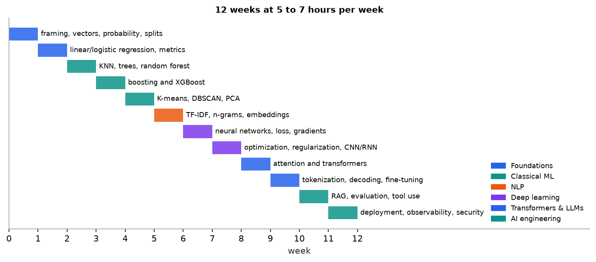

# The 12-week plan

> **Mental model.** Alternate four things every week: learn a concept, calculate a small example by hand, run a code experiment, and write a short note explaining it. You understand a concept when you can explain it simply, calculate a small example, implement it, and diagnose when it fails.

**You will learn to**
- Schedule the course at 5 to 7 hours per week.
- Produce one concrete deliverable each week.
- Use the three-pass method and active recall.
- Judge your own understanding with the teaching test.

**Why it matters.** Courses fail from drift, not difficulty. A fixed weekly rhythm with a tangible output each week turns reading into skill and produces a portfolio as a side effect.

## 1. Intuition

**Three passes per topic.**

1. **Intuition:** read the mental model and study each figure before the formulas.
2. **Mechanics:** redo the worked examples by hand, then run the scripts in [`code/`](../../code/).
3. **Engineering:** build the week's deliverable and explain the trade-offs out loud.

**Active recall.** Close the lesson and answer its quiz without notes. Missed questions go into a review queue (the website tracks this automatically); revisit them a few days later.

**Don't wait to finish the theory.** Build from week 1. If you already code comfortably in Python, spend less time on syntax and more on experiments, error analysis, and deployment.

## 2. Visualization

## 3. The math

The plan budgets about 72 hours (12 weeks × 6 hours). A useful split per week:

| Activity | Share | Hours (of 6) |
|---|---|---|
| Lessons and figures (pass 1) | 25% | 1.5 |
| Worked examples by hand and quizzes (pass 2) | 25% | 1.5 |
| Deliverable: code, experiment, write-up (pass 3) | 50% | 3 |

Half the time goes into building, because that is where understanding is tested.

## 4. Implementation: the plan

| Week | Concepts | Lessons | Hands-on deliverable |
|---|---|---|---|
| 1 | problem framing, vectors, probability, splits | [Vectors](../00-foundations/01-vectors-and-matrices.md), [probability](../00-foundations/03-probability-and-statistics.md), [workflow](../02-ml-workflow/01-ml-workflow.md) | EDA notebook and a leakage checklist for a real dataset |
| 2 | linear and logistic regression, metrics | [Linear regression](../03-regression/01-linear-regression.md), [logistic regression](../04-classification/01-logistic-regression.md), [metrics](../04-classification/02-classification-metrics.md) | regression and classification from scratch, checked against scikit-learn |
| 3 | KNN, trees, random forests | [KNN](../05-instance-and-probabilistic/01-k-nearest-neighbors.md), [trees](../06-trees-and-ensembles/01-decision-trees.md) | compare decision boundaries and error slices across three models |
| 4 | boosting and XGBoost | [Ensembles](../06-trees-and-ensembles/02-random-forests-and-boosting.md) | tabular benchmark with tuning and early stopping |
| 5 | K-means, DBSCAN, PCA | [K-means](../07-unsupervised/01-k-means.md), [clustering](../07-unsupervised/02-density-hierarchical-and-mixture-clustering.md), [PCA](../08-dimensionality-reduction/01-pca.md) | customer or document clustering report with validation |
| 6 | TF-IDF, n-grams, embeddings | [Text to vectors](../09-classical-nlp/01-text-to-vectors.md), [embeddings](../09-classical-nlp/02-word-embeddings.md) | text classifier baseline with error analysis |
| 7 | neural networks, loss, gradients | [Forward pass](../10-neural-networks/01-neural-network-forward-pass.md), [gradient descent](../11-gradient-descent-backprop/01-gradient-descent.md), [backprop](../11-gradient-descent-backprop/02-backpropagation.md) | NumPy MLP or PyTorch classifier with gradient checks |
| 8 | optimization, regularization, CNN and RNN overview | [Training](../12-training-regularization/01-training-and-regularization.md), [CNNs](../13-deep-architectures/01-convolutional-networks.md), [RNNs](../13-deep-architectures/02-recurrent-networks.md) | training diagnostic report: curves, early stopping, regularization comparison |
| 9 | attention and transformer internals | [Self-attention](../14-transformers/01-self-attention.md), [transformer architecture](../14-transformers/02-transformer-architecture.md) | calculate attention by hand, then inspect tensors in a real model |
| 10 | tokenization, decoding, fine-tuning concepts | [Tokenization](../15-llms/01-tokenization-and-pretraining.md), [decoding](../15-llms/02-decoding.md), [adapting LLMs](../15-llms/03-adapting-llms.md) | small transformer inference notebook exploring decoding settings |
| 11 | RAG, evaluation, tool use | [RAG](../16-rag/01-rag-pipeline.md), [evaluation](../17-llm-evaluation/01-llm-evaluation.md) | grounded Q&A service with citations and an evaluation set |
| 12 | deployment, observability, security | [Architecture](../20-production-ai/01-production-architecture.md), [reliability](../20-production-ai/02-reliability-cost-and-observability.md), [security](../21-safety-security/01-ai-security.md) | FastAPI demo with tests, tracing, and a security test suite |

## 5. Engineering

**Make each deliverable portfolio-grade.** A short README per deliverable: problem, data, baseline, method, results with honest failure analysis, and what you would do next. Compare against a simple baseline every time and report failures honestly.

**Questions to ask before trusting any result** (from the [model-selection cheat sheet](../../cheatsheets/model-selection.md)): Was the test set truly unseen and representative? Could a feature leak the target? Does the metric match the cost of errors? How does it do on meaningful slices? Is it calibrated? What happens under drift and outages? Can you reproduce it?

**When you fall behind,** cut scope, not rhythm: do the hand calculation and a smaller deliverable rather than skipping a week.

> [!TIP]
> Your strongest AI-engineering advantage is the combination of ML understanding, reliable backend engineering, evaluation discipline, and production observability. The plan builds all four.

### Common mistakes

- Reading every lesson before building anything.
- Skipping hand calculations because the library "does it."
- Collecting deliverables without write-ups, so nobody (including future you) can see what you learned.

## 6. Knowledge check

<!-- quiz:twelve-week-plan -->
**[Take the study-plan quiz](../../quizzes/twelve-week-plan.md)**
<!-- /quiz -->

**Practice exercise.** Write your own week-1 deliverable spec: dataset, decision, prediction unit, target, metric, baseline, and three possible leakage risks.

Example

Dataset: public bike-share trips. Decision: how many bikes to place at each station each morning. Prediction unit: station × hour. Target: departures in the next hour. Metric: MAE in bikes. Baseline: same hour last week. Leakage risks: using weather observed after the hour, using the hour's own trip count in rolling features, random splitting across time.

**Implementation challenge.** Set up a repository for your 12 weeks with one folder per week, a shared environment file, and a README index that links each week's write-up.

## Summary

- 12 weeks × 5 to 7 hours; half of each week is building.
- Three passes per topic: intuition, mechanics, engineering. Use active recall and a review queue.
- One portfolio-grade deliverable per week, always against a baseline, with honest failure analysis.
- The teaching test: explain it simply, calculate it, implement it, diagnose its failures.

**Next:** [The portfolio project ladder](02-project-ladder.md)

**Related:** [Course index](../../README.md) · [Model-selection cheat sheet](../../cheatsheets/model-selection.md)

## Interview angle

<strong>Walk me through a project you're proud of.</strong>

Use the same structure as a portfolio README and keep it to about two minutes: problem, baseline, approach, results, failures, next steps. Open with the decision the project supports and its metric ("predict next-hour departures per station to place bikes; error measured as MAE in bikes"), not the model. State the baseline ("same hour last week") and why it was the bar to beat. Describe the approach in one or two sentences, including one real design choice and its alternative. Give results as a difference from the baseline with uncertainty, on a test set the interviewer can trust: time-split, leakage-checked. Then spend real time on failure analysis: where it was weakest, which slice, and why. Close with what you'd do next. Use only numbers you measured and can reproduce. Interviewers will drill into one detail, so pick a project where you did the hand calculation and the debugging yourself.

<strong>Tell me about a result you didn't trust at first. How did you check it?</strong>

Strong answers show a checklist, not a hunch. The questions to ask before trusting any result: was the test set truly unseen and representative, or randomly split across time? Could a feature leak the target, such as information only known after prediction time? Does the metric match the cost of errors? Is performance consistent across meaningful slices, or carried by one easy segment? Are the probabilities calibrated if someone will act on them? What happens under drift or a dependency outage? Can the result be reproduced from a clean checkout with one command? A good story: "My model jumped 15 points over baseline, which was suspicious. Ablating features one at a time showed a single rolling feature that included the current hour's count. After fixing it, the honest gain was much smaller but real." Use your own measured numbers. The interviewer is testing skepticism toward your own good news.

<strong>How do you get up to speed on an ML area you haven't worked in before?</strong>

Describe a repeatable method with an output. Mine is three passes per topic. First, intuition: the core idea and its main picture before any formulas. Second, mechanics: work a small example by hand, such as an attention output or a backprop step, then run a reference implementation and check that the numbers match. Third, engineering: build a small deliverable against a simple baseline and write up the trade-offs and failures. I use active recall, answering questions without notes and revisiting misses a few days later, and I judge understanding with a teaching test: can I explain it simply, calculate a small case, implement it, and say how it fails? For a new job domain, I'd also read the team's existing evaluation sets and incident reports early, because they show what actually goes wrong. Give one concrete example of doing this, with the artifact you produced.

<strong>You're behind schedule on a project with a fixed deadline. What do you cut?</strong>

Cut scope, not rigor or rhythm. Keep the pieces that make the result trustworthy: a baseline, a held-out evaluation, failure analysis, and a short write-up. Cut the pieces that only make it bigger: extra models, a polished UI, stretch features, and a hyperparameter search beyond the obvious knobs. Concretely, I'd define the minimum viable version, the smallest thing that runs end to end and answers the core question against a baseline, ship that first, and list the rest as next steps with reasons. In the course's project ladder, the minimum for the tabular project is a baseline versus a boosted model, a cost-based threshold, a calibration plot, and a one-page failure report. A common failure is spending weeks on a demo before any evaluation exists, then having nothing defensible to show. Interviewers want to hear that you protect the evaluation, and that you communicate the cut to stakeholders early, not at the deadline.

